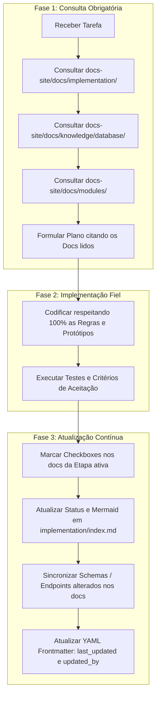

# Diretrizes Mestre e Protocolo de Memória — Tutor Inteligente

> **Aviso para todos os Agentes do Antigravity:** Este repositório possui uma documentação canônica, detalhada e estruturada em `docs-site/docs/`. Este documento é a regra de maior precedência do projeto e define o protocolo obrigatório de consulta e atualização contínua de documentação.

---

## 1. Contexto Geral do Projeto

O **Tutor Inteligente** é uma plataforma EAD verticalizada para o ensino de Matemática do Ensino Médio, integrando tutoria adaptativa com Inteligência Artificial e Teoria de Resposta ao Item (TRI / CAT).

* **Backend:** FastAPI (Python 3.11), SQLAlchemy 2.0 async, Alembic, Pydantic v2.
* **Frontend:** Next.js 14 (App Router, TypeScript, TailwindCSS, Shadcn/UI).
* **Banco de Dados:** PostgreSQL 16 com extensão `pgvector` (vetores 768d para RAG).
* **Cache & Sessões:** Redis 7 (gerenciamento de sessão única e cache volátil).
* **IA / LLM:** Gemini Flash via `LLMFactory` centralizada.
* **Ambiente de Desenvolvimento:** 100% orquestrado via Docker Compose local em `infra/docker-compose.yml`.

---

## 2. A Regra de Ouro: Single Source of Truth

A documentação localizada em `docs-site/docs/` é a **ÚNICA Fonte da Verdade** da arquitetura, regras de negócio e modelagem deste projeto.

1. **É terminantemente proibido inventar:**
   * Nomes de tabelas, colunas, tipos ou relacionamentos que divirjam de `docs-site/docs/knowledge/database/`.
   * Regras de validação ou fluxos de tela que divirjam de `docs-site/docs/modules/`.
   * Etapas ou escopos de tarefas que divirjam de `docs-site/docs/implementation/`.
2. **Resolução de Conflitos e Desvios:**
   * Se uma solicitação do usuário divergir da documentação oficial, o agente **DEVE alertar o usuário** explicitamente sobre o desvio.
   * Havendo confirmação da alteração arquitetural, o agente **DEVE atualizar a documentação técnica correspondente** para que o repositório permaneça sempre sincronizado e canônico.

---

## 3. Ciclo Obrigatório de Trabalho dos Agentes (3 Fases)

Todos os agentes (inclusive subagentes de pesquisa ou execução) **DEVEM** operar estritamente dentro do ciclo em três fases abaixo:



### Fase 1: Consulta Prévia Obrigatória (Antes de planejar ou codificar)
Antes de criar qualquer arquivo de código ou plano de implementação:
1. **Identificar a Etapa Ativa:** Ler `docs-site/docs/implementation/index.md` e abrir o arquivo detalhado da etapa em questão (ex: `docs-site/docs/implementation/etapa-04-onboarding.md`).
2. **Consultar o Modelo de Dados:** Verificar as tabelas envolvidas em `docs-site/docs/knowledge/database/` (ex: `01-usuarios.md`, etc.).
3. **Consultar as Regras do Módulo:** Ler as especificações de negócio e protótipos em `docs-site/docs/modules/<modulo>/`.
4. **Citação no Plano:** Qualquer plano gerado pelo agente **DEVE citar explicitamente** os arquivos de documentação consultados como base da solução.

### Fase 2: Implementação com Fidelidade 100%
* Implementar o backend, migrações do Alembic, schemas e componentes de interface em estrita conformidade com os protótipos documentados.
* Respeitar todas as restrições de segurança (sessão única, validação de CPF por módulo 11, hashes Argon2/Bcrypt, etc.).

### Fase 3: Atualização Obrigatória Pós-Implementação (Antes de concluir)
Antes de entregar a tarefa como finalizada, o agente **DEVE**:
1. **Checklist de Aceitação:** Marcar com `[x]` os critérios de aceitação validados no arquivo `docs-site/docs/implementation/etapa-XX-*.md`.
2. **Painel Geral de Implementação:** Se uma etapa for concluída ou seu status mudar, atualizar:
   * O status e badge em `docs-site/docs/implementation/index.md`.
   * O diagrama Mermaid de progresso das etapas.
3. **Sincronização de Módulos e Schemas:** Se qualquer novo endpoint, tabela, coluna ou regra de negócio foi adicionada ou ajustada, atualizar imediatamente os arquivos correspondentes em `knowledge/database/` e `modules/`.
4. **Padronização de Metadados (Frontmatter):**
   * Manter o frontmatter YAML intacto em cada arquivo editado.
   * Atualizar o campo `last_updated: "YYYY-MM-DD"`.
   * Atualizar o campo `updated_by: antigravity`.
   * Atualizar o bloco de comentário `<!-- ai-summary ... -->` caso o escopo do arquivo tenha mudado.

---

## 4. Mapa das Estruturas de Documentação

| Diretório | Finalidade | Quando Consultar |
| :--- | :--- | :--- |
| `docs-site/docs/implementation/` | Roteiro das 10 etapas verticais, tutoriais de setup e aceitação. | **Sempre**, no início e fim de qualquer tarefa de sprint. |
| `docs-site/docs/knowledge/database/` | Dicionário de dados oficial das 17 tabelas do sistema. | Ao criar models SQLAlchemy, migrations Alembic ou DTOs. |
| `docs-site/docs/knowledge/` | Arquitetura geral, contexto de negócio e decisões de infraestrutura. | Ao tomar decisões de arquitetura ou integrações. |
| `docs-site/docs/modules/<modulo>/` | Regras de negócio, fluxos de usuário e protótipos de endpoints/schemas. | Ao implementar qualquer regra de domínio ou tela. |
| `docs-site/docs/systems/` | Estrutura de pastas, convenções de código e padrões do sistema. | Ao organizar novos módulos, serviços ou rotas. |

---

## 5. Padrão de Frontmatter dos Arquivos de Documentação

Ao criar ou editar qualquer documento em `docs-site/docs/`, preserve a seguinte estrutura no topo do arquivo:

```yaml
---
title: Nome do Documento
type: implementation | knowledge | module | system
status: active | completed | planned
related:
  - systems/index.md
last_updated: "2026-09-07"
updated_by: antigravity
---

<!-- ai-summary
Resumo conciso em 2-4 linhas das responsabilidades, fluxos e decisões cobertas neste documento.
-->
```

---

## 6. Comandos e Ambiente Local

* Orquestração: `docker compose -f infra/docker-compose.yml up -d`
* Logs do backend: `docker logs -f ti-backend`
* Migrações: `docker exec -it ti-backend alembic upgrade head`
* Testes do backend: `docker exec -it ti-backend pytest`
* Frontend: Executando no container `ti-frontend` (Next.js 14 em `http://localhost:3000`).