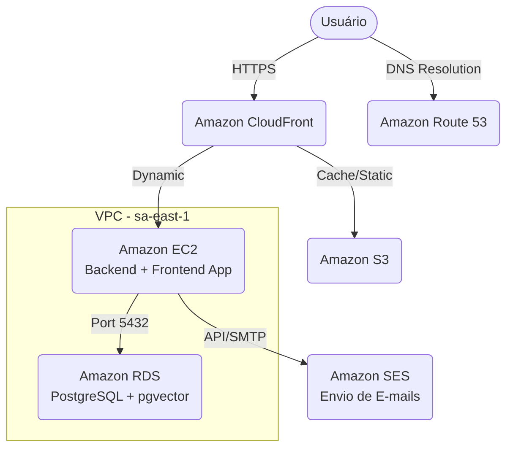

<!-- ai-summary: Tutorial detalhado sobre a configuração da infraestrutura AWS para o Tutor Inteligente, incluindo EC2, RDS, S3, CloudFront, Route 53 e SES. -->

# Etapa 2: Infraestrutura AWS

**Duração:** 3-5 dias
**Pré-requisito:** Etapa 1 concluída (Docker Compose rodando localmente)
**Entregável:** Aplicação acessível via HTTPS com certificado SSL válido

Este guia é um passo a passo extremamente detalhado para provisionar a infraestrutura em nuvem na Amazon Web Services (AWS) para o **Tutor Inteligente**. Ele foi desenhado para quem nunca utilizou a AWS, com explicações sobre cada configuração exigida.

---

## Arquitetura AWS Planejada



---

## 2.1 Criar Conta AWS

Se você não tem uma conta, precisará criar uma e ativar o *Free Tier* (nível gratuito).

### Passo a passo para criação
1. Acesse [aws.amazon.com](https://aws.amazon.com/) e clique em **Crie uma conta da AWS**.
2. Insira um e-mail válido (esta será a conta `root`).
3. Siga o fluxo preenchendo os dados pessoais e informações de cartão de crédito.
   > [!NOTE]
   > A AWS fará uma cobrança temporária (geralmente US$ 1,00) que será estornada para validar o cartão. O *Free Tier* é ativado automaticamente.

### Configurar Usuário IAM (Boas Práticas)
Nunca utilize a conta `root` (o e-mail que você usou para criar a conta) para o dia a dia. Vamos criar um usuário administrativo.

1. No console da AWS, busque por **IAM** na barra de pesquisa.
2. Vá em **Users** (Usuários) > **Add users** (Adicionar usuários).
3. Nomeie o usuário (ex: `admin-siade`).
4. Marque **Provide user access to the AWS Management Console**.
   - Escolha **I want to create an IAM user**.
   - Defina uma senha customizada e desmarque a opção de trocar a senha no próximo login (se for apenas para você).
5. Em **Permissions**, selecione **Attach policies directly** e marque `AdministratorAccess`.
6. Conclua a criação.

> [!IMPORTANT]
> **Configure o MFA (Multi-Factor Authentication)** tanto para o usuário `root` quanto para o seu novo usuário IAM. No IAM, clique no seu usuário, vá na aba **Security credentials** e ative o MFA usando um app como Google Authenticator ou Authy.

---

## 2.2 Provisionar Instância EC2

A EC2 será o nosso servidor onde rodarão os containers Docker (Frontend e Backend).

### Passo a passo no Console
1. Troque a região da AWS no canto superior direito para **South America (São Paulo) us-east-1** (ou `sa-east-1`).
2. Busque por **EC2** na barra superior e clique em **Instances** > **Launch instances**.
3. **Name**: `tutor-inteligente-server`
4. **Application and OS Images (Amazon Machine Image)**:
   - Escolha **Ubuntu**.
   - Selecione `Ubuntu Server 22.04 LTS (HVM), SSD Volume Type` (procure a tag *Free tier eligible*).
5. **Instance type**: `t3.micro` (elegível ao Free Tier). Se o orçamento permitir, `t3.small` oferece mais estabilidade.
6. **Key pair (login)**:
   - Clique em **Create new key pair**.
   - Nome: `tutor-key`.
   - Tipo: `RSA`.
   - Formato: `.pem` (para macOS/Linux/PowerShell no Windows).
   - Clique em **Create**. O arquivo `tutor-key.pem` será baixado. **Guarde-o em um local seguro, você não poderá baixá-lo novamente.**
7. **Network settings**:
   - Marque **Allow SSH traffic from** e mude de `Anywhere` para `My IP` (Apenas seu IP poderá acessar o terminal).
   - Marque **Allow HTTP traffic from the internet**.
   - Marque **Allow HTTPS traffic from the internet**.
   - Clique em **Edit** e adicione uma regra (Add security group rule): Type: `Custom TCP`, Port Range: `8000`, Source: `Anywhere` (usado temporariamente para testar a API).
8. **Configure storage**: 20 GB gp3 (O limite do Free tier é 30 GB no total).
9. Clique em **Launch instance**.

### Associar Elastic IP
Um IP Elástico garante que o IP público do seu servidor nunca mude se ele for reiniciado.
1. No menu da EC2, vá em **Elastic IPs** (no menu esquerdo, sob Network & Security).
2. Clique em **Allocate Elastic IP address** > **Allocate**.
3. Selecione o IP criado, vá em **Actions** > **Associate Elastic IP address**.
4. Selecione sua instância `tutor-inteligente-server` e clique em **Associate**.

### Como acessar via SSH no Windows
Abra o **PowerShell**, navegue até a pasta onde salvou o `.pem` e execute:

```powershell
# Altere as permissões do arquivo (necessário no Windows para o SSH não recusar a chave)
icacls.exe tutor-key.pem /reset
icacls.exe tutor-key.pem /grant:r "$($env:USERNAME):(r)"
icacls.exe tutor-key.pem /inheritance:r

# Conecte-se substituindo SEU_ELASTIC_IP pelo IP associado
ssh -i tutor-key.pem ubuntu@SEU_ELASTIC_IP
```

> [!TIP]
> Caso seu IP de internet mude no futuro, você precisará atualizar a regra de Segurança (Security Group) da porta 22 (SSH) na AWS para o seu novo IP.

---

## 2.3 Instalar Docker na EC2

Após acessar a EC2 via SSH, execute os comandos abaixo para instalar o Docker.

```bash
# Atualizar pacotes
sudo apt update && sudo apt upgrade -y

# Instalar dependências
sudo apt install apt-transport-https ca-certificates curl software-properties-common -y

# Adicionar chave GPG oficial do Docker
curl -fsSL https://download.docker.com/linux/ubuntu/gpg | sudo gpg --dearmor -o /usr/share/keyrings/docker-archive-keyring.gpg

# Adicionar repositório do Docker
echo "deb [arch=$(dpkg --print-architecture) signed-by=/usr/share/keyrings/docker-archive-keyring.gpg] https://download.docker.com/linux/ubuntu $(lsb_release -cs) stable" | sudo tee /etc/apt/sources.list.d/docker.list > /dev/null

# Atualizar pacotes novamente e instalar o Docker
sudo apt update
sudo apt install docker-ce docker-ce-cli containerd.io docker-compose-plugin -y

# Adicionar o usuário 'ubuntu' ao grupo do Docker para rodar sem 'sudo'
sudo usermod -aG docker ubuntu
```

> [!WARNING]
> Após o comando `usermod`, você precisa sair da sessão SSH digitando `exit` e conectar novamente para que as permissões tenham efeito.

Verifique a instalação:
```bash
docker --version
docker compose version
```

---

## 2.4 Configurar RDS PostgreSQL

> [!NOTE]
> Para o MVP, você **pode rodar o PostgreSQL em um container Docker na EC2** para economizar custos. O RDS é recomendado para produção por ter backups automáticos, mas se desejar seguir com o RDS, siga os passos abaixo.

1. Busque por **RDS** na barra superior e vá em **Create database**.
2. **Choose a database creation method**: Standard create.
3. **Engine options**: PostgreSQL (versão 16.x).
4. **Templates**: **Free tier**.
5. **Settings**:
   - DB instance identifier: `tutor-db`
   - Master username: `postgres`
   - Master password: `SuaSenhaForteAqui123`
6. **Instance configuration**: `db.t3.micro`.
7. **Storage**: 20 GB gp3.
8. **Connectivity**:
   - Não permitir acesso público (Public access: No).
   - Create a new VPC security group (Nome: `rds-ec2-sg`).
9. Após criar, vá no Security Group recém criado (`rds-ec2-sg`), edite as regras de entrada (Inbound rules):
   - Type: `PostgreSQL` (5432)
   - Source: Selecione o Security Group da sua instância EC2.

### Habilitar pgvector
O pgvector é suportado no RDS do PostgreSQL 15.2+. 
Conecte-se ao banco a partir da sua EC2 e rode:

```sql
CREATE EXTENSION vector;
```

---

## 2.5 Configurar Amazon S3

Vamos criar um bucket para armazenar os arquivos e documentos da aplicação.

1. Busque por **S3** e clique em **Create bucket**.
2. **Bucket name**: `tutor-inteligente-assets` (precisa ser um nome único globalmente).
3. **AWS Region**: `sa-east-1` (São Paulo).
4. **Block Public Access**: Marque **Block all public access** (vamos usar URLs pré-assinadas via backend para maior segurança).
5. Clique em **Create bucket**.

### CORS Configuration
Vá no bucket > aba **Permissions** > role até **Cross-origin resource sharing (CORS)** > Edit.

```json
[
    {
        "AllowedHeaders": ["*"],
        "AllowedMethods": ["GET", "PUT", "POST", "DELETE"],
        "AllowedOrigins": ["https://seu-dominio.com", "http://localhost:3000"],
        "ExposeHeaders": []
    }
]
```

### Criar IAM Policy para o Backend
Crie um usuário IAM chamado `tutor-backend-s3` (Programmatic access / Access key) com a seguinte política em linha para dar acesso apenas ao bucket:

```json
{
    "Version": "2012-10-17",
    "Statement": [
        {
            "Effect": "Allow",
            "Action": [
                "s3:PutObject",
                "s3:GetObject",
                "s3:DeleteObject"
            ],
            "Resource": "arn:aws:s3:::tutor-inteligente-assets/*"
        }
    ]
}
```
Anote o **Access Key ID** e o **Secret Access Key**.

---

## 2.6 Configurar Route 53 e Certificate Manager (ACM)

Para ter HTTPS, precisamos de um domínio e um certificado.

### Route 53 (Domínio)
1. Busque por **Route 53**.
2. Vá em **Hosted zones** > **Create hosted zone**.
3. Insira seu domínio (ex: `tutorinteligente.com`) e crie.
4. Pegue os 4 servidores DNS listados nos registros tipo `NS` e configure no seu registrador de domínio (Registro.br, GoDaddy, etc.).
5. Crie um registro tipo `A` apontando para o seu **Elastic IP** da EC2.

### Certificate Manager (ACM)
1. Busque por **Certificate Manager**.
2. Mude a região para **us-east-1 (N. Virginia)** (OBRIGATÓRIO se for usar CloudFront).
3. **Request a certificate** > **Request a public certificate**.
4. Fully qualified domain name: `tutorinteligente.com` e `*.tutorinteligente.com`.
5. Validação via DNS.
6. A AWS pedirá para você criar registros CNAME no Route 53. Se os dois estiverem na mesma conta, haverá um botão para criar os registros automaticamente.

---

## 2.7 Configurar Amazon CloudFront

O CloudFront será nosso CDN, recebendo o tráfego HTTPS e repassando para a EC2.

1. Busque por **CloudFront** > **Create Distribution**.
2. **Origin domain**: Selecione o DNS Público da sua EC2 ou digite o Elastic IP.
3. **Protocol**: HTTP Only (o CloudFront falará HTTP com a EC2, mas entregará HTTPS para o usuário). Porta 80 ou 3000 (depende da sua configuração de proxy na EC2).
4. **Viewer protocol policy**: Redirect HTTP to HTTPS.
5. **Allowed HTTP methods**: `GET, HEAD, OPTIONS, PUT, POST, PATCH, DELETE`.
6. **Cache key and origin requests**: Cache policy and origin request policy. Selecione *CachingDisabled* para a API, ou configure adequadamente para o frontend.
7. **Custom SSL certificate**: Selecione o certificado criado no ACM.
8. **Alternate domain name (CNAME)**: `tutorinteligente.com` e `www.tutorinteligente.com`.
9. Crie a distribuição.
10. Volte no **Route 53**, apague o registro A que apontava para a EC2, e crie um **Registro A -> Alias** apontando para a distribuição do CloudFront.

---

## 2.8 Configurar Amazon SES

O SES será usado para envios de e-mails (como links de verificação e recuperação de senha).

1. Busque por **Amazon SES**.
2. **Verified identities** > **Create identity**.
3. Escolha **Domain**, digite seu domínio e marque para publicar registros no Route 53 automaticamente.
4. Por padrão, a conta fica no **Sandbox**, permitindo enviar apenas para e-mails verificados. Para sair do Sandbox, no painel principal do SES, clique em "Request production access" explicando detalhadamente como você vai enviar e-mails e como vai lidar com bounces.
5. Para conseguir as credenciais, vá em **SMTP Settings** > **Create SMTP credentials**. Anote o usuário e senha gerados para colocar no seu arquivo `.env`.

---

## 2.9 Primeiro Deploy na AWS

Conecte-se na EC2 e configure o repositório:

```bash
# Clonar o repositório
git clone https://github.com/SiadeLucas/Tutor-Inteligente.git
cd Tutor-Inteligente

# Copiar env de exemplo (você precisará criar esse arquivo se não existir)
cp .env.example .env

# Editar o arquivo .env
nano .env
```

Preencha o `.env` com os dados de produção (DB, S3, SMTP, Gemini API Key, etc.).

Levante a infraestrutura:
```bash
docker compose -f docker-compose.prod.yml up -d
```

Verifique se os containers estão de pé:
```bash
docker compose ps
```

---

## 2.10 Critérios de Aceitação

- [ ] Conta AWS e Free Tier ativados.
- [ ] Usuário IAM administrativo criado e com MFA habilitado.
- [ ] Instância EC2 t3.micro rodando Ubuntu 22.04 em sa-east-1.
- [ ] IP Elástico alocado e associado à EC2.
- [ ] Docker e Docker Compose instalados com sucesso.
- [ ] Banco de dados configurado e funcional (RDS ou container).
- [ ] Bucket S3 criado com acesso público bloqueado e CORS configurado.
- [ ] CloudFront recebendo tráfego HTTPS via domínio customizado e repassando para a EC2.
- [ ] SES configurado e credenciais SMTP geradas.
- [ ] Primeiro deploy feito usando Docker Compose na instância EC2.
- [ ] Aplicação respondendo via HTTPS pelo domínio oficial.
