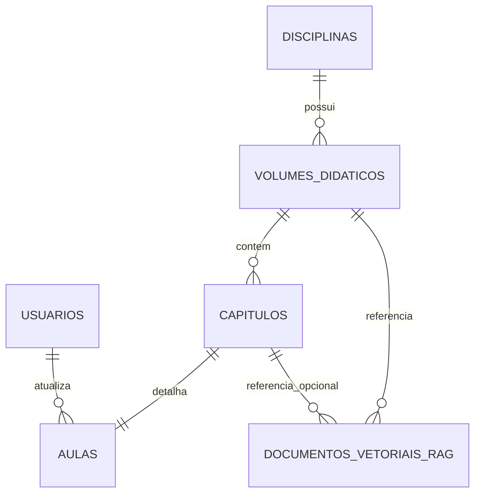

<!-- ai-summary
Guia detalhado de implementação da Etapa 5 (Conteúdo Didático) do Tutor Inteligente. Cobre a criação das tabelas de banco de dados (disciplinas, volumes, capítulos, aulas, vetores RAG), modelos SQLAlchemy, migrações Alembic, endpoints FastAPI de conteúdo, interfaces React no frontend incluindo a Árvore de Habilidades (Skill Tree) e a Tela de Aula em formato Split-Screen com suporte a KaTeX, além da base canônica de 11 volumes e 63 capítulos em app.seeds.volumes.
-->

# Etapa 5: Conteúdo Didático

Esta etapa estabelece a base de conhecimento do Tutor Inteligente, introduzindo o catálogo de disciplinas, volumes, capítulos e o conteúdo textual das aulas formatado em KaTeX.

**Duração Estimada:** 1-2 semanas  
**Pré-requisito:** [Etapa 3: Autenticação](etapa-03-autenticacao.md) concluída (O sistema precisa identificar os usuários para rastrear progresso).  
**Entregável:** Navegação funcional da Skill Tree (Árvore de Habilidades) e visualização completa de uma aula estruturada em 4 blocos.

---

## 1. Tabelas de Banco de Dados

A arquitetura de conteúdo é hierárquica: `Disciplina -> Volume Didático -> Capítulo -> Aula`. 
Além disso, incluiremos a tabela base para RAG (Retrieval-Augmented Generation), que será de fato populada na Etapa 6.

> [!IMPORTANT]
> A tabela `documentos_vetoriais_rag` requer a extensão `pgvector` instalada e ativada no PostgreSQL.

### Modelo de Dados Relacional



### Detalhamento das Tabelas

| Tabela | Chave Primária | Relacionamentos | Colunas Principais |
|---|---|---|---|
| `disciplinas` | `id` (UUID) | N/A | `slug` (UNIQUE), `nome`, `nivel_ensino`, `cor_tema`, `ordem` |
| `volumes_didaticos` | `id` (UUID) | FK `disciplina_id` | `nome_colecao`, `numero_volume` (1-11), `titulo`, `grande_area`, `preco_padrao` |
| `capitulos` | `id` (UUID) | FK `volume_id` | `numero_capitulo`, `titulo`, `duracao_estimada_minutos` (default 50), `pre_requisitos_ids` (UUID[]) |
| `aulas` (1:1 c/ caps) | `id` (UUID) | FK `capitulo_id` (UNIQUE), FK `atualizado_por` | `bloco_1_teoria` (KaTeX), `bloco_2_exemplos` (KaTeX), `bloco_3_dicas` (KaTeX), `video_url` |
| `documentos_vetoriais_rag` | `id` (UUID) | FK `volume_id`, FK `capitulo_id` (null) | `conteudo_texto`, `embedding` (VECTOR(768)), `metadata` (JSONB) |

---

## 2. Modelos SQLAlchemy e Migração

Crie os modelos SQLAlchemy correspondentes no arquivo `backend/app/models/content.py`.

> [!TIP]
> Utilize tipos do PostgreSQL nativos via SQLAlchemy, como `ARRAY` e `JSONB`. Para a coluna de vetores, você precisará da biblioteca `pgvector`.

### Passo 2.1: Instalar dependências de vetor

Execute no terminal do backend (PowerShell):

```powershell
poetry add pgvector
```

### Passo 2.2: Criar a Migração Alembic

Gere o script de migração usando a ferramenta do Alembic.

```powershell
alembic revision --autogenerate -m "002_content_tables"
```

> [!WARNING]
> Abra o arquivo de migração gerado em `backend/alembic/versions/` e **adicione a criação da extensão pgvector** na função `upgrade()`, ANTES da criação das tabelas:
> ```python
> def upgrade():
>     op.execute('CREATE EXTENSION IF NOT EXISTS vector;')
>     # ... resto do código gerado pelo alembic
> ```

Aplique as mudanças ao banco:

```powershell
alembic upgrade head
```

---

## 3. Schemas de Resposta (Pydantic)

Crie os schemas Pydantic em `backend/app/schemas/content.py`.

Você precisará de schemas de leitura (Responses) para listagem e detalhamento:
- `DisciplinaResponse`
- `VolumeResponse`
- `CapituloResponse`
- `AulaCompletaResponse`
- `SkillTreeNodeResponse`: Este schema será uma composição do `CapituloResponse` acrescido de campos voltados ao mapa de habilidades (como status de cor do mapa de calor do usuário: "green", "yellow", "red", "grey").

---

## 4. Endpoints de Conteúdo (FastAPI)

Crie as rotas em `backend/app/api/v1/endpoints/conteudo.py`.
Você deve implementar tanto rotas de navegação de estrutura (para alimentar a UI) quanto as rotas de interação da aula.

### Rotas de Listagem (Skill Tree e Catálogo)
- `GET /api/v1/conteudo/disciplinas` - Retorna todas as disciplinas ativas.
- `GET /api/v1/conteudo/volumes/{disciplina_id}` - Retorna a coleção de volumes.
- `GET /api/v1/conteudo/capitulos/{volume_id}` - Retorna os capítulos formatados para a Skill Tree.

### Rotas Interativas da Aula
- `GET /api/v1/conteudo/aulas/{capitulo_id}` - Recupera a aula (os 4 blocos) pertinente àquele capítulo.
- `GET /api/v1/conteudo/aulas/{capitulo_id}/fixacao` - Serve a bateria de fixação **sem expor o gabarito** (correção server-side, anti-trapaça).
- `POST /api/v1/conteudo/aulas/{capitulo_id}/fixacao` - Corrige as respostas no servidor (RN-CNT-010) e persiste o `heatmap_dominio` (RN-PRG-012) + counters do dia (`exercicios_submetidos`, `aulas_concluidas`). **Não** grava tempo: `segundos_ativos` tem escritor exclusivo (auto-sync do `useStudyTimer` via `POST /api/v1/progresso/tempo-estudo`, contrato da Etapa 8 — o campo legado `segundos_estudo` é aceito mas ignorado).
- `POST /api/v1/conteudo/aulas/{capitulo_id}/concluir` - Rota legada de conclusão manual com trava de 60%; persiste `aula_concluida` no heatmap.
- `POST /api/v1/conteudo/aulas/{capitulo_id}/chat` - **(Placeholder)** Ponto de entrada do tutor socrático (Etapa 6). Retorna dummy data por enquanto.
- `POST /api/v1/conteudo/aulas/{capitulo_id}/pista` - **(Placeholder)** Dica rápida contextual.

> [!IMPORTANT]
> **Todos os endpoints de conteúdo exigem autenticação** (`get_current_user` da Etapa 3). O status do heatmap na Skill Tree é real e por usuário — não há mais status mockado.

---

## 5. Scripts Canônicos de Seed e Sincronização Contínua (Deploy)

A base instrucional completa da plataforma está versionada diretamente em código Python sob `backend/app/seeds/volumes/` (`vol_01_conjuntos.py` a `vol_11_financeira_estatistica.py`). Os scripts de carga rodam 100% offline, em menos de 5 segundos, com semântica estrita de **UPSERT (Update or Insert)**.

### Dados Populados:
- **1 Disciplina:** "Matemática" (`slug`: matematica)
- **11 Volumes Canônicos da Coleção Iezzi:**
  1. Conjuntos e Funções (`algebra_funcoes`) — 8 capítulos
  2. Logaritmos (`algebra_funcoes`) — 5 capítulos
  3. Trigonometria (`geometria`) — 5 capítulos
  4. Sequências, Matrizes e Determinantes (`algebra_linear`) — 6 capítulos
  5. Combinatória e Probabilidade (`aplicada`) — 6 capítulos
  6. Complexos, Polinômios e Equações (`algebra_funcoes`) — 4 capítulos
  7. Geometria Analítica (`geometria`) — 5 capítulos
  8. Limites, Derivadas e Integrais (`algebra_funcoes`) — 6 capítulos
  9. Geometria Plana (`geometria`) — 6 capítulos
  10. Geometria Espacial (`geometria`) — 6 capítulos
  11. Matemática Financeira e Estatística (`aplicada`) — 6 capítulos
- **63 Aulas Completas com KaTeX:** Teoria, Exemplos Resolvidos e Dicas IA estruturados em 3 blocos.
- **189 Questões de Fixação Server-Side:** Centralizadas em `BATERIAS_FIXACAO_CANONICAS` (3 por capítulo, gabarito protegido).
- **315 Itens Calibrados TRI 3PL:** Mapeados por `(volume_numero, capitulo_numero)` em `itens_exercicios`.

### Comandos de Execução Local / Container:

```powershell
# População de Conteúdo Didático (63 Aulas)
docker exec -e PYTHONPATH=. ti-backend python -m scripts.seed_content

# População de Exercícios Calibrados TRI (315 Itens)
docker exec -e PYTHONPATH=. ti-backend python -m scripts.seed_exercises
```

### Estratégia de Deploy Contínuo (AWS CI/CD):
Graças à idempotência dos seeders:
- **Novos Commits / Deploys:** Rodam automaticamente após `alembic upgrade head`. Qualquer ajuste em textos KaTeX ou distratores nos arquivos de seed é refletido no PostgreSQL sem recriar UUIDs nem corromper tentativas ou heatmaps dos alunos.
- **Base Vetorial RAG (`pgvector`):** O script `scripts/ingest_iezzi.py` utiliza a API do Gemini e é disparado isoladamente no provisionamento inicial ou sob demanda.

---

## 6. Frontend: Árvore de Habilidades (Skill Tree)

Em `frontend/src/app/(student)/materias/page.tsx`, implemente a visualização da árvore de conteúdo.

### Componentes Principais
1. **Grid de Áreas:** Organize os 11 volumes visivelmente por grandes áreas (Álgebra, Geometria, Aplicada).
2. **Nós Colapsáveis (Accordion):** Cada volume, ao ser clicado, expande a lista de capítulos.
3. **Indicador de Status (Heatmap):** 
   - 🟩 **Verde:** Domínio alcançado (80%+)
   - 🟨 **Amarelo:** Em progresso aceitável (40%-79%)
   - 🟥 **Vermelho:** Dificuldade crítico (<40%)
   - ⬜ **Cinza/Desbotado:** Não iniciado

Ao clicar em um nó de capítulo, o usuário é direcionado para a rota da aula correspondente.

---

## 7. Frontend: Tela de Aula Split-Screen

Em `frontend/src/app/(student)/aula/[id]/page.tsx`, crie uma experiência de aula imersiva com tela dividida.

### Layout Split-Screen
- **Painel Esquerdo (65%):** Visualização de conteúdo principal.
- **Painel Direito (35%):** Sidebar com Chat Socrático (mock visual nesta etapa) e temporizador.

### Funcionalidades do Painel Esquerdo
Implemente um componente de abas (Tabs) para navegar entre:
1. **Teoria**
2. **Exemplos (Passo-a-passo)**
3. **Dicas e Armadilhas**
4. **Fixação (Exercícios)**

> [!NOTE]
> Você precisará de uma biblioteca React para renderizar as equações matemáticas das strings markdown retornadas pelo back-end. Recomenda-se o uso de `react-katex` ou `rehype-katex` integrado com um renderizador markdown (como `react-markdown`).

### Painel Direito e Lógica Auxiliar
- **useStudyTimer Hook:** Hook customizado React (`frontend/src/hooks/useStudyTimer.ts`) que cronometra o tempo líquido ativo da sessão (pausa após 3 min de inatividade) e persiste via `POST /api/v1/progresso/tempo-estudo`. Desde a Etapa 8 é o **único escritor** de `segundos_ativos` (ver etapa-08, seção 8.7).
- **Botão de Conclusão:** Ficará localizado ao final da aba "Fixação", sendo ativado apenas quando o usuário simular/submeter um acerto de 60%+ na avaliação.

---

## 8. Critérios de Aceitação

- [x] A migração Alembic para todas as tabelas de conteúdo é executada sem erros no Windows.
- [x] A extensão `pgvector` é habilitada corretamente pela migração.
- [x] O script de seed popula o banco com 1 disciplina, 11 volumes categorizados e todos os 63 capítulos dos 11 volumes preenchidos com aulas completas em KaTeX (teoria, exemplos, dicas), baterias de fixação server-side em `BATERIAS_FIXACAO_CANONICAS`, 315 itens calibrados TRI (TRI_DATA) e fragmentos RAG canônicos em `app.seeds.volumes`.
- [x] O endpoint de `/capitulos/{volume_id}` retorna a estrutura com dados de progresso (status da árvore).
- [x] A interface da Skill Tree no Frontend agrupa os 11 volumes por grandes áreas (ex: Álgebra).
- [x] A coloração dos nós dos capítulos muda adequadamente com base nos dados mockados de desempenho.
- [x] A página de aula divide a tela (65/35) em telas grandes.
- [x] Equações em sintaxe KaTeX são perfeitamente renderizadas no conteúdo dos blocos de aula.
- [x] O botão "Concluir Aula" faz um POST bem-sucedido para `/aulas/{id}/concluir`.
