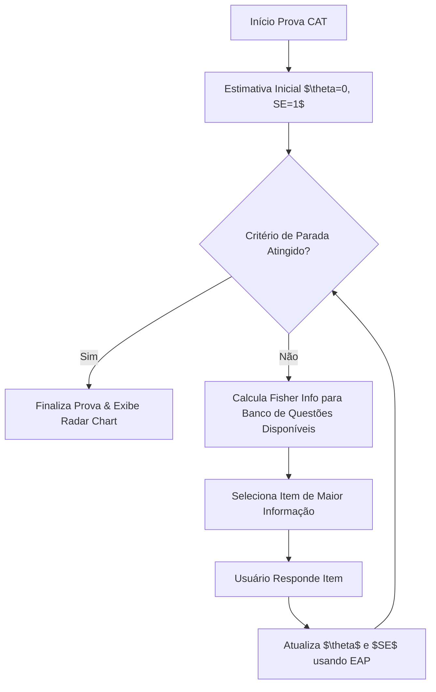

<!-- ai-summary
Plano de implementação detalhado para a Etapa 7: Exercícios e Motor CAT.
Cobre a estruturação de tabelas de exercícios, tentativas, caixa de reforço e provas CAT.
Inclui a implementação do Motor Psicométrico CAT (TRI), validação matemática com SymPy,
lógica de segunda chance e questões gêmeas, bem como interfaces KaTeX no Frontend.
-->

# Etapa 7: Exercícios e Motor CAT

> [!IMPORTANT]
> **Duração Estimada:** 1-2 semanas
> **Pré-requisito:** Etapa 5 concluída (Estrutura de conteúdo funcionando)
> **Entregável:** Resolução de exercícios com 2ª chance, Caixa de Reforço funcional e Teste Adaptativo CAT rodando.

> [!NOTE]
> **Adoção realizada na implementação (desvio documentado):** o MVP de fixação server-side da Etapa 5
> (`/api/v1/conteudo/aulas/{capitulo_id}/fixacao`) foi promovido a motor de gravação das tentativas
> (RN-CNT-010 + Tabela 12). O módulo desta etapa fornece a bateria TRI (`GET /api/v1/exercicios/capitulo/{capitulo_id}`),
> a submissão com 2ª chance, Caixa de Reforço, Questões Gêmeas e Prova CAT. Os endpoints e tabelas
> da etapa permanecem como definidos abaixo.

Nesta etapa, implementaremos o núcleo de avaliação do **Tutor Inteligente**. O foco será não apenas exibir exercícios de múltipla escolha e numéricos (renderizados usando KaTeX), mas validá-los de forma inteligente usando SymPy, permitindo geração de questões gêmeas, e aplicando a Teoria da Resposta ao Item (TRI) no Teste Adaptativo Computadorizado (CAT).

---

## 7.1 Banco de Dados: Tabelas de Exercícios

Precisamos armazenar as questões, histórico de tentativas, itens na caixa de reforço para revisão espaçada, e histórico do teste adaptativo.

### Modelos SQLAlchemy (`backend/app/models/exercises.py`)

Crie os modelos SQLAlchemy mapeando o esquema desejado:

```python
from sqlalchemy import Column, String, Text, Boolean, Integer, Numeric, ForeignKey, JSON
from sqlalchemy.dialects.postgresql import UUID, JSONB
from sqlalchemy.orm import relationship
import uuid
from app.db.base_class import Base

class ItemExercicio(Base):
    __tablename__ = 'itens_exercicios'

    id = Column(UUID(as_uuid=True), primary_key=True, default=uuid.uuid4)
    capitulo_id = Column(UUID(as_uuid=True), ForeignKey('capitulos.id'), nullable=False)
    tipo_item = Column(String(50), nullable=False) # 'multipla_escolha' ou 'numerico'
    enunciado_katex = Column(Text, nullable=False)
    alternativas = Column(JSONB, nullable=True) # array de {letra, texto_katex, correta}
    gabarito_resposta = Column(Text, nullable=True)
    gabarito_expressao_sympy = Column(Text, nullable=True)
    
    # Parâmetros TRI
    parametro_a = Column(Numeric(5, 3), default=1.0) # Discriminação
    parametro_b = Column(Numeric(5, 3), default=0.0) # Dificuldade
    parametro_c = Column(Numeric(5, 3), default=0.25) # Acerto casual (chute)
    
    item_matriz_id = Column(UUID(as_uuid=True), ForeignKey('itens_exercicios.id'), nullable=True)
    criado_por = Column(UUID(as_uuid=True), ForeignKey('usuarios.id'), nullable=False)
    
    # Relacionamentos
    # (Adicione relationships conforme necessário)

class TentativaExercicio(Base):
    __tablename__ = 'tentativas_exercicios'

    id = Column(UUID(as_uuid=True), primary_key=True, default=uuid.uuid4)
    usuario_id = Column(UUID(as_uuid=True), ForeignKey('usuarios.id'), nullable=False)
    item_id = Column(UUID(as_uuid=True), ForeignKey('itens_exercicios.id'), nullable=False)
    capitulo_id = Column(UUID(as_uuid=True), ForeignKey('capitulos.id'), nullable=False)
    
    resposta_enviada = Column(Text, nullable=False)
    acertou = Column(Boolean, nullable=False)
    eh_segunda_chance = Column(Boolean, default=False)
    pontuacao = Column(Numeric(3, 2), nullable=False) # 1.0, 0.5, ou 0.0
    tempo_resposta_segundos = Column(Integer, nullable=False)

class CaixaReforco(Base):
    __tablename__ = 'caixa_reforco'

    id = Column(UUID(as_uuid=True), primary_key=True, default=uuid.uuid4)
    usuario_id = Column(UUID(as_uuid=True), ForeignKey('usuarios.id'), nullable=False)
    item_id = Column(UUID(as_uuid=True), ForeignKey('itens_exercicios.id'), nullable=False)
    capitulo_id = Column(UUID(as_uuid=True), ForeignKey('capitulos.id'), nullable=False)
    
    status = Column(String(20), default='pendente') # 'pendente', 'revisado', 'dominado'
    tentativas_reforco = Column(Integer, default=0)

class ProvaCAT(Base):
    __tablename__ = 'provas_cat'

    id = Column(UUID(as_uuid=True), primary_key=True, default=uuid.uuid4)
    usuario_id = Column(UUID(as_uuid=True), ForeignKey('usuarios.id'), nullable=False)
    disciplina_id = Column(UUID(as_uuid=True), ForeignKey('disciplinas.id'), nullable=False)
    
    theta_estimado = Column(Numeric(5, 3), default=0.0)
    erro_padrao = Column(Numeric(5, 3), default=1.0)
    total_itens_respondidos = Column(Integer, default=0)
    
    status = Column(String(20), default='em_andamento') # 'em_andamento', 'finalizado'
    tipo = Column(String(50), nullable=False) # 'diagnostica_onboarding', 'marco_7_dias'
    itens_respondidos = Column(JSONB, default=list) # [{item_id, resposta, acertou, tempo}]
```

### Migração Alembic

Crie a migração (verifique se está na pasta `backend`). A migração consolidada final desta etapa é
`004_exercise_tables` (revision `de042328f643`, down_revision `0df7b4f4b350`), pois a numeração `003`
foi consumida pela migração de conteúdo da Etapa 5:

```powershell
alembic revision --autogenerate -m "004_exercise_tables"
alembic upgrade head
```

> [!NOTE]
> Crie um script de Seed para adicionar questões iniciais referentes aos Capítulos do Volume 1, para possibilitar os testes manuais e de integração. Defina parâmetros `a`, `b`, e `c` para esses exercícios.

---

## 7.2 Backend: Motor Psicométrico CAT

Vamos implementar as equações fundamentais da Teoria da Resposta ao Item (TRI), modelo logístico de 3 Parâmetros (3PL).

`backend/app/services/cat_engine.py`

*   **Modelo 3PL**: Probabilidade de acerto dado a proficiência ($\theta$):
    $P(\theta) = c + \frac{1 - c}{1 + e^{-a(\theta - b)}}$
*   **Informação de Fisher**: Usada para selecionar o próximo melhor item.
    $I(\theta) = a^2 \frac{(P - c)^2}{(1 - c)^2 P (1 - P)}$
*   **Estimador EAP (Expected A Posteriori)**: Atualização Bayesiana do $\theta$ após cada resposta.

> [!IMPORTANT]
> **Critérios de Parada do Teste:** O teste deve parar quando o número de itens $N \ge 12$ E o Erro Padrão $SE \le 0.30$, ou se o número máximo de itens $N = 20$ for alcançado.



---

## 7.3 Backend: Validador SymPy (Sandbox Segura)

Para questões numéricas e algébricas, precisamos comparar se a expressão do aluno equivale ao gabarito, independentemente de estarem simplificadas.

`backend/app/services/sympy_validator.py`

> [!CAUTION]
> **SEGURANÇA**
> Como `sympify` executa eval, é imperativo usar um dicionário global restrito e aplicar restrições de tempo e tamanho.

1.  **Limitação de Caracteres**: `MAX_CARACTERES = 150`
2.  **Sandbox Dictionary**: `global_dict = {}` (Evita injeção de código `__import__('os')`)
3.  **Timeout**: Use `ThreadPoolExecutor` com um timeout rígido de 5 segundos.
4.  **Lógica**:
    *   Fazer parse da resposta via `parse_expr` ou `sympify` do SymPy.
    *   Subtrair a resposta do `gabarito_expressao_sympy` e chamar `sympy.simplify()`.
    *   Se a simplificação for uma constante muito próxima de zero (tolerância `0.01`), está correto.

---

## 7.4 Backend: Lógica de 2ª Chance e Questões Gêmeas

A lógica de avaliação formativa é central no Tutor Inteligente.

*   **1ª Tentativa Correta**: O usuário recebe **1.0 ponto**.
*   **1ª Tentativa Errada**:
    *   Não dar zero!
    *   Fornecer a **Dica de Estágio 2**.
    *   Permitir uma 2ª chance.
*   **2ª Tentativa Correta**: O usuário recebe **0.5 ponto**.
*   **2ª Tentativa Errada**:
    *   Usuário recebe **0.0 ponto**.
    *   O item é adicionado à **Caixa de Reforço** do usuário.
    *   O sistema invoca a LLMFactory para gerar uma **Questão Gêmea**.
*   **Questão Gêmea**: A questão original é clonada. Os coeficientes são mutados mantendo a estrutura lógica e algébrica (usando manipulação de variáveis ou pedindo pra a IA retornar a questão alterada, mas com os novos gabaritos).

---

## 7.5 Backend: 6 Endpoints de Exercícios

Crie as seguintes rotas em `backend/app/api/v1/endpoints/exercises.py`:

| Método | Endpoint | Descrição |
| :--- | :--- | :--- |
| `POST` | `/api/v1/exercicios/submeter` | Submissão de exercício de fixação com lógica de 2ª chance. |
| `POST` | `/api/v1/exercicios/gerar-gemea/{item_matriz_id}` | Gera questão gêmea após 2º erro consecutivo. |
| `POST` | `/api/v1/exercicios/cat/iniciar` | Inicia sessão CAT com *prior* N(0,1), $SE=1.0$. |
| `POST` | `/api/v1/exercicios/cat/submeter` | Submissão cega CAT (sem feedback) e atualização EAP do $\theta$. |
| `GET` | `/api/v1/exercicios/capitulo/{capitulo_id}` | Retorna 3 a 5 exercícios de fixação, ordenados por parâmetro $b$ (dificuldade). |
| `GET` | `/api/v1/exercicios/caixa-reforco` | Lista os itens pendentes na Caixa de Reforço. |

---

## 7.6 Frontend: Interface de Exercícios KaTeX

No diretório Next.js (`frontend/src/components/exercises/`):

1.  **Componente ExerciseCard**:
    *   Renderizar as expressões em KaTeX.
    *   Se for `multipla_escolha`, exibir `RadioGroup` com os itens renderizados.
    *   Se for `numerico`, exibir `Input` e um painel de preview live de LaTeX pra confirmação do usuário (para ele ter certeza que digitou `x^2` corretamente).
2.  **Feedback Visual**:
    *   Acertou: **Verde** e celebração.
    *   Errou a 1ª: **Amarelo**, mostra a Dica (Hint).
    *   Errou a 2ª: **Vermelho**, mostra o gabarito.
3.  **Animação da Questão Gêmea**: Se errar 2 vezes, após exibir a Caixa de Reforço, uma animação lateral (slide-in) deve trazer a questão gêmea instanciada para tentar imediatamente (se configurado).
4.  **Caixa de Reforço**: Página (`/dashboard/reforco`) com listagem visual dos exercícios que aguardam revisão (Spaced Repetition).

---

## 7.7 Frontend: Prova Adaptativa CAT

O ambiente de prova CAT é diferente do ambiente de fixação.

*   **Interface Limpa**: Sem feedback de "certo/errado", sem dicas, apenas botões de Próximo.
*   **Barra de Progresso**: Exibe a contagem de itens em relação ao total estimado.
*   **Timer**: Um temporizador exibido para cada questão, capturando o `tempo_resposta_segundos` (crítico para futuras heurísticas anticolagem).
*   **Finalização - Radar Chart**: Ao terminar, revelar a pontuação estimada $\theta$ agrupada por grande área (`grande_area`) através de um gráfico de radar (Radar Chart usando `Recharts` ou `Chart.js`).

---

## 7.8 Critérios de Aceitação

- [x] Modelos de banco de dados (`itens_exercicios`, `tentativas_exercicios`, `caixa_reforco`, `provas_cat`) foram criados e a migração Alembic foi aplicada no PostgreSQL.
- [x] O Motor CAT calcula o $\theta$ iterativamente usando o estimador EAP de forma precisa (validar com testes unitários).
- [x] A função Fisher Information escolhe os itens corretos em relação ao $\theta$ do aluno.
- [x] O teste CAT para automaticamente quando $N \ge 12$ e $SE \le 0.30$, ou $N = 20$.
- [x] A validação SymPy foi testada usando Timeout e Sandbox seguros e avalia corretamente expressões algebricamente equivalentes com tolerância.
- [x] Submissão no modo normal (fixação) aplica a regra de 2ª chance, gerando 1.0, 0.5 e 0.0 pontos respectivamente. O número da tentativa é contado no servidor (anti-fraude).
- [x] No caso de falha completa (0.0), o item é colocado na `caixa_reforco` e é marcado como `superado` quando o aluno acerta a Questão Gêmea equivalente (RN-EXE-008.1).
- [x] Todos os 6 endpoints listados foram implementados e testados. Durante a prova CAT, a submissão é cega para o cliente e a régua acerto/erro é autoritativa no servidor (RN-EXE-010); correção server-side integrada com a bateria server-side da Etapa 5.
- [x] O frontend exibe `ExerciseCard` com renderização robusta usando KaTeX.
- [x] A página da Prova CAT renderiza uma interface limpa, sem feedbacks, com envio de tempo e finaliza exibindo um gráfico Radar.

