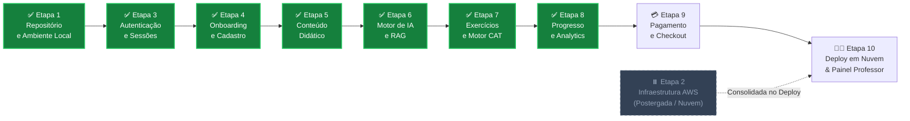
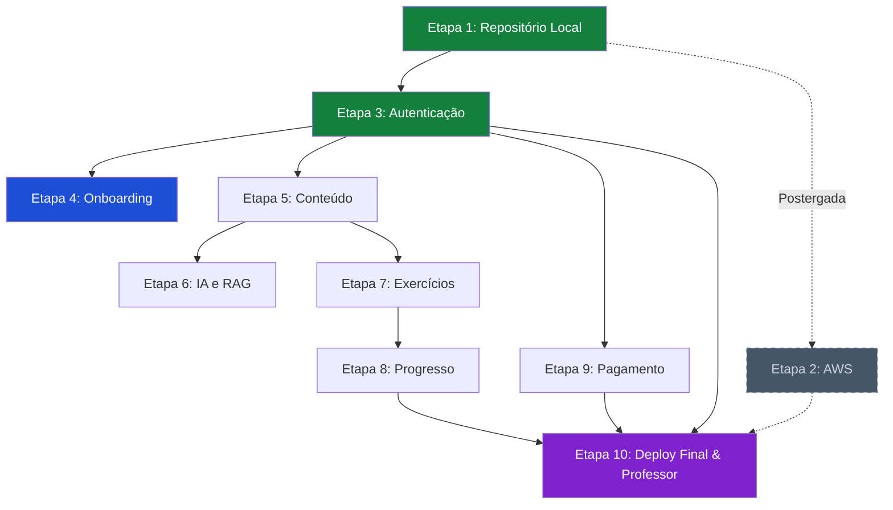

<!-- ai-summary
Plano de implementação completo em 10 etapas para construção da plataforma Tutor Inteligente.
Abordagem vertical (end-to-end por módulo): cada etapa entrega banco + backend + frontend testáveis.
Inclui tutoriais detalhados de AWS, Docker, Alembic, CI/CD e critérios de aceitação por etapa.
Stack: Next.js 14 + FastAPI + PostgreSQL 16 + Redis 7 + Gemini Flash + Asaas + AWS Free Tier.
-->

# Plano de Implementação

Roteiro completo e sequencial para a construção da plataforma **Tutor Inteligente**, organizado em **10 etapas verticais** (end-to-end). Cada etapa entrega uma fatia funcional testável no navegador.

---

## Filosofia de Construção

| Princípio | Descrição |
|:---|:---|
| **Vertical por Sprint** | Cada etapa entrega banco + backend + frontend de um módulo, resultando em funcionalidade visível |
| **Tutorial Detalhado** | Cada passo inclui comandos exatos, configurações e explicações para execução autônoma |
| **Critérios de Aceitação** | Toda etapa termina com uma checklist de testes que deve passar 100% antes de avançar |
| **Migrações Incrementais** | Alembic cria apenas as tabelas necessárias a cada etapa, sem carregar o schema inteiro |
| **Deploy Contínuo** | A partir da Etapa 2, cada mudança pode ser publicada na AWS com `git push` |

---

## Decisões Técnicas Consolidadas

| Decisão | Escolha |
|:---|:---|
| **Hospedagem de Código** | GitHub (repositório privado) + GitHub Actions para CI/CD |
| **Infraestrutura MVP** | AWS Free Tier: EC2 t3.micro + RDS PostgreSQL + S3 + CloudFront |
| **Migrações de Banco** | Alembic com SQLAlchemy (versionadas por etapa) |
| **Provedor de IA** | Gemini Flash (Google) — gratuito no MVP via `LLMFactory` |
| **Gateway de Pagamento** | Asaas (PIX dinâmico + Cartão de Crédito + Webhook) |
| **E-mail Transacional** | Amazon SES (links mágicos e notificações) |
| **Abordagem de Build** | Vertical end-to-end por módulo funcional |

---

## Mapa de Progresso das 10 Etapas

---

## Visão Geral das 10 Etapas

### [Etapa 1: Repositório e Ambiente Local](etapa-01-repositorio.md) — :white_check_mark: **Concluída**
**Duração estimada: 2-3 dias** | **Status:** `Concluída`

Criação do repositório GitHub, estrutura de pastas do Monorepo, migração dos docs para `docs-site/`, configuração do Docker Compose local, arquivo `.env`, e `docker compose up` funcional com os 4 containers saudáveis.

**Entregável:** `docker compose ps` mostrando 4 containers `healthy` no terminal local. [x] Concluído!

---

### [Etapa 2: Infraestrutura AWS](etapa-02-infraestrutura-aws.md) — :pause_button: **Postergada / Pulada**
**Duração estimada original: 3-5 dias** | **Status:** `Postergada para a Etapa 10 (Deploy Final)`

> [!NOTE]
> **Etapa Pulada no Ciclo de Desenvolvimento:** Para evitar custos desnecessários e dependência de cartão de crédito no início do projeto, o provisionamento de nuvem foi postergado. Todo o desenvolvimento e validação dos módulos (Etapas 3 a 9) ocorrerá de forma 100% autônoma no ambiente Docker local configurado na Etapa 1 (PostgreSQL 16 com pgvector, Redis 7, FastAPI e Next.js 14). O provisionamento em nuvem será realizado de forma consolidada no final, durante a Etapa 10.

**Entregável futuro:** Aplicação acessível via `https://seudominio.com.br` com certificado SSL válido.

---

### [Etapa 3: Autenticação e Sessões](etapa-03-autenticacao.md) — :white_check_mark: **Concluída**
**Duração estimada: 1-2 semanas** | **Status:** `Concluída`

Tabelas `usuarios`, `sessoes_ativas` e `tokens_recuperacao_senha`. Backend com login por e-mail/CPF, JWT com refresh token em cookie HTTP-Only, sessão única concorrente (heartbeat 30s no Redis), link mágico com SHA-256 e rate limiting. Frontend com telas de login, recuperação de senha, redefinição e modal de conflito concorrente, completamente aderente ao Design System institucional Khan Academy (Laranja `#F57C00` e fundos neutros).

**Entregável:** Login funcional no navegador com sessão única entre abas e design system institucional. [x] Concluído!

---

### [Etapa 4: Onboarding e Cadastro](etapa-04-onboarding.md) — :white_check_mark: **Concluída**
**Duração estimada: 1-2 semanas** | **Status:** `Concluída`

Wizard de 3 etapas (Identificação → Credenciais/Contato → Acadêmico/Endereço) com validação matemática de CPF (Módulo 11 em `app/core/validators.py`), consulta automática de CEP via ViaCEP, detecção de menor de idade e dados do responsável legal. Persistência de rascunho no Redis (TTL 48h). Frontend com wizard multi-step em `(auth)/cadastro` e máscaras de input. A prova de proficiência CAT é disparada no primeiro acesso a uma matéria (Etapa 7).

**Entregável:** Cadastro de novo aluno funcional, com dados salvos no PostgreSQL e redirect para o dashboard. [x] Concluído!

---

### [Etapa 5: Conteúdo Didático](etapa-05-conteudo.md) — :white_check_mark: **Concluída**
**Duração estimada: 1-2 semanas** | **Status:** `Concluída`

Tabelas `disciplinas`, `volumes_didaticos`, `capitulos`, `aulas`, `documentos_vetoriais_rag` (pgvector + índice HNSW), `heatmap_dominio` (Tabela 15) e `horas_estudo_diarias` (Tabela 17) — todas em uma única migração consolidada `003_content_tables`. Backend FastAPI com autenticação obrigatória em todas as rotas, navegação em árvore (`/skill-tree`, `/volumes`, `/capitulos`) com heatmap de domínio real por usuário (RN-PRG-012), aulas estruturadas em 4 blocos com fórmulas em KaTeX, bateria de fixação server-side (gabarito protegido, correção anti-trapaça) e trava de 60% de aproveitamento persistindo progresso (RN-CNT-010). Acervo de 11 volumes da coleção Gelson Iezzi baixado e auditado com 100% de legibilidade OCR em `backend/data/ebooks/`. Frontend Next.js 14 com Skill Tree interativa agrupada nas 4 Grandes Áreas com progresso real, tela de aula split-screen (65%/35%) com abas pedagógicas, chat socrático contextual com citações RAG, cronômetro de estudo ativo enviado ao servidor.

**Entregável:** Navegação pela Skill Tree e visualização de uma aula completa em 4 blocos no navegador. [x] Concluído!

---

### [Etapa 6: Motor de IA e RAG](etapa-06-ia-rag.md) — :white_check_mark: **Concluída**
**Duração estimada: 1-2 semanas** | **Status:** `Concluída`

Integração com Gemini Flash via `LLMFactory`, configuração do pgvector para busca semântica HNSW, implementação do Tutor Socrático em 3 estágios de ajuda, ingestão de embeddings dos volumes do Iezzi e chat em tempo real na tela de aula com suporte a KaTeX e FSM.

**Entregável:** Chat socrático funcional na tela de aula com respostas contextuais baseadas no volume do Iezzi. [x] Concluído!

---

### [Etapa 7: Exercícios e Motor CAT](etapa-07-exercicios.md) — :white_check_mark: **Concluída**
**Duração estimada: 1-2 semanas** | **Status:** `Concluída`

Tabelas `itens_exercicios`, `tentativas_exercicios`, `caixa_reforco` e `provas_cat` criadas via migração `004_exercise_tables`. Backend com bateria de fixação, lógica de 2ª chance (1.0 vs 0.5 vs 0.0), validação SymPy com sandbox segura e timeout de 5s, Caixa de Reforço, Questões Gêmeas paramétricas com distratores estruturados e Prova Adaptativa CAT com TRI 3PL + EAP Bayesiano e seleção MFI. Frontend Next.js 14 com `ExerciseCard` com KaTeX, feedback visual de tentativas e dicas socráticas, página de prova diagnóstica CAT com submissão cega e polígono de proficiência em Gráfico Radar com Recharts, e dashboard de revisão espaçada da Caixa de Reforço.

**Entregável:** Resolução de exercícios com 2ª chance, Caixa de Reforço e Prova CAT adaptativa funcionais. [x] Concluído!

---

### [Etapa 8: Progresso e Analytics](etapa-08-progresso.md) — :white_check_mark: **Concluída**
**Duração estimada: 1 semana** | **Status:** `Concluída`

Tabelas `heatmap_dominio`, `historico_theta` e `horas_estudo_diarias` com migração `005_progress_tables`. Backend com micro-ajuste estocástico do theta (TRI 3PL), métricas tridimensionais, Hub de Ação Top 3 e geração de Boletim PDF vetorial com ReportLab. Frontend com Heatmap visual dos 11 volumes, Gráfico Radar comparativo (entrada CAT vs atual), Timeline de Theta com linha de meta (+1.0) e download do PDF institucional.

**Entregável:** Dashboard de progresso completo com gráficos interativos e download de Boletim PDF. [x] Concluído!

---

### [Etapa 9: Pagamento e Checkout](etapa-09-pagamento.md)
**Duração estimada: 1-2 semanas**

Tabelas `matriculas_pagamentos` e `transacoes_financeiras`. Integração com gateway Asaas (conta Sandbox → Produção), geração de PIX dinâmico com QR Code, checkout transparente com cartão de crédito tokenizado, webhook com idempotência e `secrets.compare_digest`, cálculo de upgrade proporcional e vigência de 365 dias. Frontend com modal de checkout in-app, polling de status PIX e confirmação de pagamento.

**Entregável:** Compra de capítulo avulso via PIX e Cartão com ativação instantânea da matrícula.

---

### [Etapa 10: Painel do Professor e Deploy Final](etapa-10-professor-deploy.md)
**Duração estimada: 1-2 semanas**

Dashboard de Analytics demográfico com query agregada (zero N+1), dossiê de alunos, editor split-screen KaTeX para curadoria de conteúdo, modo Visão do Aluno e extrato financeiro. Configuração de CI/CD completo com GitHub Actions (testes + deploy automático na AWS), domínio final com SSL, monitoramento e documentação de operação.

**Entregável:** Plataforma completa em produção com domínio próprio, CI/CD ativo e todas as funcionalidades testadas.

---

## Dependências entre Etapas

> [!NOTE]
> As Etapas 5, 9 e 10 dependem apenas da Etapa 3 (Autenticação). Isso significa que, se precisar, um time maior pode paralelizar Conteúdo (5), Pagamento (9) e Onboarding (4) após a Etapa 3.

---

## Estimativa Total

| Cenário | Duração |
|:---|:---|
| **1 dev solo + IA (Antigravity)** | 10-14 semanas |
| **2 devs paralelos + IA** | 6-8 semanas |
| **3+ devs paralelos + IA** | 4-6 semanas |

> [!TIP]
> Com o Antigravity, cada etapa pode ser executada em sessões de trabalho focado onde o agente gera o código e você revisa, testa e ajusta. Isso pode reduzir significativamente os tempos estimados.
