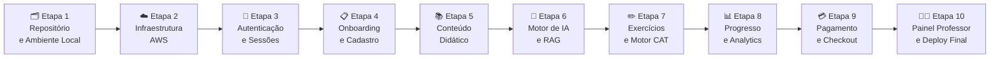
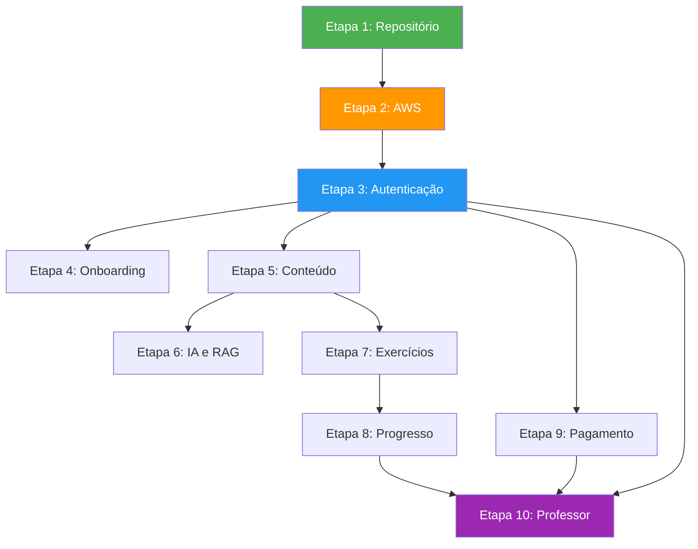

<!-- ai-summary
Plano de implementação completo em 10 etapas para construção da plataforma Tutor Inteligente.
Abordagem vertical (end-to-end por módulo): cada etapa entrega banco + backend + frontend testáveis.
Inclui tutoriais detalhados de AWS, Docker, Alembic, CI/CD e critérios de aceitação por etapa.
Stack: Next.js 14 + FastAPI + PostgreSQL 16 + Redis 7 + Gemini Flash + Asaas + AWS Free Tier.
-->

# Plano de Implementação

Roteiro completo e sequencial para a construção da plataforma **Tutor Inteligente**, organizado em **10 etapas verticais** (end-to-end). Cada etapa entrega uma fatia funcional testável no navegador.

---

## Filosofia de Construção

| Princípio | Descrição |
|:---|:---|
| **Vertical por Sprint** | Cada etapa entrega banco + backend + frontend de um módulo, resultando em funcionalidade visível |
| **Tutorial Detalhado** | Cada passo inclui comandos exatos, configurações e explicações para execução autônoma |
| **Critérios de Aceitação** | Toda etapa termina com uma checklist de testes que deve passar 100% antes de avançar |
| **Migrações Incrementais** | Alembic cria apenas as tabelas necessárias a cada etapa, sem carregar o schema inteiro |
| **Deploy Contínuo** | A partir da Etapa 2, cada mudança pode ser publicada na AWS com `git push` |

---

## Decisões Técnicas Consolidadas

| Decisão | Escolha |
|:---|:---|
| **Hospedagem de Código** | GitHub (repositório privado) + GitHub Actions para CI/CD |
| **Infraestrutura MVP** | AWS Free Tier: EC2 t3.micro + RDS PostgreSQL + S3 + CloudFront |
| **Migrações de Banco** | Alembic com SQLAlchemy (versionadas por etapa) |
| **Provedor de IA** | Gemini Flash (Google) — gratuito no MVP via `LLMFactory` |
| **Gateway de Pagamento** | Asaas (PIX dinâmico + Cartão de Crédito + Webhook) |
| **E-mail Transacional** | Amazon SES (links mágicos e notificações) |
| **Abordagem de Build** | Vertical end-to-end por módulo funcional |

---

## Mapa de Progresso das 10 Etapas

---

## Visão Geral das 10 Etapas

### [Etapa 1: Repositório e Ambiente Local](etapa-01-repositorio.md)
**Duração estimada: 2-3 dias**

Criação do repositório GitHub, estrutura de pastas do Monorepo, configuração do Docker Compose local, arquivo `.env`, e primeiro `docker compose up` funcional com os 4 containers saudáveis.

**Entregável:** `docker compose ps` mostrando 4 containers `healthy` no terminal local.

---

### [Etapa 2: Infraestrutura AWS](etapa-02-infraestrutura-aws.md)
**Duração estimada: 3-5 dias**

Tutorial passo a passo de criação da conta AWS, provisionamento da instância EC2, RDS PostgreSQL, bucket S3, distribuição CloudFront e configuração do domínio com Route 53. Inclui instalação de Docker na EC2 e primeiro deploy remoto.

**Entregável:** Aplicação acessível via `https://seudominio.com.br` com certificado SSL válido.

---

### [Etapa 3: Autenticação e Sessões](etapa-03-autenticacao.md)
**Duração estimada: 1-2 semanas**

Tabelas `usuarios`, `sessoes_ativas` e `tokens_recuperacao_senha`. Backend com login por e-mail/CPF, JWT com refresh token, sessão única concorrente (heartbeat 30s), link mágico com SHA-256, e rate limiting. Frontend com telas de login, redefinição de senha e modal de sessão concorrente.

**Entregável:** Login funcional no navegador com sessão única entre abas.

---

### [Etapa 4: Onboarding e Cadastro](etapa-04-onboarding.md)
**Duração estimada: 1-2 semanas**

Wizard de 3 etapas (Identificação → Credenciais/Contato → Acadêmico) com validação matemática de CPF, consulta automática de CEP via ViaCEP, detecção de menor de idade e dados do responsável legal. Persistência de rascunho no Redis. Frontend com wizard multi-step e máscaras de input.

**Entregável:** Cadastro de novo aluno funcional, com dados salvos no PostgreSQL e redirect para o dashboard.

---

### [Etapa 5: Conteúdo Didático](etapa-05-conteudo.md)
**Duração estimada: 1-2 semanas**

Tabelas `disciplinas`, `volumes_didaticos`, `capitulos`, `aulas` e `documentos_vetoriais_rag`. Backend para servir conteúdo estruturado em 4 blocos KaTeX. Frontend com Skill Tree visual dos 11 volumes, tela de aula split-screen 65%/35%, cronômetro de estudo ativo e conclusão de aula com trava de 60%.

**Entregável:** Navegação pela Skill Tree e visualização de uma aula completa em 4 blocos no navegador.

---

### [Etapa 6: Motor de IA e RAG](etapa-06-ia-rag.md)
**Duração estimada: 1-2 semanas**

Integração com Gemini Flash via `LLMFactory`, configuração do pgvector para busca semântica HNSW, implementação do Tutor Socrático em 3 estágios de ajuda, ingestão de embeddings dos volumes do Iezzi e chat em tempo real na tela de aula.

**Entregável:** Chat socrático funcional na tela de aula com respostas contextuais baseadas no volume do Iezzi.

---

### [Etapa 7: Exercícios e Motor CAT](etapa-07-exercicios.md)
**Duração estimada: 1-2 semanas**

Tabelas `itens_exercicios`, `tentativas_exercicios`, `caixa_reforco` e `provas_cat`. Backend com bateria de fixação, lógica de 2ª chance (1.0 vs 0.5), validação SymPy com sandbox segura, Caixa de Reforço, Questões Gêmeas por mutação paramétrica e Prova Adaptativa CAT com TRI 3PL + EAP. Frontend com interface KaTeX de exercícios, feedback visual e Prova Diagnóstica.

**Entregável:** Resolução de exercícios com 2ª chance, Caixa de Reforço e Prova CAT adaptativa funcionais.

---

### [Etapa 8: Progresso e Analytics](etapa-08-progresso.md)
**Duração estimada: 1 semana**

Tabelas `heatmap_dominio`, `historico_theta` e `horas_estudo_diarias`. Backend com micro-ajuste estocástico do theta, métricas tridimensionais, Hub de Ação Top 3 e geração de Boletim PDF com ReportLab. Frontend com Heatmap visual, Gráfico Radar comparativo (entrada CAT vs atual), Timeline de Theta e botão de download do PDF.

**Entregável:** Dashboard de progresso completo com gráficos interativos e download de Boletim PDF.

---

### [Etapa 9: Pagamento e Checkout](etapa-09-pagamento.md)
**Duração estimada: 1-2 semanas**

Tabelas `matriculas_pagamentos` e `transacoes_financeiras`. Integração com gateway Asaas (conta Sandbox → Produção), geração de PIX dinâmico com QR Code, checkout transparente com cartão de crédito tokenizado, webhook com idempotência e `secrets.compare_digest`, cálculo de upgrade proporcional e vigência de 365 dias. Frontend com modal de checkout in-app, polling de status PIX e confirmação de pagamento.

**Entregável:** Compra de capítulo avulso via PIX e Cartão com ativação instantânea da matrícula.

---

### [Etapa 10: Painel do Professor e Deploy Final](etapa-10-professor-deploy.md)
**Duração estimada: 1-2 semanas**

Dashboard de Analytics demográfico com query agregada (zero N+1), dossiê de alunos, editor split-screen KaTeX para curadoria de conteúdo, modo Visão do Aluno e extrato financeiro. Configuração de CI/CD completo com GitHub Actions (testes + deploy automático na AWS), domínio final com SSL, monitoramento e documentação de operação.

**Entregável:** Plataforma completa em produção com domínio próprio, CI/CD ativo e todas as funcionalidades testadas.

---

## Dependências entre Etapas

> [!NOTE]
> As Etapas 5, 9 e 10 dependem apenas da Etapa 3 (Autenticação). Isso significa que, se precisar, um time maior pode paralelizar Conteúdo (5), Pagamento (9) e Onboarding (4) após a Etapa 3.

---

## Estimativa Total

| Cenário | Duração |
|:---|:---|
| **1 dev solo + IA (Antigravity)** | 10-14 semanas |
| **2 devs paralelos + IA** | 6-8 semanas |
| **3+ devs paralelos + IA** | 4-6 semanas |

> [!TIP]
> Com o Antigravity, cada etapa pode ser executada em sessões de trabalho focado onde o agente gera o código e você revisa, testa e ajusta. Isso pode reduzir significativamente os tempos estimados.
