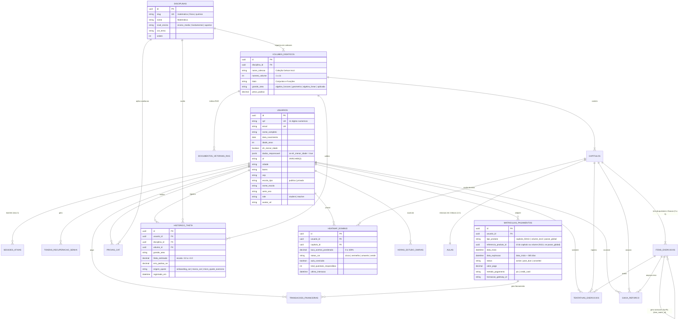
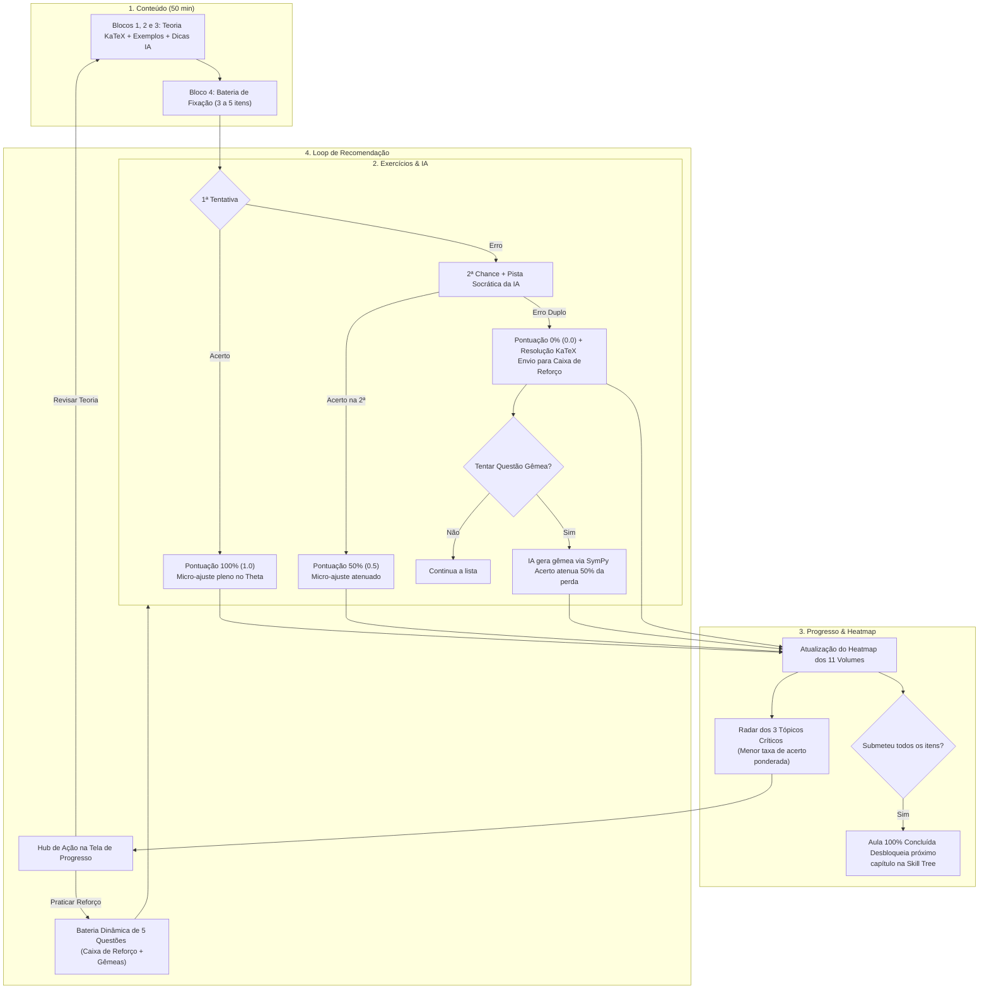
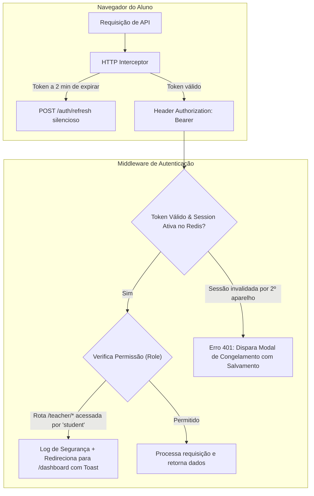

<!-- ai-summary
Arquitetura de dados, modelagem relacional e fluxo de integração inter-módulos da plataforma Tutor Inteligente.
Detalhamento do ciclo fechado da Tríade Pedagógica: Conteúdo (11 Volumes Iezzi) <-> Exercícios (CAT & Questões Gêmeas) <-> Progresso (TRI, Heatmap e Recomendações).
Diagrama de Entidade-Relacionamento (ERD) e ciclo de vida dos dados desde o Onboarding até a consolidação no Painel do Professor.
-->

# Arquitetura de Dados e Integração Inter-Módulos

Documentação técnica do fluxo de dados e relacionamentos entre os 8 módulos da plataforma **Tutor Inteligente**, com foco especial na integração da **Tríade Pedagógica**:

$$\text{Conteúdo (Iezzi \& 11 IAs)} \longleftrightarrow \text{Exercícios (CAT \& Questões Gêmeas)} \longleftrightarrow \text{Progresso (TRI } \theta \text{, Heatmap \& Recomendações)}$$

---

## 1. Diagrama de Entidade-Relacionamento (ERD)

A base de dados centraliza as informações cadastrais do **Onboarding**, os contratos comerciais de **Pagamento** e a trilha de aprendizagem contínua:



---

## 2. O Ciclo Fechado da Tríade Pedagógica

A aprendizagem do estudante opera em circuito fechado (*closed-loop learning*):



---

## 3. Regras Matemáticas de Integração Inter-Módulos

### 3.1 Ponderação da Taxa de Acertos do Capítulo
Para cada questão da bateria de fixação:

$$\text{Score}(q) = \begin{cases} 
1.0, & \text{se acertada na 1ª tentativa} \\ 
0.5, & \text{se acertada na 2ª tentativa (com auxílio de dica)} \\ 
0.0, & \text{se errada nas 2 tentativas} 
\end{cases}$$

A taxa ponderada de maestria do capítulo no Heatmap é dada por:

$$\text{Taxa Ponderada} (\%) = \left( \frac{\sum_{q=1}^{N} \text{Score}(q)}{N} \right) \times 100$$

### 3.2 Thresholds de Cores do Heatmap
- **Cinza (Neutro)**: $N < 3$ questões respondidas no capítulo.
- **Vermelho (Crítico)**: $N \ge 3$ e $\text{Taxa Ponderada} < 50\%$.
- **Amarelo (Em Desenvolvimento)**: $N \ge 3$ e $50\% \le \text{Taxa Ponderada} < 75\%$.
- **Verde (Consolidado)**: $N \ge 3$ e $\text{Taxa Ponderada} \ge 75\%$.

---

## 4. Integração com o Painel do Professor

Todos os eventos gerados pela Tríade Pedagógica são consumidos pelo **Painel do Professor**:
- **Filtro Demográfico**: Cruza a Taxa Ponderada com a Rede de Ensino (Pública vs Privada) e Região/UF do Onboarding.
- **Dossiê Individual**: O professor abre a Ficha do Aluno e inspeciona em quais capítulos o estudante solicitou mais Questões Gêmeas e quais estão arquivados na Caixa de Reforço.
- **Supervisão em Piloto Automático**: O professor acompanha o progresso e saúde da turma sem necessidade de intervenções manuais (conforme RN-PRF-008 e RN-PRF-018).

---

## 5. Arquitetura de Sessões, Segurança e Roteamento

A segurança de acesso e a proteção de rotas operam com validação distribuída em camadas. O controle de concorrência e presença adota uma **arquitetura híbrida**:
1. **Camada Volátil (Redis 7)**: Armazena a chave de presença `session:{usuario_id}:active` com **TTL de 45 segundos**, atualizada pelos heartbeats a cada 30 segundos (`useHeartbeat.ts`). Absorve a alta frequência sem onerar o banco de dados.
2. **Camada de Persistência (PostgreSQL)**: Mantém o registro auditável na tabela `sessoes_ativas` para histórico de conexões, geolocalização por IP e auditoria forense.



---

## 6. Dicionário de Dados e Esquema Físico das Tabelas (PostgreSQL 16)

Abaixo estão especificadas as **17 tabelas centrais** do banco de dados relacional e vetorial (`pgvector`), com chaves primárias em **UUID v4**, tipos de dados nativos, integridade referencial e índices.

### 6.1 Domínio 1: Autenticação, Usuários e Sessões

#### 1. Tabela `usuarios`
Centraliza o cadastro unificado de Alunos e Professores gerado no Onboarding.

```sql
CREATE TABLE usuarios (
    id UUID PRIMARY KEY DEFAULT gen_random_uuid(),
    cpf VARCHAR(11) UNIQUE NOT NULL,               -- 11 dígitos normalizados (apenas números)
    email VARCHAR(255) UNIQUE NOT NULL,
    senha_hash VARCHAR(255) NOT NULL,              -- bcrypt ou Argon2id
    nome_completo VARCHAR(255) NOT NULL,
    data_nascimento DATE NOT NULL,
    idade_anos INT NOT NULL,
    eh_menor_idade BOOLEAN NOT NULL DEFAULT FALSE, -- True se idade_anos < 18
    dados_responsavel JSONB,                       -- Obrigatório se eh_menor_idade = true
    uf VARCHAR(2) NOT NULL,
    cidade VARCHAR(100) NOT NULL,
    bairro VARCHAR(100),
    cep VARCHAR(8) NOT NULL,                       -- 8 dígitos numéricos (00000000)
    escola_tipo VARCHAR(50) NOT NULL,              -- 'publica' | 'privada'
    nome_escola VARCHAR(200),
    serie_ano VARCHAR(50) NOT NULL,                -- Validação dinâmica pela disciplina
    role VARCHAR(20) NOT NULL DEFAULT 'student',   -- 'student' | 'teacher'
    avatar_url TEXT,
    ativo BOOLEAN NOT NULL DEFAULT TRUE,
    criado_em TIMESTAMPTZ NOT NULL DEFAULT NOW(),
    atualizado_em TIMESTAMPTZ NOT NULL DEFAULT NOW()
);

CREATE INDEX idx_usuarios_cpf ON usuarios(cpf);
CREATE INDEX idx_usuarios_email ON usuarios(email);
CREATE INDEX idx_usuarios_role ON usuarios(role);
CREATE INDEX idx_usuarios_uf_cidade ON usuarios(uf, cidade);
```

#### 2. Tabela `sessoes_ativas`
Garante a regra de **1 sessão única concorrente por aluno**, permitindo congelamento e invalidação em tempo real.

```sql
CREATE TABLE sessoes_ativas (
    id UUID PRIMARY KEY DEFAULT gen_random_uuid(),
    usuario_id UUID NOT NULL REFERENCES usuarios(id) ON DELETE CASCADE,
    session_token VARCHAR(255) UNIQUE NOT NULL,
    refresh_token_hash VARCHAR(255) NOT NULL,
    ip_address VARCHAR(45) NOT NULL,
    user_agent TEXT,
    ultimo_heartbeat TIMESTAMPTZ NOT NULL DEFAULT NOW(),
    revogado BOOLEAN NOT NULL DEFAULT FALSE,
    criado_em TIMESTAMPTZ NOT NULL DEFAULT NOW()
);

CREATE INDEX idx_sessoes_usuario ON sessoes_ativas(usuario_id, revogado);
```

#### 3. Tabela `tokens_recuperacao_senha`
Tokens de uso único para recuperação por link mágico via e-mail (validade de 15 minutos).

```sql
CREATE TABLE tokens_recuperacao_senha (
    id UUID PRIMARY KEY DEFAULT gen_random_uuid(),
    usuario_id UUID NOT NULL REFERENCES usuarios(id) ON DELETE CASCADE,
    token_hash VARCHAR(255) UNIQUE NOT NULL,
    expira_em TIMESTAMPTZ NOT NULL,
    utilizado BOOLEAN NOT NULL DEFAULT FALSE,
    criado_em TIMESTAMPTZ NOT NULL DEFAULT NOW()
);
```

---

### 6.2 Domínio 2: Pagamentos e Acessos (Comercial)

#### 4. Tabela `matriculas_pagamentos`
Controla os produtos adquiridos, vigência de 12 meses (365 dias) e status de desbloqueio na Skill Tree.

```sql
CREATE TABLE matriculas_pagamentos (
    id UUID PRIMARY KEY DEFAULT gen_random_uuid(),
    usuario_id UUID NOT NULL REFERENCES usuarios(id) ON DELETE CASCADE,
    tipo_produto VARCHAR(30) NOT NULL,             -- 'capitulo_50min' | 'volume_iezzi' | 'passe_global'
    referencia_produto_id UUID,                    -- ID do capitulo ou volume adquirido
    data_inicio TIMESTAMPTZ NOT NULL DEFAULT NOW(),
    data_expiracao TIMESTAMPTZ NOT NULL,           -- data_inicio + INTERVAL '365 days'
    status VARCHAR(20) NOT NULL DEFAULT 'active',  -- 'active' | 'past_due' | 'canceled'
    valor_pago DECIMAL(10, 2) NOT NULL,
    metodo_pagamento VARCHAR(20) NOT NULL,         -- 'pix' | 'credit_card'
    transacao_gateway_id VARCHAR(100),
    criado_em TIMESTAMPTZ NOT NULL DEFAULT NOW()
);

CREATE INDEX idx_matriculas_usuario_produto ON matriculas_pagamentos(usuario_id, referencia_produto_id, status);
```

#### 5. Tabela `transacoes_financeiras`
Histórico auditável de pagamentos emitidos, taxas de gateway e conciliação bancária do professor.

```sql
CREATE TABLE transacoes_financeiras (
    id UUID PRIMARY KEY DEFAULT gen_random_uuid(),
    matricula_id UUID REFERENCES matriculas_pagamentos(id) ON DELETE SET NULL,
    usuario_id UUID NOT NULL REFERENCES usuarios(id),
    valor_bruto DECIMAL(10, 2) NOT NULL,
    taxa_gateway DECIMAL(10, 2) NOT NULL DEFAULT 0.00,
    valor_liquido DECIMAL(10, 2) NOT NULL,
    metodo VARCHAR(20) NOT NULL,
    status_transacao VARCHAR(30) NOT NULL,          -- 'paid' | 'waiting_payment' | 'refunded'
    gateway_payload JSONB,                          -- Retorno bruto do webhook (PIX endToEndId)
    pago_em TIMESTAMPTZ,
    criado_em TIMESTAMPTZ NOT NULL DEFAULT NOW()
);
```

---

### 6.3 Domínio 3: Conteúdo e Coleções Didáticas

#### 6. Tabela `disciplinas`
Permite escalabilidade nativa para qualquer matéria (Matemática, Física, Química) e nível de ensino (Ensino Médio, Fundamental, Superior).

```sql
CREATE TABLE disciplinas (
    id UUID PRIMARY KEY DEFAULT gen_random_uuid(),
    slug VARCHAR(50) UNIQUE NOT NULL,             -- 'matematica' | 'fisica' | 'quimica'
    nome VARCHAR(100) NOT NULL,                   -- 'Matemática'
    nivel_ensino VARCHAR(50) NOT NULL,            -- 'ensino_medio' | 'fundamental' | 'superior'
    icone VARCHAR(50) NOT NULL DEFAULT 'school',  -- Ícone Material Symbols
    cor_tema VARCHAR(20) NOT NULL DEFAULT '#F57C00',
    ordem INT NOT NULL,
    ativo BOOLEAN NOT NULL DEFAULT TRUE,
    criado_em TIMESTAMPTZ NOT NULL DEFAULT NOW()
);

CREATE INDEX idx_disciplinas_slug ON disciplinas(slug);
```

#### 7. Tabela `volumes_didaticos`
Organiza as coleções de livros ou apostilas associadas a uma disciplina. Na Matemática, hospeda os 11 volumes da coleção *Gelson Iezzi*.

```sql
CREATE TABLE volumes_didaticos (
    id UUID PRIMARY KEY DEFAULT gen_random_uuid(),
    disciplina_id UUID NOT NULL REFERENCES disciplinas(id) ON DELETE CASCADE,
    nome_colecao VARCHAR(150) NOT NULL,           -- 'Fundamentos de Matemática Elementar - Gelson Iezzi'
    numero_volume INT NOT NULL,                   -- 1 a 11 (ou 1 a 3 para Física)
    titulo VARCHAR(150) NOT NULL,                 -- Ex: 'Conjuntos e Funções'
    grande_area VARCHAR(50) NOT NULL,             -- Ex: 'algebra_funcoes' | 'geometria' | 'mecanica'
    ordem_exibicao INT NOT NULL,
    preco_padrao DECIMAL(10, 2) NOT NULL DEFAULT 49.90,
    ativo BOOLEAN NOT NULL DEFAULT TRUE,
    CONSTRAINT uk_volume_disciplina_numero UNIQUE (disciplina_id, numero_volume)
);

CREATE INDEX idx_volumes_disciplina ON volumes_didaticos(disciplina_id, ordem_exibicao);
```

#### 8. Tabela `capitulos`
Capítulos temáticos dos volumes, desenhados para sessões de 50 minutos.

```sql
CREATE TABLE capitulos (
    id UUID PRIMARY KEY DEFAULT gen_random_uuid(),
    volume_id UUID NOT NULL REFERENCES volumes_didaticos(id) ON DELETE CASCADE,
    numero_capitulo INT NOT NULL,
    titulo VARCHAR(200) NOT NULL,                  -- Ex: 'Função Quadrática e Parábola'
    tempo_estimado_min INT NOT NULL DEFAULT 50,
    preco_avulso DECIMAL(10, 2) NOT NULL DEFAULT 9.90,
    pre_requisitos_ids UUID[] DEFAULT '{}',        -- Array com IDs de capítulos recomendados
    ordem INT NOT NULL,
    criado_em TIMESTAMPTZ NOT NULL DEFAULT NOW()
);

CREATE INDEX idx_capitulos_volume ON capitulos(volume_id, ordem);
```

#### 9. Tabela `aulas`
Conteúdo pedagógico em 4 blocos estruturado com fórmulas KaTeX.

```sql
CREATE TABLE aulas (
    id UUID PRIMARY KEY DEFAULT gen_random_uuid(),
    capitulo_id UUID UNIQUE NOT NULL REFERENCES capitulos(id) ON DELETE CASCADE,
    bloco1_teoria_katex TEXT NOT NULL,             -- Conceito e Teoremas em KaTeX (10 min)
    bloco2_exemplos_katex TEXT NOT NULL,           -- Exemplos Resolvidos Passo a Passo (15 min)
    bloco3_dicas_ia TEXT NOT NULL,                 -- Dicas do Tutor Socrático e Pegadinhas (10 min)
    video_url TEXT,                                -- URL complementar no S3/Vimeo (opcional)
    publicado BOOLEAN NOT NULL DEFAULT TRUE,
    atualizado_por UUID REFERENCES usuarios(id),   -- ID do professor curador
    atualizado_em TIMESTAMPTZ NOT NULL DEFAULT NOW()
);
```

#### 10. Tabela `documentos_vetoriais_rag` (Extensão `pgvector`)
Base de conhecimento dos Agentes Especialistas de IA particionada por volume e disciplina.

```sql
-- Ativação da extensão de vetores
CREATE EXTENSION IF NOT EXISTS vector;

CREATE TABLE documentos_vetoriais_rag (
    id UUID PRIMARY KEY DEFAULT gen_random_uuid(),
    volume_id UUID NOT NULL REFERENCES volumes_didaticos(id) ON DELETE CASCADE,
    capitulo_id UUID REFERENCES capitulos(id) ON DELETE CASCADE,
    trecho_conteudo TEXT NOT NULL,                 -- Texto do livro e definições
    metadados JSONB NOT NULL DEFAULT '{}',         -- Número da página, teorema, autor
    embedding vector(768) NOT NULL,                -- Vetor denso 768d (Google text-embedding-004 gratuito)
    criado_em TIMESTAMPTZ NOT NULL DEFAULT NOW()
);

-- Índice HNSW com distância cosseno para busca sub-5ms
CREATE INDEX idx_rag_embedding_hnsw 
ON documentos_vetoriais_rag 
USING hnsw (embedding vector_cosine_ops);

CREATE INDEX idx_rag_volume ON documentos_vetoriais_rag(volume_id);
```

---

### 6.4 Domínio 4: Exercícios, Provas CAT e Avaliações

#### 11. Tabela `itens_exercicios`
Banco de questões do Iezzi e Questões Gêmeas geradas por IA.

```sql
CREATE TABLE itens_exercicios (
    id UUID PRIMARY KEY DEFAULT gen_random_uuid(),
    capitulo_id UUID NOT NULL REFERENCES capitulos(id) ON DELETE CASCADE,
    tipo_origem VARCHAR(30) NOT NULL DEFAULT 'iezzi_original', -- 'iezzi_original' | 'gemea_ia'
    item_matriz_id UUID REFERENCES itens_exercicios(id),       -- Aponta para a matriz se for gêmea
    enunciado_katex TEXT NOT NULL,
    alternativas JSONB NOT NULL,                               -- [{"letra": "A", "texto": "...", "correta": false}, ...]
    resposta_correta VARCHAR(5) NOT NULL,                      -- 'A' | 'B' | 'C' | 'D' | 'E'
    resolucao_passo_a_passo TEXT NOT NULL,
    parametro_a DECIMAL(6, 3) NOT NULL DEFAULT 1.000,          -- Discriminação da TRI
    parametro_b DECIMAL(6, 3) NOT NULL DEFAULT 0.000,          -- Dificuldade da TRI (escala -3 a +3)
    parametro_c DECIMAL(6, 3) NOT NULL DEFAULT 0.200,          -- Acerto casual (20% para 5 alternativas)
    metadados_sympy JSONB,                                     -- Expressão simbólica determinística
    validado_sympy BOOLEAN NOT NULL DEFAULT TRUE,
    ativo BOOLEAN NOT NULL DEFAULT TRUE,
    criado_em TIMESTAMPTZ NOT NULL DEFAULT NOW()
);

CREATE INDEX idx_itens_capitulo ON itens_exercicios(capitulo_id, ativo);
```

#### 12. Tabela `tentativas_exercicios`
Registro de todas as submissões dos estudantes, alimentando a pontuação ponderada.

```sql
CREATE TABLE tentativas_exercicios (
    id UUID PRIMARY KEY DEFAULT gen_random_uuid(),
    usuario_id UUID NOT NULL REFERENCES usuarios(id) ON DELETE CASCADE,
    item_id UUID NOT NULL REFERENCES itens_exercicios(id) ON DELETE CASCADE,
    capitulo_id UUID NOT NULL REFERENCES capitulos(id),
    tentativa_numero INT NOT NULL,                             -- 1 ou 2
    resposta_enviada VARCHAR(5) NOT NULL,
    acertou BOOLEAN NOT NULL,
    pontuacao_obtida DECIMAL(3, 1) NOT NULL,                   -- 1.0 (1ª tent) | 0.5 (2ª tent com dica) | 0.0 (erro)
    usou_dica_ia BOOLEAN NOT NULL DEFAULT FALSE,
    tempo_resposta_segundos INT NOT NULL,
    criado_em TIMESTAMPTZ NOT NULL DEFAULT NOW()
);

CREATE INDEX idx_tentativas_usuario_capitulo ON tentativas_exercicios(usuario_id, capitulo_id);
```

#### 13. Tabela `caixa_reforco`
Itens com erro duplo arquivados para revisão e treinos de reforço dinâmicos.

```sql
CREATE TABLE caixa_reforco (
    id UUID PRIMARY KEY DEFAULT gen_random_uuid(),
    usuario_id UUID NOT NULL REFERENCES usuarios(id) ON DELETE CASCADE,
    item_id UUID NOT NULL REFERENCES itens_exercicios(id) ON DELETE CASCADE,
    capitulo_id UUID NOT NULL REFERENCES capitulos(id),
    total_erros INT NOT NULL DEFAULT 1,
    status VARCHAR(20) NOT NULL DEFAULT 'pendente',            -- 'pendente' | 'superado'
    arquivado_em TIMESTAMPTZ NOT NULL DEFAULT NOW(),
    superado_em TIMESTAMPTZ
);

CREATE INDEX idx_caixa_reforco_pendente ON caixa_reforco(usuario_id, status);
```

#### 14. Tabela `provas_cat`
Sessões de Prova Adaptativa (Onboarding e marcos periódicos de 7 dias) vinculadas à disciplina.

```sql
CREATE TABLE provas_cat (
    id UUID PRIMARY KEY DEFAULT gen_random_uuid(),
    usuario_id UUID NOT NULL REFERENCES usuarios(id) ON DELETE CASCADE,
    disciplina_id UUID NOT NULL REFERENCES disciplinas(id) ON DELETE CASCADE,
    tipo_prova VARCHAR(30) NOT NULL,                           -- 'onboarding_diagnostico' | 'marco_periodico'
    theta_geral DECIMAL(6, 3) NOT NULL,
    erro_padrao_se DECIMAL(6, 3) NOT NULL,
    scores_grandes_areas JSONB NOT NULL,                       -- {"algebra": 0.45, "geometria": -0.20, ...}
    total_itens_aplicados INT NOT NULL,
    itens_respondidos_ids UUID[] NOT NULL DEFAULT '{}',
    iniciado_em TIMESTAMPTZ NOT NULL DEFAULT NOW(),
    finalizado_em TIMESTAMPTZ
);

CREATE INDEX idx_provas_cat_usuario_disciplina ON provas_cat(usuario_id, disciplina_id);
```

---

### 6.5 Domínio 5: Progresso, Desempenho e Analytics

#### 15. Tabela `heatmap_dominio`
Consolida o estado do Heatmap dos volumes por estudante e capítulo.

```sql
CREATE TABLE heatmap_dominio (
    id UUID PRIMARY KEY DEFAULT gen_random_uuid(),
    usuario_id UUID NOT NULL REFERENCES usuarios(id) ON DELETE CASCADE,
    capitulo_id UUID NOT NULL REFERENCES capitulos(id) ON DELETE CASCADE,
    total_questoes_respondidas INT NOT NULL DEFAULT 0,
    taxa_acertos_ponderada DECIMAL(5, 2) NOT NULL DEFAULT 0.00,-- 0.00 a 100.00%
    status_cor VARCHAR(20) NOT NULL DEFAULT 'cinza',            -- 'cinza' | 'vermelho' | 'amarelo' | 'verde'
    aula_concluida BOOLEAN NOT NULL DEFAULT FALSE,
    ultima_interacao TIMESTAMPTZ NOT NULL DEFAULT NOW(),
    CONSTRAINT uk_heatmap_usuario_capitulo UNIQUE (usuario_id, capitulo_id)
);

CREATE INDEX idx_heatmap_usuario ON heatmap_dominio(usuario_id);
```

#### 16. Tabela `historico_theta`
Série temporal da evolução psicométrica do estudante ($\theta$) por disciplina e volume.

```sql
CREATE TABLE historico_theta (
    id UUID PRIMARY KEY DEFAULT gen_random_uuid(),
    usuario_id UUID NOT NULL REFERENCES usuarios(id) ON DELETE CASCADE,
    disciplina_id UUID NOT NULL REFERENCES disciplinas(id) ON DELETE CASCADE,
    volume_id UUID REFERENCES volumes_didaticos(id) ON DELETE SET NULL,
    grande_area VARCHAR(50) NOT NULL,                          -- 4 slugs canônicos + 'geral' (theta global da prova CAT)
    theta_estimado DECIMAL(6, 3) NOT NULL,                     -- Escala contínua de -3.000 a +3.000
    erro_padrao_se DECIMAL(6, 3) NOT NULL,
    origem_ajuste VARCHAR(40) NOT NULL,                        -- 'onboarding_cat' | 'marco_cat' | 'micro_ajuste_exercicio'
    registrado_em TIMESTAMPTZ NOT NULL DEFAULT NOW()
);

CREATE INDEX idx_historico_theta_usuario_disciplina ON historico_theta(usuario_id, disciplina_id, registrado_em);
```

#### 17. Tabela `horas_estudo_diarias`
Métricas de tempo líquido de estudo ativo para cálculo de streaks e relatórios.

```sql
CREATE TABLE horas_estudo_diarias (
    id UUID PRIMARY KEY DEFAULT gen_random_uuid(),
    usuario_id UUID NOT NULL REFERENCES usuarios(id) ON DELETE CASCADE,
    data_registro DATE NOT NULL,
    segundos_ativos INT NOT NULL DEFAULT 0,                    -- Tempo líquido sem inatividade (>3min pausa)
    aulas_concluidas INT NOT NULL DEFAULT 0,
    exercicios_submetidos INT NOT NULL DEFAULT 0,
    CONSTRAINT uk_horas_usuario_data UNIQUE (usuario_id, data_registro)
);

CREATE INDEX idx_horas_estudo_usuario ON horas_estudo_diarias(usuario_id, data_registro);
```

