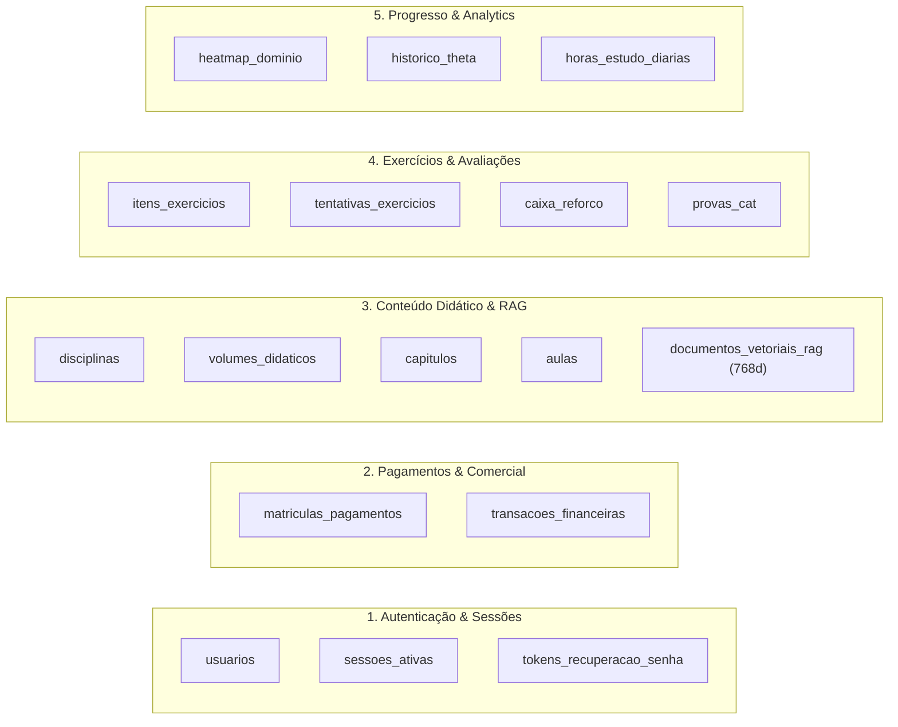

<!-- ai-summary
Catálogo completo e modularizado das 17 tabelas físicas do banco de dados relacional e vetorial PostgreSQL 16 + pgvector.
Divisão por domínios: Autenticação (3), Pagamentos (2), Conteúdo (5), Exercícios (4) e Progresso (3).
-->

# Dicionário Físico de Dados (17 Tabelas)

Este diretório contém a documentação física detalhada de cada uma das **17 tabelas** que compõem o banco de dados da plataforma **Tutor Inteligente**, executado em container Docker oficial do **PostgreSQL 16 com a extensão `pgvector`**.

---

## Estrutura por Domínios de Negócio

---

## Catálogo de Páginas das Tabelas

### 1. Autenticação, Usuários e Sessões
- [Tabela 01: `usuarios`](01-usuarios.md) — Cadastro central de alunos e professores, CPF, idade e menoridade.
- [Tabela 02: `sessoes_ativas`](02-sessoes-ativas.md) — Controle de 1 dispositivo concorrente por aluno e heartbeat.
- [Tabela 03: `tokens_recuperacao_senha`](03-tokens-recuperacao.md) — Links mágicos temporários (15 min) para redefinição.

### 2. Pagamentos e Acessos (Comercial)
- [Tabela 04: `matriculas_pagamentos`](04-matriculas-pagamentos.md) — Controle de vigência (365 dias) de capítulos, volumes e passes.
- [Tabela 05: `transacoes_financeiras`](05-transacoes-financeiras.md) — Extrato contábil auditável com taxas de gateway (Asaas/MercadoPago).

### 3. Conteúdo e Coleções Didáticas
- [Tabela 06: `disciplinas`](06-disciplinas.md) — Matérias (Matemática ativa no MVP; Física/Química prontas) e níveis de ensino.
- [Tabela 07: `volumes_didaticos`](07-volumes-didaticos.md) — Coleções didáticas (11 volumes da Coleção Gelson Iezzi ativos).
- [Tabela 08: `capitulos`](08-capitulos.md) — Capítulos estruturados para 50 minutos com árvore de pré-requisitos.
- [Tabela 09: `aulas`](09-aulas.md) — Conteúdo pedagógico em 4 blocos estruturado com fórmulas KaTeX.
- [Tabela 10: `documentos_vetoriais_rag`](10-documentos-vetoriais-rag.md) — Base de vetores 768d (Google Gemini text-embedding-004 gratuito).

### 4. Exercícios, Provas CAT e Avaliações
- [Tabela 11: `itens_exercicios`](11-itens-exercicios.md) — Banco de questões em KaTeX, parâmetros TRI ($a, b, c$) e metadados SymPy.
- [Tabela 12: `tentativas_exercicios`](12-tentativas-exercicios.md) — Submissões com lógica de 2ª chance e pontuação ponderada (1.0 vs 0.5).
- [Tabela 13: `caixa_reforco`](13-caixa-reforco.md) — Arquivamento automático de erros duplos para treinos adaptativos.
- [Tabela 14: `provas_cat`](14-provas-cat.md) — Sessões da Prova Adaptativa isoladas por disciplina.

### 5. Progresso, Desempenho e Analytics
- [Tabela 15: `heatmap_dominio`](15-heatmap-dominio.md) — Estado das 4 cores de maestria por capítulo e volume.
- [Tabela 16: `historico_theta`](16-historico-theta.md) — Série temporal contínua da evolução psicométrica ($\theta$) por disciplina.
- [Tabela 17: `horas_estudo_diarias`](17-horas-estudo-diarias.md) — Métricas de tempo líquido ativo (com pausa em inatividade > 3 min).
