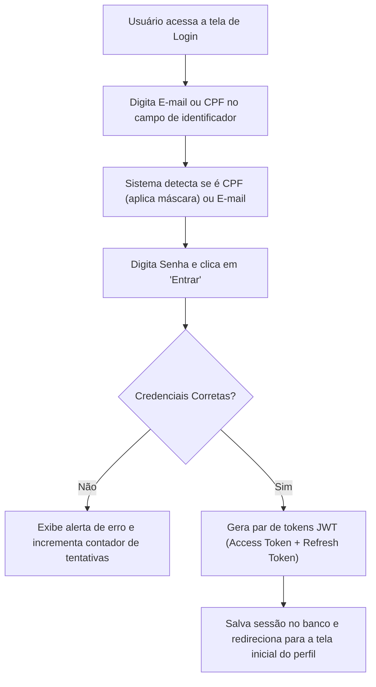

# 1. Login por E-mail ou CPF e Cadastro

### 1.1 Fluxo de Entrada Híbrido

```mermaid
flowchart TD
    A["Usuário acessa a tela de Login"] --> B["Digita E-mail ou CPF no campo de identificador"]
    B --> C["Sistema detecta se é CPF (aplica máscara) ou E-mail"]
    
    C --> D["Digita Senha e clica em 'Entrar'"]
    D --> E{"Credenciais Corretas?"}
    
    E -->|Não| F["Exibe alerta de erro e incrementa contador de tentativas"]
    E -->|Sim| G["Gera par de tokens JWT (Access Token + Refresh Token)"]
    G --> H["Salva sessão no banco e redireciona para a tela inicial do perfil"]
```
