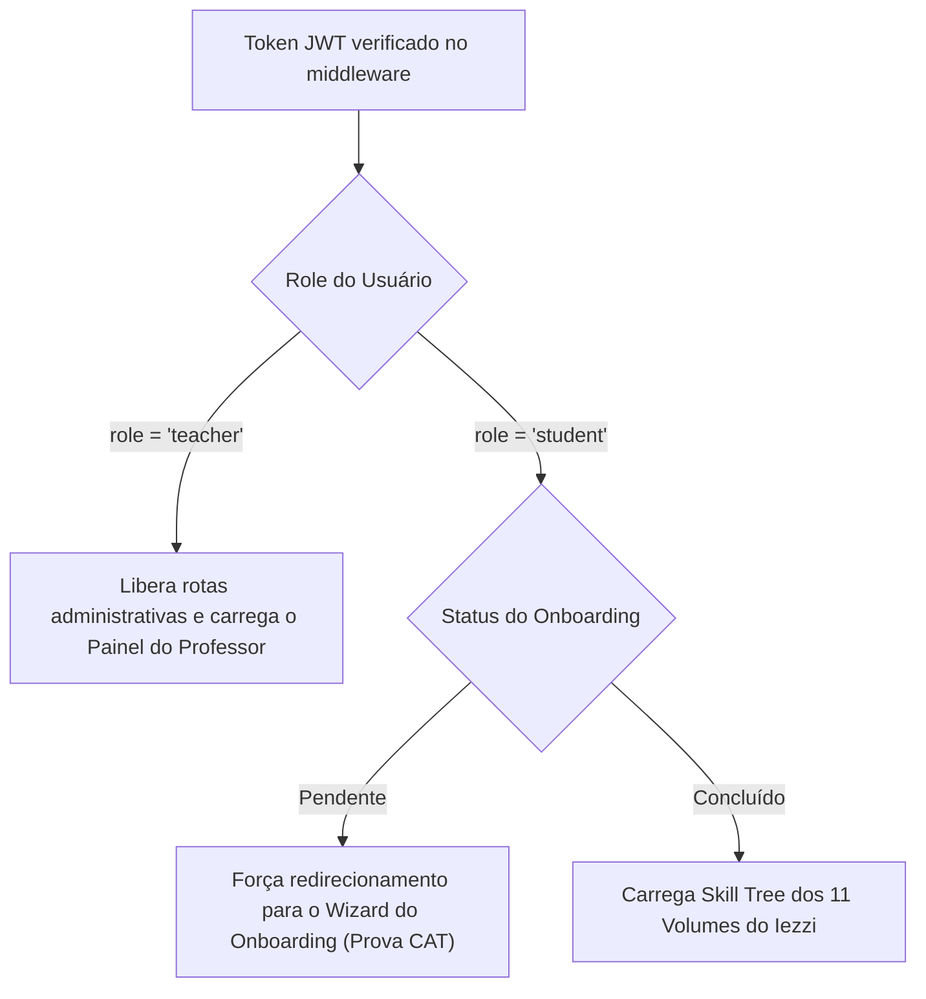

# 2. Perfis de Usuário e Roteamento de Interface

### 2.1 Separação de Acessos

```mermaid
flowchart TD
    A["Token JWT verificado no middleware"] --> B{"Role do Usuário"}
    
    B -->|"role = 'teacher'"| C["Libera rotas administrativas e carrega o Painel do Professor"]
    
    B -->|"role = 'student'"| D{"Status do Onboarding"}
    D -->|"Pendente"| E["Força redirecionamento para o Wizard do Onboarding (Prova CAT)"]
    D -->|"Concluído"| F["Carrega Skill Tree dos 11 Volumes do Iezzi"]
```
