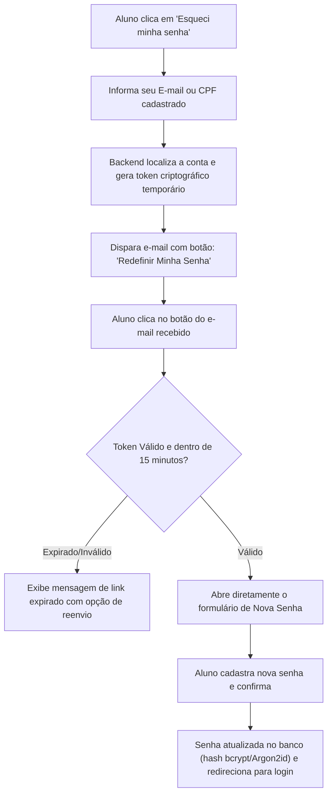

# 4. Recuperação de Senha por Link Mágico

### 4.1 Fluxo de Redefinição sem Código

```mermaid
flowchart TD
    A["Aluno clica em 'Esqueci minha senha'"] --> B["Informa seu E-mail ou CPF cadastrado"]
    B --> C["Backend localiza a conta e gera token criptográfico temporário"]
    
    C --> D["Dispara e-mail com botão: 'Redefinir Minha Senha'"]
    D --> E["Aluno clica no botão do e-mail recebido"]
    
    E --> F{"Token Válido e dentro de 15 minutos?"}
    F -->|Expirado/Inválido| G["Exibe mensagem de link expirado com opção de reenvio"]
    F -->|Válido| H["Abre diretamente o formulário de Nova Senha"]
    
    H --> I["Aluno cadastra nova senha e confirma"]
    I --> J["Senha atualizada no banco (hash bcrypt/Argon2id) e redireciona para login"]
```
