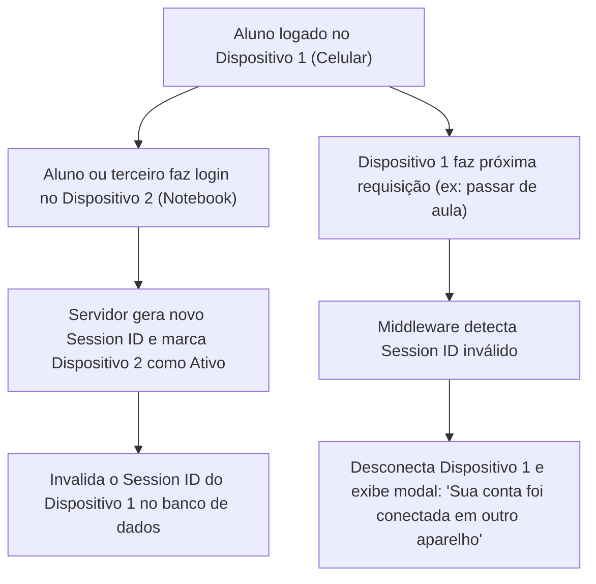

# 3. Controle de Sessão Única Concorrente

### 3.1 Prevenção de Compartilhamento de Contas

```mermaid
flowchart TD
    A["Aluno logado no Dispositivo 1 (Celular)"] --> B["Aluno ou terceiro faz login no Dispositivo 2 (Notebook)"]
    
    B --> C["Servidor gera novo Session ID e marca Dispositivo 2 como Ativo"]
    C --> D["Invalida o Session ID do Dispositivo 1 no banco de dados"]
    
    A --> E["Dispositivo 1 faz próxima requisição (ex: passar de aula)"]
    E --> F["Middleware detecta Session ID inválido"]
    F --> G["Desconecta Dispositivo 1 e exibe modal: 'Sua conta foi conectada em outro aparelho'"]
```
