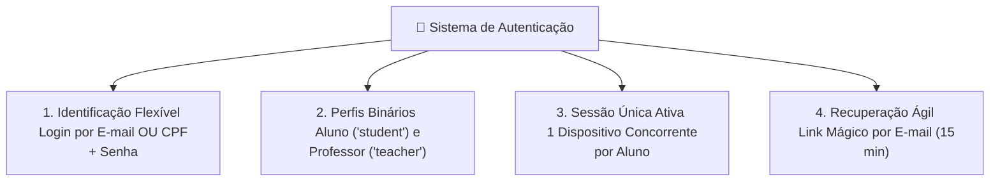
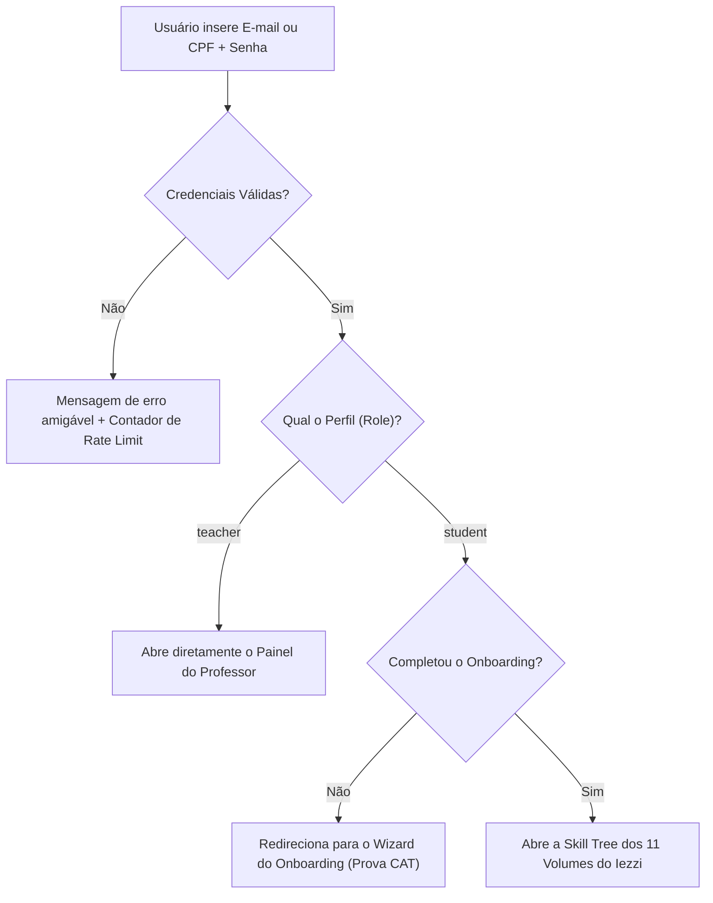
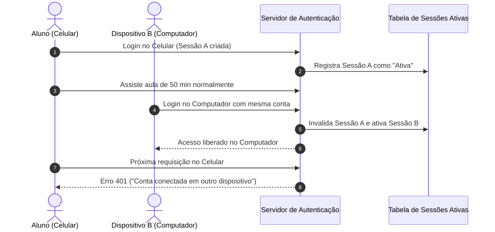
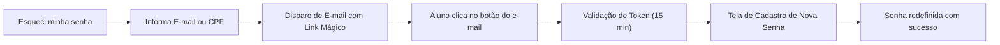

<!-- ai-summary
Módulo Autenticação. Sistema de controle de acesso, identificação e segurança de sessões do Tutor Inteligente.
Login híbrido por E-mail ou CPF + Senha.
2 perfis de usuário: Aluno (`student`) e Professor (`teacher`).
Controle de 1 sessão ativa concorrente por aluno (desconexão automática do dispositivo anterior para evitar rateio de contas pagas).
Recuperação de senha via Link Mágico enviado por e-mail com token temporário de 15 minutos.
Segurança com hash criptográfico seguro (bcrypt/Argon2id), Rate Limiting contra força bruta e JWT com cookies HTTP-Only.
-->

# Autenticação

Documentação do sistema de identificação de usuários, gerenciamento de perfis (`student` e `teacher`), controle de sessões simultâneas e segurança de credenciais do **Tutor Inteligente**.

---

## 1. Pilares de Autenticação e Segurança

O módulo de Autenticação garante acesso ágil e proteção contra compartilhamento indevido de contas:

| Pilar | Descrição | Regra Chave |
|:---|:---|:---|
| **Login por E-mail ou CPF** | Facilidade de entrada para estudantes brasileiros | Validação de formato e máscara automática |
| **Dois Níveis de Acesso** | Separação entre interface de estudo e painel gestor | `student` (Aulas/Exercícios) e `teacher` (Gestão Total) |
| **Sessão Única Concorrente** | Proteção contra rateio de contas pagas | Desconecta automaticamente o aparelho anterior |
| **Link Mágico por E-mail** | Redefinição de senha sem atrito | Token criptografado de uso único válido por 15 min |

---

## 2. Fluxo de Entrada e Roteamento Inteligente

Após autenticar com sucesso, o sistema direciona o usuário conforme seu perfil e status no Onboarding:

---

## 3. Política de 1 Dispositivo Concorrente

Para proteger o modelo comercial de venda por capítulos e volumes:

---

## 4. Recuperação de Senha por Link Mágico

Fluxo sem atrito para redefinição segura de credenciais:

---

## 5. Navegação nas Seções Detalhadas

| Seção | Descrição |
|:---|:---|
| [Fluxo](flow/index.md) | Diagramas de login por CPF/E-mail, roteamento de perfis, sessão única e link mágico |
| [Regras de Negócio](business-rules/index.md) | Especificação das regras RN-AUT-001 a RN-AUT-020 (validação de CPF, roles, tokens e antifraude) |
