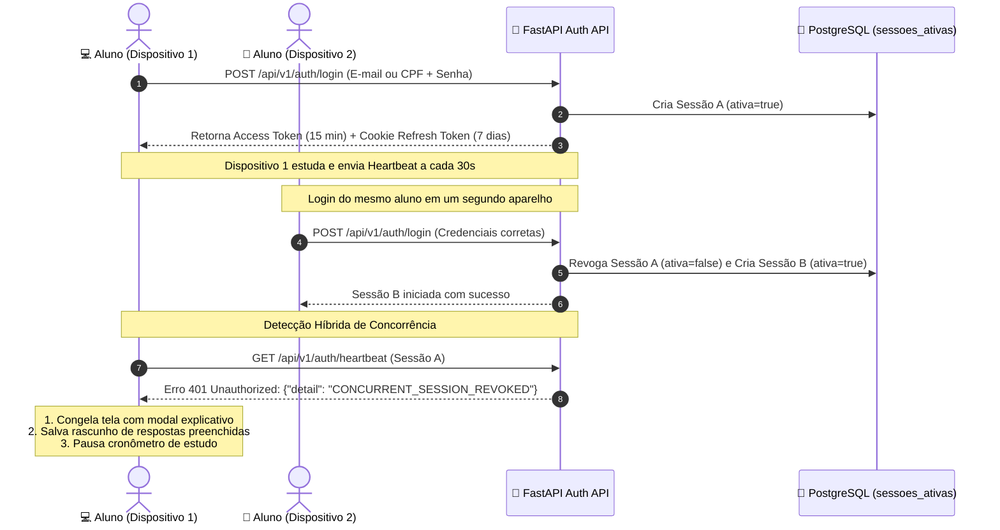

<!-- ai-summary
Hub de protótipos de código do módulo de Autenticação e Segurança.
Implementações técnicas de referência em Python 3.11 (FastAPI, PyJWT, Argon2id) e TypeScript:
1. Schemas e DTOs (Pydantic v2).
2. Gestão de Sessão Única e Heartbeat (Desconexão Concorrente).
3. Serviço de Tokens JWT e Rotação de Refresh Token (Silent Refresh).
4. Endpoints REST da API FastAPI.
-->

# Autenticação — Protótipos de Código e Segurança

Esta seção reúne as implementações de referência e o código-fonte executável do subsistema de segurança, autenticação híbrida (E-mail/CPF), controle de **sessão única concorrente** e tokens criptográficos da plataforma **Tutor Inteligente**.

---

## Estrutura dos Protótipos Técnicos

| Documento | Escopo Técnico | Linguagem / Stack |
|:---|:---|:---:|
| [1. Schemas & DTOs](schemas.md) | Contratos tipados de login flexível, par de tokens, recuperação de senha e tipos TypeScript | **Pydantic v2 / TypeScript** |
| [2. Gestão de Sessão Única](session-manager.md) | Invalidação atômica de sessões anteriores, heartbeat de 30s e salvamento de rascunho | **Python / FastAPI / SQLAlchemy** |
| [3. Serviço JWT & Silent Refresh](jwt-service.md) | Emissão de Access Token (15 min), Refresh Token seguro (7 dias em cookie HTTP-Only) e rotação | **Python / PyJWT / Cryptography** |
| [4. Endpoints da API FastAPI](endpoints.md) | Rotas assíncronas de login, refresh, logout, heartbeat e link mágico | **FastAPI / Python** |

---

## Fluxo de Autenticação e Desconexão Concorrente

