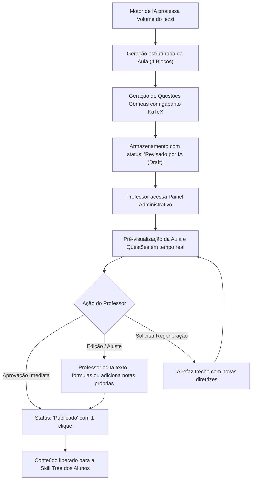

# 4. Curadoria Docente (Human-in-the-Loop)

### 4.1 Ciclo de Geração e Aprovação de Conteúdo

```mermaid
flowchart TD
    A["Motor de IA processa Volume do Iezzi"] --> B["Geração estruturada da Aula (4 Blocos)"]
    B --> C["Geração de Questões Gêmeas com gabarito KaTeX"]
    C --> D["Armazenamento com status: 'Revisado por IA (Draft)'"]
    
    D --> E["Professor acessa Painel Administrativo"]
    E --> F["Pré-visualização da Aula e Questões em tempo real"]
    
    F --> G{"Ação do Professor"}
    G -->|"Aprovação Imediata"| H["Status: 'Publicado' com 1 clique"]
    G -->|"Edição / Ajuste"| I["Professor edita texto, fórmulas ou adiciona notas próprias"]
    G -->|"Solicitar Regeneração"| J["IA refaz trecho com novas diretrizes"]
    
    I --> H
    J --> F
    H --> K["Conteúdo liberado para a Skill Tree dos Alunos"]
```
