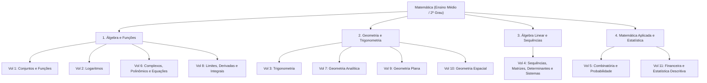
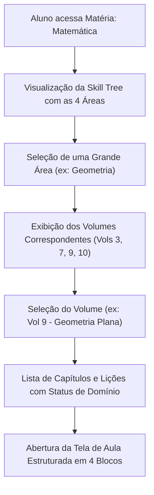

# 1. Estrutura e Mapeamento da Coleção Iezzi

### 1.1 Hierarquia de Conteúdo

A plataforma estrutura o conhecimento em uma árvore multinível que conecta a coleção física à interface do aluno:

### 1.2 Navegação do Aluno na Skill Tree

