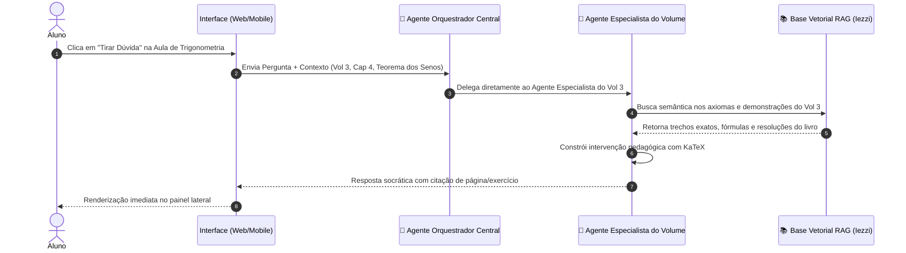
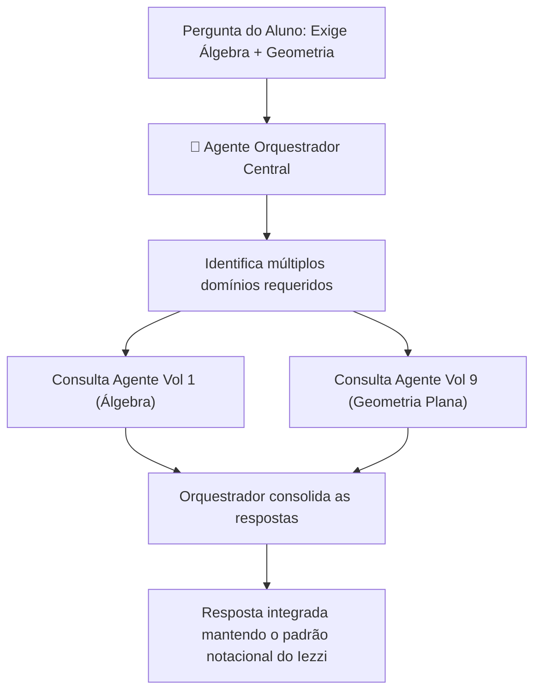

# 2. Arquitetura Multi-Agente e RAG

### 2.1 Roteamento Inteligente de Dúvidas

```mermaid
sequenceDiagram
    autonumber
    actor Aluno
    participant Interface as Interface (Web/Mobile)
    participant Orquestrador as 🤖 Agente Orquestrador Central
    participant AgenteVol as 🤖 Agente Especialista do Volume
    participant VectorDB as 📚 Base Vetorial RAG (Iezzi)
    
    Aluno->>Interface: Clica em "Tirar Dúvida" na Aula de Trigonometria
    Interface->>Orquestrador: Envia Pergunta + Contexto (Vol 3, Cap 4, Teorema dos Senos)
    Orquestrador->>AgenteVol: Delega diretamente ao Agente Especialista do Vol 3
    AgenteVol->>VectorDB: Busca semântica nos axiomas e demonstrações do Vol 3
    VectorDB-->>AgenteVol: Retorna trechos exatos, fórmulas e resoluções do livro
    AgenteVol->>AgenteVol: Constrói intervenção pedagógica com KaTeX
    AgenteVol-->>Interface: Resposta socrática com citação de página/exercício
    Interface-->>Aluno: Renderização imediata no painel lateral
```

### 2.2 Tratamento de Dúvidas Interdisciplinares

```mermaid
flowchart TD
    A["Pergunta do Aluno: Exige Álgebra + Geometria"] --> B["🤖 Agente Orquestrador Central"]
    B --> C["Identifica múltiplos domínios requeridos"]
    C --> D["Consulta Agente Vol 1 (Álgebra)"]
    C --> E["Consulta Agente Vol 9 (Geometria Plana)"]
    D --> F["Orquestrador consolida as respostas"]
    E --> F
    F --> G["Resposta integrada mantendo o padrão notacional do Iezzi"]
```
