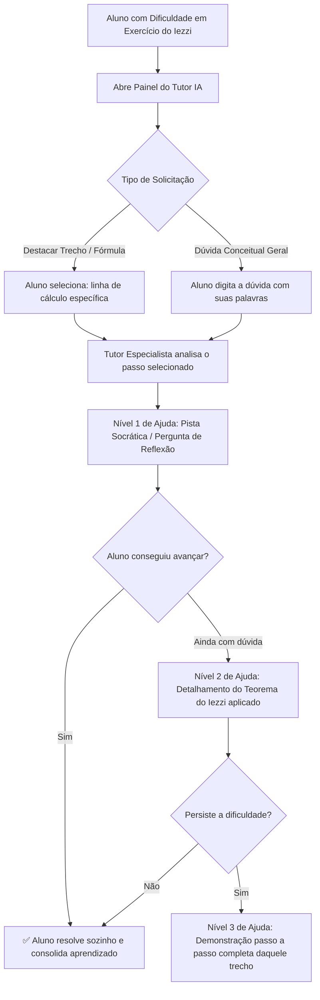

# 3. Experiência de Tira-Dúvidas e Tutor Socrático

### 3.1 Interação Guiada e Pistas Graduais

```mermaid
flowchart TD
    A["Aluno com Dificuldade em Exercício do Iezzi"] --> B["Abre Painel do Tutor IA"]
    B --> C{"Tipo de Solicitação"}
    
    C -->|"Destacar Trecho / Fórmula"| D["Aluno seleciona: linha de cálculo específica"]
    C -->|"Dúvida Conceitual Geral"| E["Aluno digita a dúvida com suas palavras"]
    
    D --> F["Tutor Especialista analisa o passo selecionado"]
    E --> F
    
    F --> G["Nível 1 de Ajuda: Pista Socrática / Pergunta de Reflexão"]
    G --> H{"Aluno conseguiu avançar?"}
    
    H -->|Sim| I["✅ Aluno resolve sozinho e consolida aprendizado"]
    H -->|Ainda com dúvida| J["Nível 2 de Ajuda: Detalhamento do Teorema do Iezzi aplicado"]
    
    J --> K{"Persiste a dificuldade?"}
    K -->|Sim| L["Nível 3 de Ajuda: Demonstração passo a passo completa daquele trecho"]
    K -->|Não| I
```
