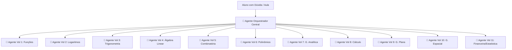
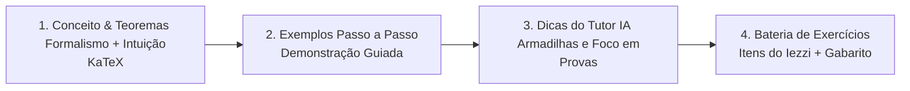

<!-- ai-summary
Módulo Conteúdo. Plataforma EAD de Matemática com geração e tutoria assistida por IA baseada integralmente na coleção clássica Fundamentos de Matemática Elementar (Gelson Iezzi - 11 volumes).
Divisão em 4 grandes áreas didáticas:
1. Álgebra e Funções (Volumes 1, 2, 6 e 8)
2. Geometria e Trigonometria (Volumes 3, 7, 9 e 10)
3. Álgebra Linear e Sequências (Volume 4)
4. Matemática Aplicada, Combinatória e Estatística (Volumes 5 e 11)
Arquitetura Multi-Agente de IA: 11 Agentes Especialistas (1 por Volume) + 1 Agente Orquestrador Central.
Aulas em 4 blocos: Conceito & Teoremas (KaTeX), Exemplos Passo a Passo, Dicas do Tutor IA, Bateria de Fixação.
Tutor Socrático Contextual com seleção de fórmulas e pistas graduais.
Banco oficial do Iezzi + Gerador de Questões Gêmeas por IA.
Curadoria Human-in-the-loop (Draft & Publish) para o professor.
-->

# Conteúdo

Documentação completa da arquitetura pedagógica, mapeamento bibliográfico e motor de Inteligência Artificial para geração de aulas, exercícios e tutoria do **Tutor Inteligente**.

---

## 1. Fonte Bibliográfica Central: Coleção Iezzi

Todo o conteúdo conceitual, formalismo matemático, progressão de tópicos e banco de exercícios da plataforma derivam da consagrada coleção **Fundamentos de Matemática Elementar (FME)**, coordenada por **Gelson Iezzi** (11 volumes).

```
Coleção Fundamentos de Matemática Elementar (11 Volumes)
├── Vol 1: Conjuntos e Funções
├── Vol 2: Logaritmos
├── Vol 3: Trigonometria
├── Vol 4: Sequências, Matrizes, Determinantes e Sistemas
├── Vol 5: Combinatória e Probabilidade
├── Vol 6: Complexos, Polinômios e Equações
├── Vol 7: Geometria Analítica
├── Vol 8: Limites, Derivadas e Noções de Integral
├── Vol 9: Geometria Plana
├── Vol 10: Geometria Espacial
└── Vol 11: Matemática Financeira e Estatística Descritiva
```

---

## 2. Mapeamento nas 4 Grandes Áreas Didáticas

Para proporcionar uma navegação fluida e intuitiva na **Skill Tree (Árvore de Habilidades)**, os 11 volumes são agrupados em **4 Grandes Áreas**:

| Grande Área | Volumes Correspondentes | Temas Centrais |
|:---|:---|:---|
| **Álgebra e Funções** | **Vol. 1**, **Vol. 2**, **Vol. 6** e **Vol. 8** | Conjuntos, Funções Elementares, Logaritmos, Números Complexos, Polinômios, Equações Algébricas e Introdução ao Cálculo |
| **Geometria e Trigonometria** | **Vol. 3**, **Vol. 7**, **Vol. 9** e **Vol. 10** | Trigonometria Circular, Geometria Analítica no Plano, Geometria Euclidiana Plana e Geometria Espacial Métrica/Posição |
| **Álgebra Linear e Sequências** | **Vol. 4** | Progressões (PA/PG), Matrizes, Teoria dos Determinantes e Resolução/Classificação de Sistemas Lineares |
| **Matemática Aplicada e Estatística** | **Vol. 5** e **Vol. 11** | Princípio Fundamental da Contagem, Análise Combinatória, Probabilidade, Matemática Financeira e Estatística Descritiva |

---

## 3. Arquitetura de Inteligência Artificial: 11 Agentes Especialistas

A plataforma adota um ecossistema **Multi-Agente Especializado** com bases vetoriais independentes (RAG - *Retrieval-Augmented Generation*):



### Benefícios da Especialização:
- **Zero Alucinação Cruzada**: O agente de Geometria Espacial não confunde notações com Análise Combinatória.
- **Rigor Terminológico e Notacional**: Fórmulas renderizadas com precisão cirúrgica em KaTeX.
- **Citação Formal de Páginas e Teoremas**: Respostas que referenciam diretamente os capítulos e exercícios do livro.

---

## 4. Estrutura Padrão de Cada Lição (4 Blocos)

Toda aula gerada e disponibilizada aos alunos respeita rigorosamente a estrutura pedagógica em 4 blocos:



---

## 5. Tira-Dúvidas Socrático & Questões Gêmeas

1. **Tutor Socrático Contextual**: Integrado à barra lateral das aulas e exercícios. O aluno pode selecionar qualquer fórmula matemática e pedir auxílio. A IA fornece dicas progressivas em vez de apenas entregar a resposta final pronta.
2. **Banco Oficial + Questões Gêmeas**: Além de todo o acervo original de questões do Iezzi, a IA gera variações paramétricas calibradas com o mesmo raciocínio para permitir treino contínuo.
3. **Curadoria do Professor**: Fluxo *Draft & Publish* no Painel Administrativo, garantindo total controle docente sobre o acervo.

---

## 6. Navegação nas Seções Detalhadas

| Seção | Descrição |
|:---|:---|
| [Fluxo](flow/index.md) | Mapeamento dos 11 volumes, arquitetura multi-agente, experiência do tutor socrático e fluxo de curadoria |
| [Regras de Negócio](business-rules/index.md) | Especificação das regras RN-CNT-001 a RN-CNT-020 (RAG, KaTeX, prompts dos agentes e curadoria) |
