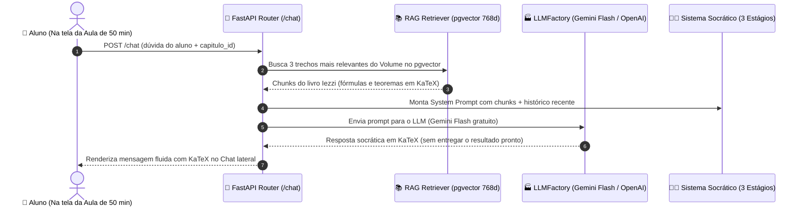

<!-- ai-summary
Hub de protótipos de código do módulo de Conteúdo & Inteligência Artificial.
Implementações técnicas de referência em Python 3.11 (FastAPI, Google GenAI SDK, LangChain, pgvector):
1. Schemas e DTOs de Chat e RAG (Pydantic v2).
2. Fábrica de LLM Desacoplada (Gemini Flash Gratuito no MVP + Suporte a OpenAI/Claude).
3. Motor RAG Particionado por Volume (pgvector 768d com text-embedding-004).
4. Prompt Socrático em 3 Estágios com Mediação Pedagógica.
5. Endpoints REST da API FastAPI.
-->

# Conteúdo — Protótipos de Código e IA Socrática

Esta seção reúne as implementações de referência e o código-fonte executável do subsistema de **Inteligência Artificial**, **RAG particionado por volume da coleção Iezzi** e o **Tutor Socrático em 3 Estágios** da plataforma **Tutor Inteligente**.

---

## Estratégia de IA: MVP 100% Gratuito com Escalabilidade Pluggable

- **MVP com Custo Zero**: O sistema utiliza no lançamento a API gratuita do **Google Gemini (Gemini Flash)** e o modelo de embeddings **Google text-embedding-004** (768 dimensões) via Google AI Studio (limite generoso de requisições gratuitas diárias).
- **Arquitetura Desacoplada (`LLMFactory`)**: Todo o código consome uma interface unificada. Quando a operação escalar comercialmente, a troca para modelos pagos (como OpenAI GPT-4o ou Anthropic Claude 3.5 Sonnet) é realizada **alterando apenas a variável `LLM_PROVIDER` no `.env`**, sem modificar nenhuma linha de código pedagógico ou de RAG.

---

## Estrutura dos Protótipos Técnicos

| Documento | Escopo Técnico | Linguagem / Provedor |
|:---|:---|:---:|
| [1. Schemas & DTOs](schemas.md) | Contratos de conversação com o tutor, requisições de dicas e chunks de RAG | **Pydantic v2 / TypeScript** |
| [2. Fábrica de LLM Desacoplada](llm-factory.md) | Provedor Gemini Flash gratuito com fallback configurável para OpenAI/Claude | **Python / Google GenAI / LangChain** |
| [3. Motor RAG em pgvector](rag-engine.md) | Busca semântica HNSW particionada pelo volume ativo com `vector(768)` | **Python / SQLAlchemy / pgvector** |
| [4. Prompt do Tutor Socrático](socratic-tutor.md) | Engenharia de prompts com mediação em 3 níveis (pergunta, pista, passo guiado) | **Prompt Engineering / KaTeX** |
| [5. Endpoints da API FastAPI](endpoints.md) | Rotas assíncronas para diálogo pedagógico e solicitação de pistas socráticas | **FastAPI / Python** |

---

## Arquitetura do Circuito Fechado de IA

