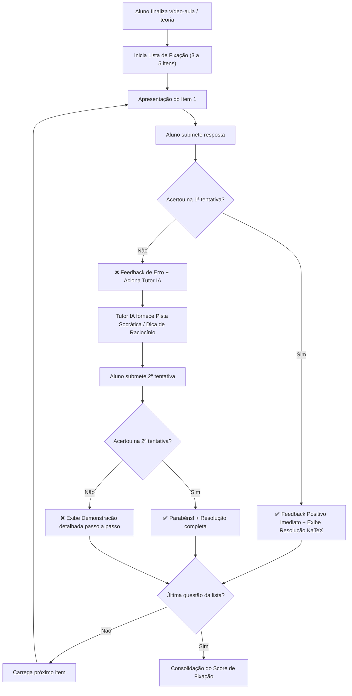
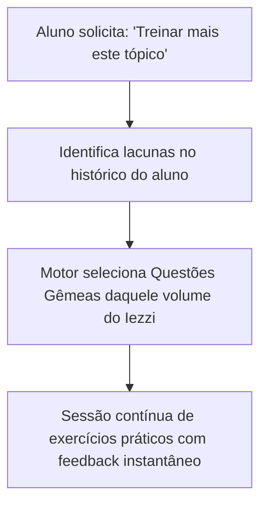

# 2. Modos de Prática e Resolução

### 2.1 Lista de Fixação de Aula (2ª Chance Assistida)

```mermaid
flowchart TD
    A["Aluno finaliza vídeo-aula / teoria"] --> B["Inicia Lista de Fixação (3 a 5 itens)"]
    B --> C["Apresentação do Item 1"]
    C --> D["Aluno submete resposta"]
    D --> E{"Acertou na 1ª tentativa?"}
    
    E -->|Sim| F["✅ Feedback Positivo imediato + Exibe Resolução KaTeX"]
    E -->|Não| G["❌ Feedback de Erro + Aciona Tutor IA"]
    
    G --> H["Tutor IA fornece Pista Socrática / Dica de Raciocínio"]
    H --> I["Aluno submete 2ª tentativa"]
    
    I --> J{"Acertou na 2ª tentativa?"}
    J -->|Sim| K["✅ Parabéns! + Resolução completa"]
    J -->|Não| L["❌ Exibe Demonstração detalhada passo a passo"]
    
    F --> M{"Última questão da lista?"}
    K --> M
    L --> M
    
    M -->|Não| N["Carrega próximo item"]
    N --> C
    M -->|Sim| O["Consolidação do Score de Fixação"]
```

### 2.2 Treino de Reforço por IA

```mermaid
flowchart TD
    A["Aluno solicita: 'Treinar mais este tópico'"] --> B["Identifica lacunas no histórico do aluno"]
    B --> C["Motor seleciona Questões Gêmeas daquele volume do Iezzi"]
    C --> D["Sessão contínua de exercícios práticos com feedback instantâneo"]
```
