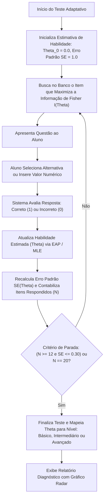

# 1. Motor Adaptativo (Computerized Adaptive Testing)

### 1.1 Ciclo de Execução do CAT

### 1.2 Curva de Informação do Item (Fisher Information)

O algoritmo busca sempre o item $i$ que fornece a máxima informação no ponto $\theta$:

$$I_i(\theta) = \frac{D^2 a_i^2 (1 - c_i) P_i(\theta) [1 - P_i(\theta)]}{[P_i(\theta) - c_i]^2}$$
