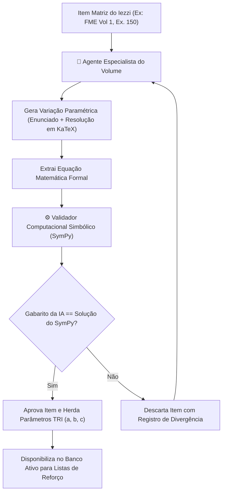

# 3. Pipeline de Geração e Validação de Questões Gêmeas

### 3.1 Arquitetura com Validação Simbólica

```mermaid
flowchart TD
    A["Item Matriz do Iezzi (Ex: FME Vol 1, Ex. 150)"] --> B["🤖 Agente Especialista do Volume"]
    B --> C["Gera Variação Paramétrica (Enunciado + Resolução em KaTeX)"]
    C --> D["Extrai Equação Matemática Formal"]
    D --> E["⚙️ Validador Computacional Simbólico (SymPy)"]
    
    E --> F{"Gabarito da IA == Solução do SymPy?"}
    F -->|Sim| G["Aprova Item e Herda Parâmetros TRI (a, b, c)"]
    F -->|Não| H["Descarta Item com Registro de Divergência"]
    H --> B
    G --> I["Disponibiliza no Banco Ativo para Listas de Reforço"]
```
