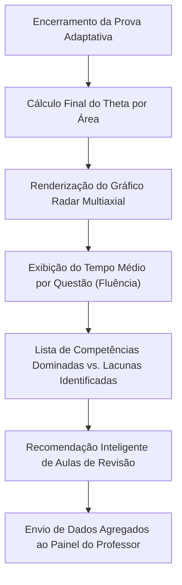

# 4. Relatórios Analíticos e Métricas de Desempenho

### 4.1 Síntese Pós-Avaliação

```mermaid
flowchart TD
    A["Encerramento da Prova Adaptativa"] --> B["Cálculo Final do Theta por Área"]
    B --> C["Renderização do Gráfico Radar Multiaxial"]
    C --> D["Exibição do Tempo Médio por Questão (Fluência)"]
    D --> E["Lista de Competências Dominadas vs. Lacunas Identificadas"]
    E --> F["Recomendação Inteligente de Aulas de Revisão"]
    F --> G["Envio de Dados Agregados ao Painel do Professor"]
```
