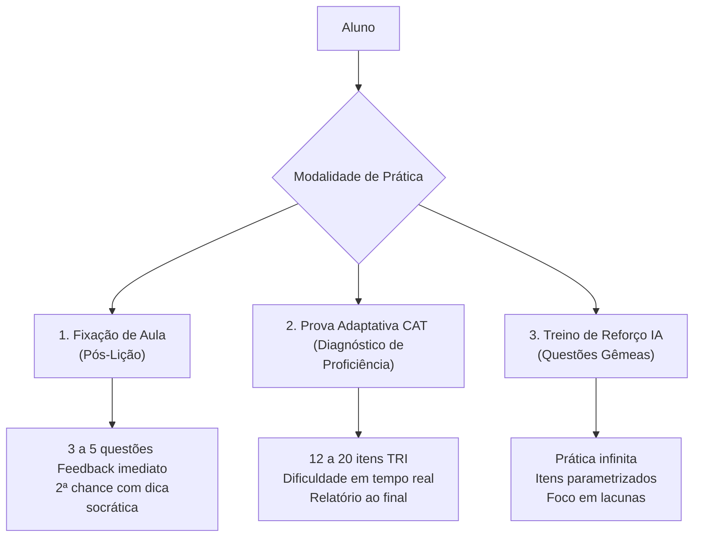
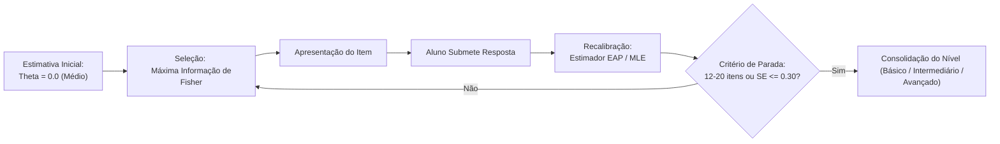
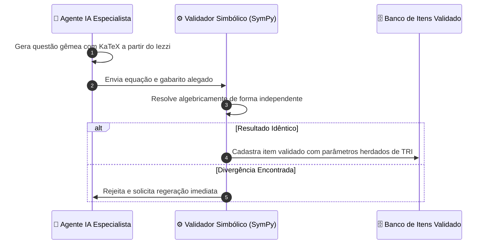

<!-- ai-summary
Módulo Exercícios / Avaliações. Motor de avaliação adaptativa e prática de Matemática do 2º Grau baseado na coleção Iezzi.
3 modos de avaliação e prática:
1. Lista de Fixação de Aula (3 a 5 itens, feedback instantâneo, 2ª chance com dica socrática).
2. Prova Diagnóstica Adaptativa (CAT por TRI 2PL/3PL, seleção por Máxima Informação de Fisher, critério de parada híbrido de 12 a 20 questões).
3. Treino Personalizado / Reforço por IA (Questões Gêmeas focadas em lacunas do aluno).
Geração de Questões Gêmeas com Dupla Validação: LLM Especialista + Validador Simbólico Computacional (SymPy).
Mapeamento de Habilidade (Theta): Básico (Theta < -0.5), Intermediário (-0.5 a +1.0), Avançado (Theta > +1.0).
Correção automática com tolerância numérica e renderização KaTeX.
Roadmap: Simulados de Grandes Vestibulares (ENEM/FUVEST/ITA) e Desafio Diário.
-->

# Exercícios / Avaliações

Documentação do sistema de avaliações, motor adaptativo computadorizado (**CAT - Computerized Adaptive Testing**), geração de questões gêmeas e banco de itens matemáticos do **Tutor Inteligente**.

---

## 1. Modos de Prática e Avaliação

A plataforma oferece 3 modalidades de interação com exercícios:

| Modalidade | Objetivo | Dinâmica | Feedback |
|:---|:---|:---|:---|
| **Lista de Fixação** | Consolidar a teoria recém-estudada no capítulo | 3 a 5 itens do Iezzi | Imediato (com 2ª chance assistida) |
| **Prova Adaptativa (CAT)** | Diagnosticar o nível de proficiência ($\theta$) na área | 12 a 20 itens calibrados | Ao final (relatório completo) |
| **Treino de Reforço** | Sanar dificuldades em tópicos específicos | Questões gêmeas ilimitadas | Imediato com resolução KaTeX |

---

## 2. O Motor Adaptativo: CAT & Teoria de Resposta ao Item (TRI)

A prova adaptativa implementa o padrão ouro internacional de psicometria educacional (**TRI 2PL/3PL**):

$$\text{Probabilidade de Acerto: } P_i(\theta) = c_i + \frac{1 - c_i}{1 + e^{-D a_i (\theta - b_i)}}$$

### Parâmetros e Mapeamento de Níveis

- **Dificuldade ($b$)**: Calibrada na escala $-3.0$ a $+3.0$.
- **Discriminação ($a$)**: Capacidade do item de distinguir faixas de domínio.
- **Acerto Casual ($c$)**: Parâmetro de probabilidade de acerto ao acaso em itens de múltipla escolha.

| Faixa de Habilidade ($\theta$) | Nível de Proficiência | Classificação Pedagógica |
|:---|:---|:---|
| $\theta < -0.50$ | **Básico** | Requer reforço em fundamentos e pré-requisitos |
| $-0.50 \le \theta \le +1.00$ | **Intermediário** | Domínio operacional dos conceitos centrais |
| $\theta > +1.00$ | **Avançado** | Domínio pleno, apto a itens complexos de vestibulares |

---

## 3. Geração de Questões Gêmeas & Dupla Validação

Para permitir treino infinito sem risco de alucinação algébrica, a geração por IA utiliza um pipeline com **computação simbólica determinística**:

---

## 4. Navegação nas Seções Detalhadas

| Seção | Descrição |
|:---|:---|
| [Fluxo](flow/index.md) | Diagramas do motor CAT, ciclo de fixação, pipeline de validação e relatórios de desempenho |
| [Regras de Negócio](business-rules/index.md) | Especificação detalhada das regras RN-EXE-001 a RN-EXE-020 (TRI, parada do CAT, KaTeX e tolerâncias) |
