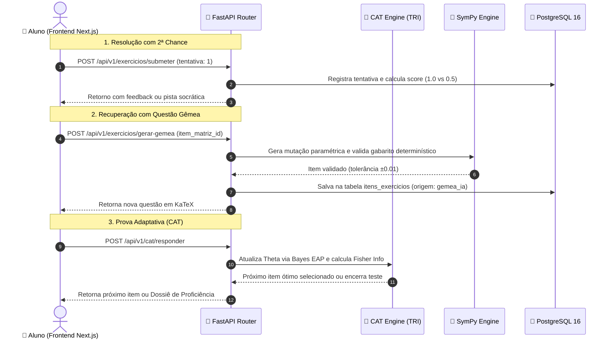

<!-- ai-summary
Hub de protótipos de código do módulo de Exercícios / Avaliações.
Implementações técnicas de referência em Python 3.11 (FastAPI, SymPy, NumPy/SciPy) e TypeScript:
1. Schemas e DTOs (Pydantic v2).
2. Motor Psicométrico CAT (TRI 2PL/3PL, Fisher Info, Estimador EAP).
3. Validador Determinístico de Álgebra e Gerador de Questões Gêmeas com SymPy.
4. Endpoints REST da API FastAPI.
-->

# Exercícios — Protótipos de Código e Algoritmos

Esta seção reúne as implementações de referência e o código-fonte executável do núcleo de avaliação adaptativa e computação simbólica da plataforma **Tutor Inteligente**.

---

## Estrutura dos Protótipos Técnicos

| Documento | Escopo Técnico | Linguagem / Stack |
|:---|:---|:---:|
| [1. Schemas & DTOs](schemas.md) | Modelos de dados de entrada/saída, validação de itens KaTeX e submissão ponderada | **Pydantic v2 / TypeScript** |
| [2. Motor Psicométrico CAT](cat-engine.md) | Equações da TRI (2PL/3PL), seleção por Máxima Informação de Fisher e estimativa EAP | **Python / NumPy / SciPy** |
| [3. Validador Algébrico SymPy](sympy-validator.md) | Parser LaTeX, checagem determinística de gabarito e mutação paramétrica de Questões Gêmeas | **Python / SymPy** |
| [4. Endpoints da API FastAPI](endpoints.md) | Rotas REST assíncronas para submissão, sessões adaptativas e geração de gêmeas | **FastAPI / Python** |

---

## Fluxo de Execução Técnica

