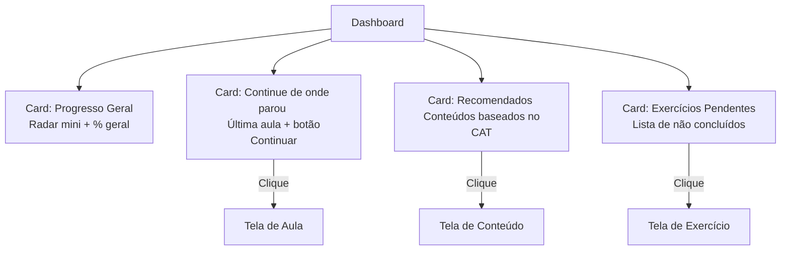
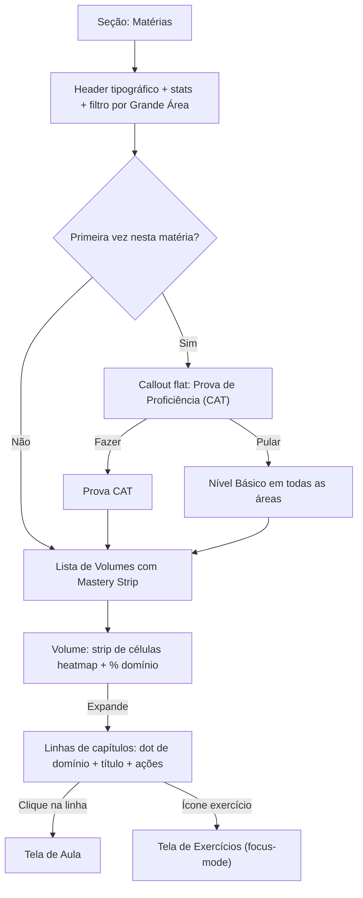
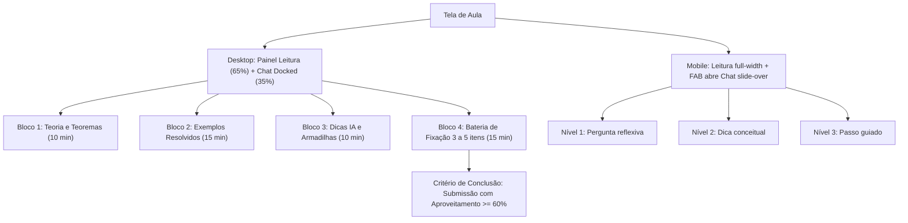
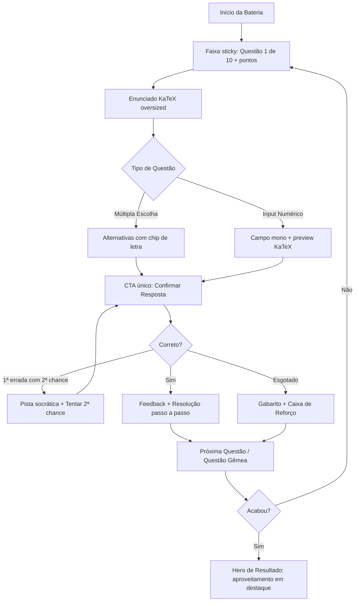
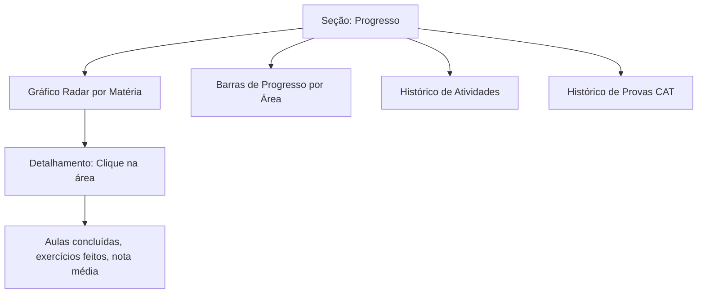
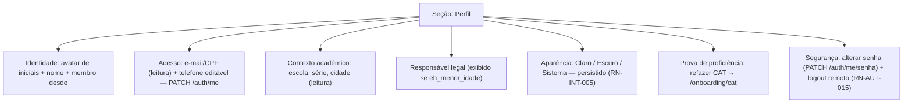

# 2. Telas do Aluno

### 2.1 Dashboard (Home)

Primeira tela após o login. Grid de cards modulares com resumo do progresso e ações rápidas.

---

### 2.2 Matérias e Skill Tree

O aluno navega pelo catálogo de matérias e visualiza a árvore de habilidades.

**Layout revisado (2026-09-10, diretriz "Caderno de Foco"):** header tipográfico flat
(sem banner-card), stats inline com `tabular-nums`, e cada volume exibe uma
**mastery strip** — uma célula na cor canônica do heatmap (RN-PRG-012) por capítulo —
para leitura de domínio de um relance. Capítulos são linhas com hairlines
(sem card-in-card). Callouts de CAT pendente e Caixa de Reforço aparecem como
faixas planas acima da lista.

---

### 2.3 Tela de Aula / Conteúdo (Sessão de 50 Minutos em Split-Screen)

Tela de aprendizado com leitor KaTeX modular e chat socrático contextualizado com IA.

**Layout revisado (2026-09-10, diretriz "Caderno de Foco"):**
- Subheader sticky: breadcrumb (Vol/Cap) + cronômetro compacto + 4 pips de
  progresso dos blocos visitados; barra de progresso de leitura no topo absoluto.
- Abas dos 4 blocos como **segmented control** sticky (não tabs de borda).
- Medida de leitura única (`max-w-[65ch]`) com tipografia sustentada.
- **Chat socrático:** docked a 35% no desktop (>= lg); no mobile, FAB flutuante
  abre slide-over full-height (sem split-screen espremido).

---

### 2.4 Tela de Exercícios

Tela dedicada e focada (sem navegação primária — AppShell focus-mode), uma questão por vez com feedback imediato.

**Layout revisado (2026-09-10, diretriz "Caderno de Foco"):**
- Faixa de progresso sticky sob o header (questão N de M + pontos, sair com ←).
- Coluna única `max-w-2xl`: a questão É a página (sem card-in-card).
- Enunciado KaTeX oversized (`text-base sm:text-lg`); alternativas com chip de letra.
- **CTA único full-width na base** (>= 52px de altura) enquanto responde.
- Conclusão: hero tipográfico com o aproveitamento como protagonista (`tabular-nums`)
  e badge semântico >= 60% (RN-CNT-010).

---

### 2.5 Progresso Consolidado

Visão geral do progresso do aluno por matéria e área.

---

### 2.6 Perfil e Configurações

Tela em modo leitura (`max-w-3xl`), seções flat separadas por hairlines — mesma linguagem das telas 2.2–2.5.

Notas de implementação:

- **Somente leitura:** e-mail, CPF e contexto acadêmico não são editáveis
  na tela (integridade de recuperação de conta e dados acadêmicos).
- **Tema:** o modo escolhido (light/dark/system) persiste em
  `localStorage` (`ti-theme`) e é aplicado pelo `DisciplineThemeProvider`,
  que recalcula as superfícies neutras ao trocar de modo. Em `system`,
  mudanças do SO aplicam ao vivo.
- **Logout remoto:** exige confirmação explícita inline — encerra TODAS as
  sessões (inclusive a atual) e redireciona para `/login`.
