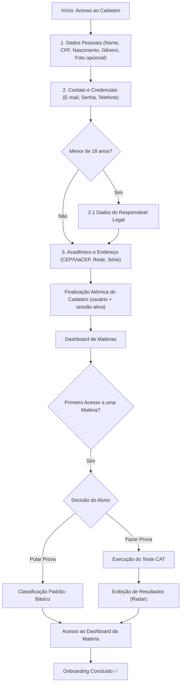

# 1. Fluxo Geral de Onboarding

### 1.1 Visão Macro do Processo
O fluxo guia o aluno desde o primeiro acesso através de um **wizard de 3 etapas**, garantindo a coleta de dados cadastrais. A calibragem do nível de aprendizado (teste adaptativo CAT) ocorre no primeiro ingresso em uma matéria, após a conclusão do cadastro.

### 1.2 Transição entre Etapas e Persistência
Cada etapa do formulário é validada no backend e o rascunho parcial é sincronizado com o Redis (TTL de 48 horas). Se o aluno interromper o cadastro antes da conclusão, seu progresso é preservado para retomada posterior.
