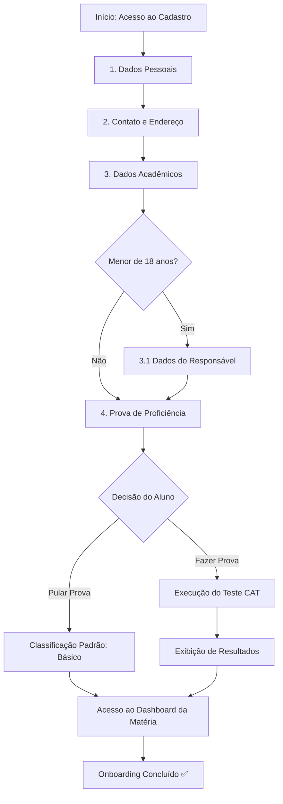

# 1. Fluxo Geral de Onboarding

### 1.1 Visão Macro do Processo
O fluxo guia o aluno desde o primeiro acesso através de um wizard estruturado, garantindo a coleta de dados cadastrais e a calibragem do seu nível de aprendizado através do teste adaptativo.

### 1.2 Transição entre Etapas e Persistência
Cada etapa do formulário é validada e salva incrementalmente no backend. Se o aluno interromper o cadastro antes da conclusão, seu progresso nas etapas concluídas é preservado para retomada posterior.
