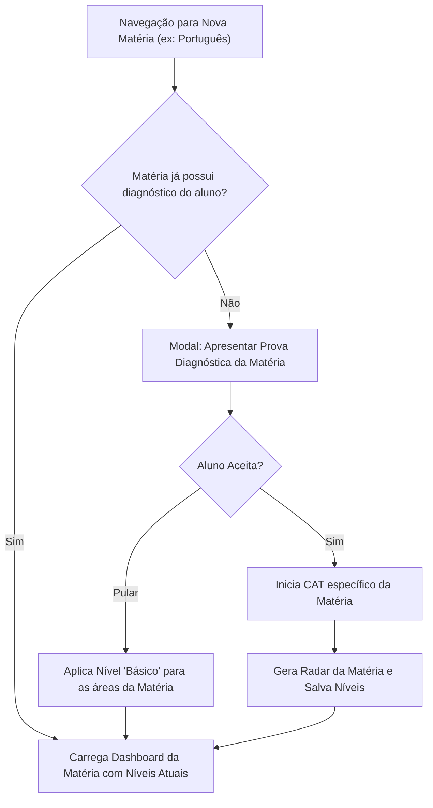
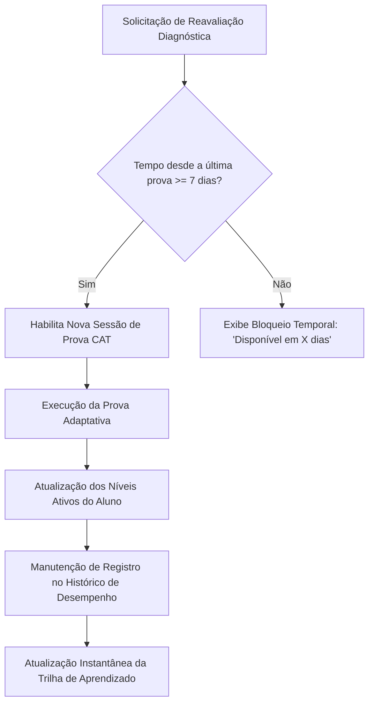

# 4. Fluxos Contínuos e Futuros

### 4.1 Descoberta e Avaliação em Novas Matérias
Com a expansão da plataforma para outras disciplinas, a prova de proficiência é disparada no primeiro ingresso do aluno em cada nova matéria (o mesmo gatilho aplicado à Matemática imediatamente após o cadastro).

---

### 4.2 Reavaliação e Política de Cooldown
Permite que o estudante refaça a avaliação diagnóstica para recalibrar sua trilha conforme avança nos estudos, respeitando o intervalo de segurança de 7 dias.

