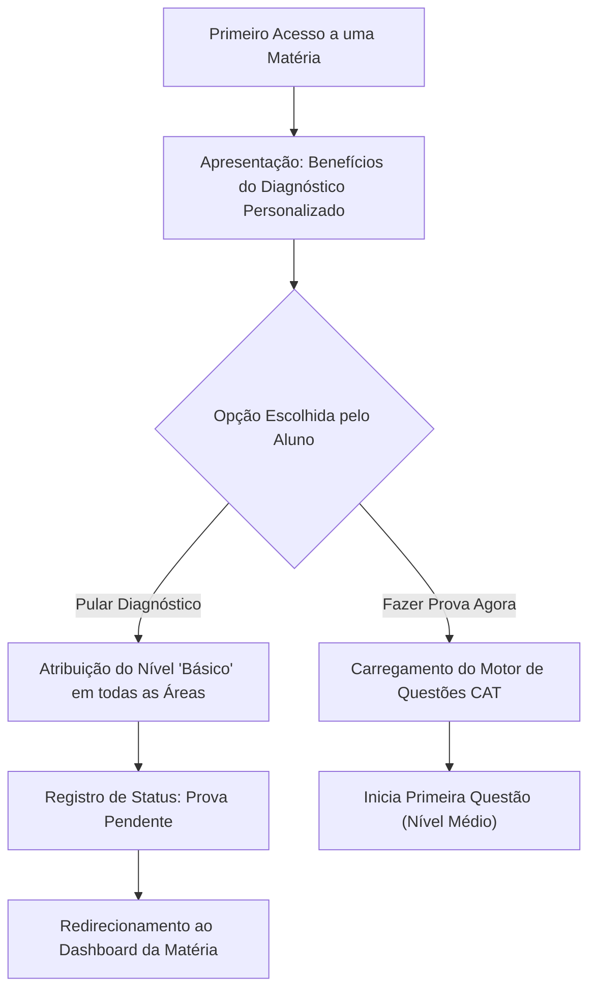
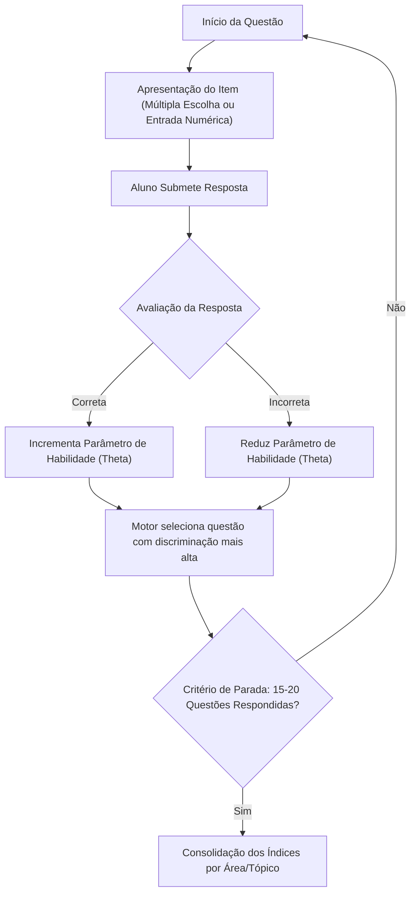
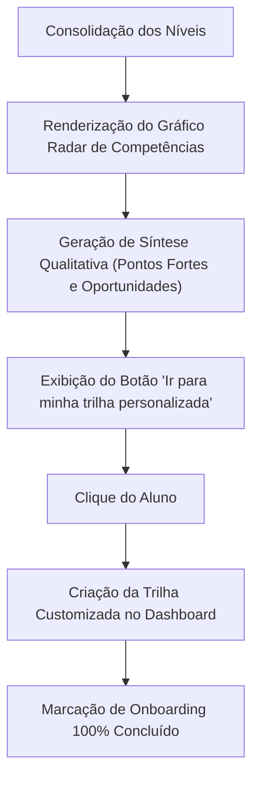

# 3. Fluxo da Avaliação de Proficiência (Pós-Cadastro)

> [!NOTE]
> A prova de proficiência **não integra o wizard de cadastro (3 etapas)**. Ela é disparada **ao entrar numa matéria pela primeira vez** — imediatamente após o cadastro (com apenas Matemática disponível) ou ao ingressar em novas matérias no futuro. A criação da sessão CAT ocorre neste momento (motor implementado na Etapa 7).

### 3.1 Iniciação e Decisão de Execução
Apresenta o objetivo pedagógico do teste e permite que o aluno escolha entre fazer o diagnóstico adaptativo imediato ou pular para o nível introdutório.

---

### 3.2 Execução do Teste Adaptativo (CAT)
O algoritmo CAT seleciona dinamicamente cada questão subsequente com base na resposta anterior, calibrando com precisão a proficiência por área.

---

### 3.3 Apresentação de Resultados e Redirecionamento
Finalizada a prova, a plataforma sintetiza os domínios do aluno e faz a transição para a trilha recomendada.

