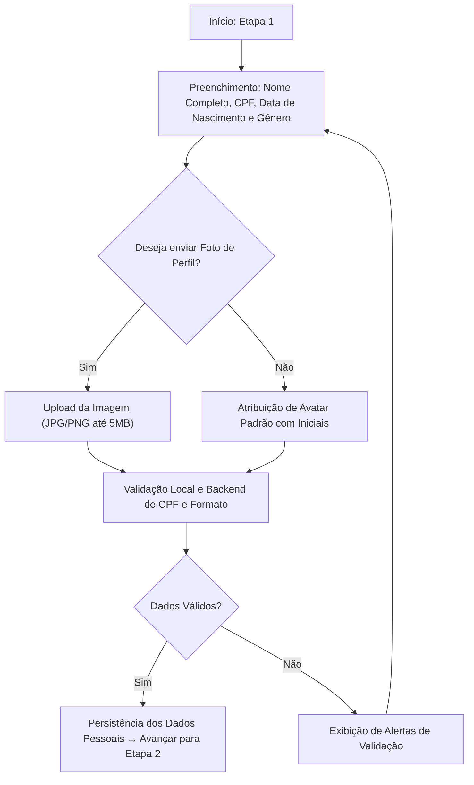
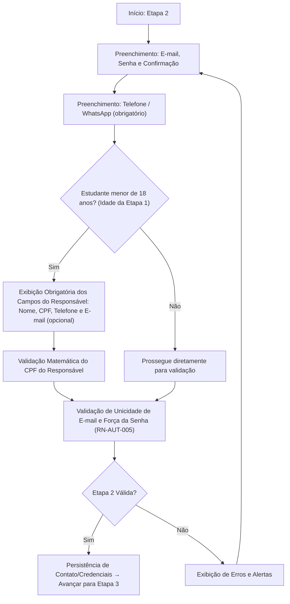
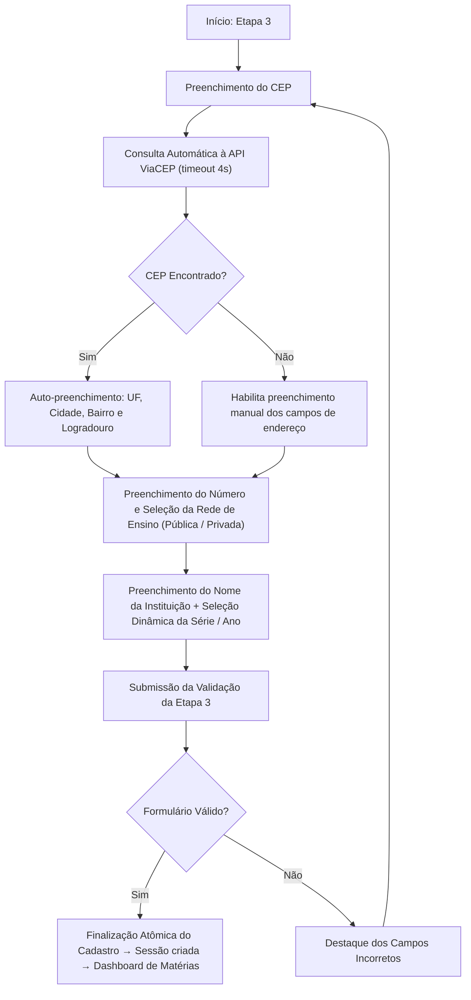

# 2. Fluxo do Wizard de Cadastro

### 2.1 Etapa 1: Dados Pessoais
Nesta etapa, coletam-se os dados de identificação civil do aluno (incluindo o gênero, usado nas métricas demográficas do Painel do Professor). A data de nascimento alimenta a lógica de checagem de maioridade para as etapas seguintes.

---

### 2.2 Etapa 2: Contato, Credenciais e Responsável Legal
Coleta as informações de comunicação (telefone/WhatsApp obrigatório), segurança de acesso (e-mail, senha e confirmação) e, condicionalmente para estudantes menores de 18 anos, os dados obrigatórios do responsável civil.

> [!NOTE]
> O endereço (CEP com auto-preenchimento via ViaCEP) foi consolidado na **Etapa 3**, junto dos dados acadêmicos — conforme o escopo canônico da Etapa 4 do plano de implementação.

---

### 2.3 Etapa 3: Acadêmico e Endereço
Coleta os dados escolares do estudante (com validação dinâmica da série/ano) e o endereço completo via CEP com auto-preenchimento pela API ViaCEP.

> [!IMPORTANT]
> A prova de proficiência (CAT) **não é disparada no cadastro**. A sessão CAT é criada apenas quando o aluno entra em uma matéria pela primeira vez (motor CAT implementado na Etapa 7 do plano de implementação).

