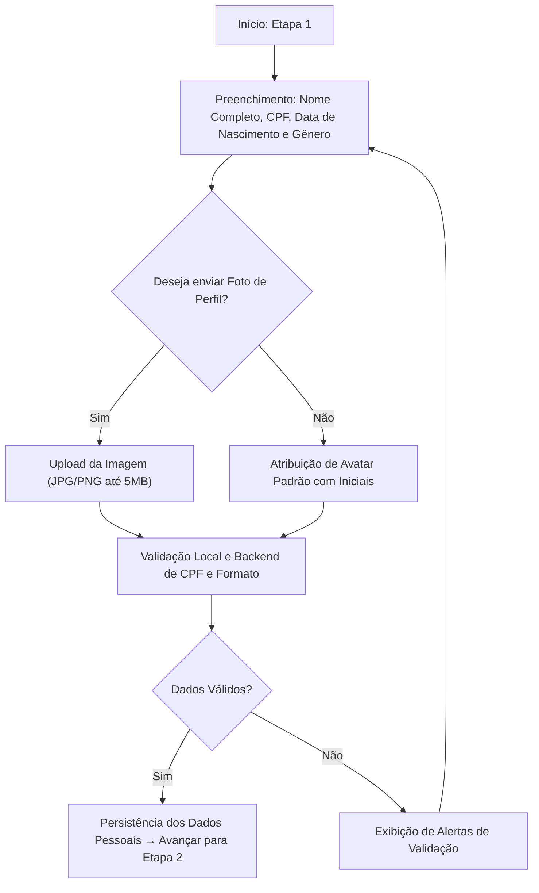
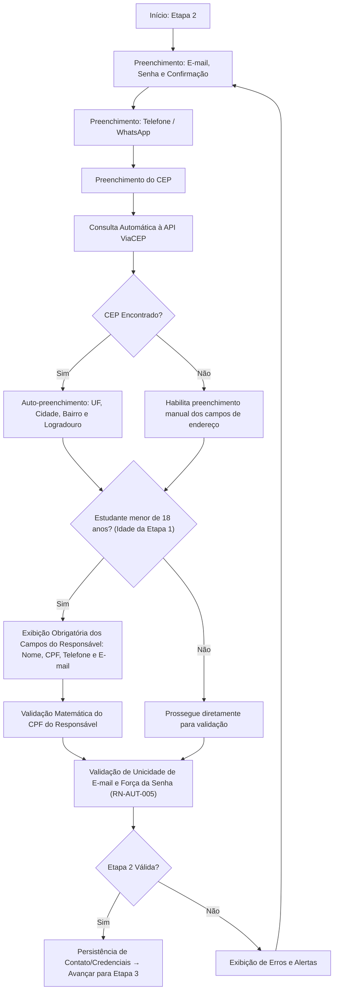
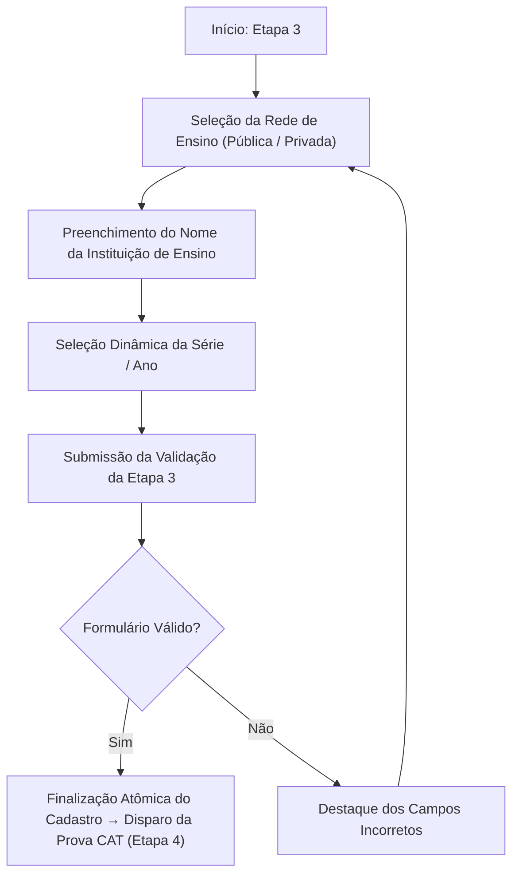

# 2. Fluxo do Wizard de Cadastro

### 2.1 Etapa 1: Dados Pessoais
Nesta etapa, coletam-se os dados de identificação civil do aluno. A data de nascimento alimenta a lógica de checagem de maioridade para as etapas seguintes.

---

### 2.2 Etapa 2: Contato, Credenciais e Responsável Legal
Coleta as informações de comunicação, segurança de acesso (e-mail, senha e confirmação), localização geográfica por CEP e, condicionalmente para estudantes menores de 18 anos, os dados obrigatórios do responsável civil.

---

### 2.3 Etapa 3: Dados Acadêmicos e Escolaridade
Coleta os dados escolares do estudante com validação dinâmica da série/ano conforme o nível de ensino da matéria selecionada.

