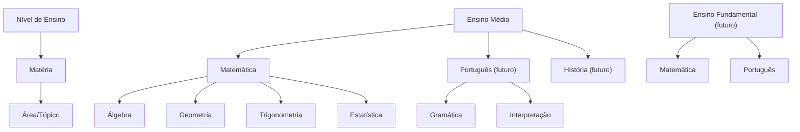

<!-- ai-summary
Módulo Onboarding. Cadastro do aluno em wizard de 3 etapas: (1) Dados pessoais (incl. gênero e foto opcional), (2) Contato & Credenciais (telefone obrigatório e responsável legal se menor de 18), (3) Acadêmico & Endereço (ViaCEP, rede de ensino, série/ano).
A Prova de Proficiência adaptativa (CAT) NÃO faz parte do wizard de cadastro: é disparada ao entrar numa matéria pela primeira vez (motor CAT entregue na Etapa 7). Pode pular (classificado como Básico). Refazer com cooldown de 7 dias.
3 níveis: Básico, Intermediário, Avançado — calculados por área/tópico dentro de cada matéria. Modelo hierárquico escalável: Nível de Ensino → Matéria → Área/Tópico.
Rascunho do wizard persistido no Redis (TTL 48h). Campos persistidos em `usuarios` (ver knowledge/database/01-usuarios.md): inclui genero, telefone, logradouro e numero.
-->

# Onboarding

Primeiro contato do aluno com a plataforma — cadastro em etapas (wizard), prova de proficiência adaptativa (pós-cadastro) e direcionamento para trilha personalizada.

## Visão Geral

O cadastro é um **wizard de 3 etapas** que coleta os dados do aluno. A prova de proficiência é uma avaliação **pós-cadastro**, disparada ao entrar em uma matéria pela primeira vez (motor CAT implementado na Etapa 7 do plano de implementação):

| Etapa do Wizard | Nome | Descrição |
|---|---|---|
| 1 | Dados Pessoais | Nome, CPF, nascimento, gênero, foto (opcional) |
| 2 | Contato & Credenciais | E-mail, senha, telefone (obrigatório) e responsável (se menor) |
| 3 | Acadêmico & Endereço | CEP com auto-preenchimento, rede pública/privada, instituição, série/ano |

> [!NOTE]
> **Decisão arquitetural (2026-09-07):** o wizard de cadastro tem **3 etapas** e não inicializa sessão CAT. A prova diagnóstica é disparada quando o aluno entra em uma matéria pela primeira vez — mantendo a migração da Etapa 4 livre das tabelas do motor CAT (entregues na Etapa 7).

## Campos de Cadastro

### Dados Pessoais (Etapa 1)

| Campo | Tipo | Obrigatório | Persistido em | Observação |
|---|---|---|---|---|
| Nome completo | texto | ✅ | `nome_completo` | Identificação civil |
| Data de nascimento | data | ✅ | `data_nascimento` | Calcula `idade_anos` e aciona responsável na Etapa 2 |
| CPF | texto (validado) | ✅ | `cpf` | Identificação única matemática (Módulo 11, 11 dígitos) |
| Gênero | select | ✅ | `genero` | Métricas demográficas no Painel do Professor |
| Foto de perfil | upload imagem | ❌ | `avatar_url` | JPEG/PNG até 5 MB; avatar com iniciais como padrão |

### Contato, Credenciais e Responsável Legal (Etapa 2)

| Campo | Tipo | Obrigatório | Persistido em | Observação |
|---|---|---|---|---|
| E-mail | e-mail | ✅ | `email` | Login único, normalizado em minúsculas |
| Senha | senha (min 8 chars) | ✅ | `senha_hash` | Hash Argon2id (RN-AUT-005) |
| Confirmação de senha | senha | ✅ | — | Deve coincidir com a senha |
| Telefone/WhatsApp | telefone | ✅ | `telefone` | Comunicação e recuperação de conta |
| Dados do responsável | bloco condicional | ✅ (se menor) | `dados_responsavel` (JSONB) | Ver tabela abaixo |

#### Responsável Legal (Etapa 2 - condicional)

> Exibido **obrigatoriamente se o aluno tiver menos de 18 anos** (calculado pela data de nascimento da Etapa 1). Persistido como JSONB em `usuarios.dados_responsavel`.

| Campo | Tipo | Obrigatório | Observação |
|---|---|---|---|
| Nome do responsável | texto | ✅ (se menor) | Representante civil |
| CPF do responsável | texto (validado) | ✅ (se menor) | Validação matemática de CPF (Módulo 11) |
| Telefone do responsável | telefone | ✅ (se menor) | Contato para avisos pedagógicos |
| E-mail do responsável | e-mail | ❌ | Comunicação complementar |

### Acadêmico & Endereço (Etapa 3)

| Campo | Tipo | Obrigatório | Persistido em | Observação |
|---|---|---|---|---|
| CEP | texto | ✅ | `cep` | Auto-preenche UF, cidade, bairro e logradouro via ViaCEP |
| Estado (UF) | select | ✅ | `uf` | Métrica por região |
| Cidade | texto | ✅ | `cidade` | Métrica por região |
| Bairro | texto | ❌ | `bairro` | Endereçamento |
| Logradouro | texto | ❌ | `logradouro` | Auto-preenchido pelo ViaCEP, editável |
| Número | texto | ❌ | `numero` | Preenchimento manual |
| Rede de ensino | select (pública/privada) | ✅ | `escola_tipo` | Métrica demográfica institucional |
| Instituição de ensino | texto/autocomplete | ❌ | `nome_escola` | Nome da escola |
| Série/ano atual | select dinâmico | ✅ | `serie_ano` | Adaptável para Ensino Médio, Fundamental ou Pré-Vestibular |

## Prova de Proficiência (Pós-Cadastro)

### Modelo: Computerized Adaptive Testing (CAT)

A prova utiliza o modelo **CAT** (teste adaptativo computadorizado cego com prior $\mathcal{N}(0, 1)$):

- Começa com questões de **dificuldade média** ($\theta = 0$)
- Acertou → próxima questão **mais desafiadora**
- Errou → próxima questão **de menor dificuldade**
- Critério de parada híbrido: **12 a 20 questões** com erro padrão $SE(\theta) \le 0.30$
- Revelação diagnóstica integral com Gráfico Radar apenas na conclusão do teste

### Gatilho da Prova

A prova é acionada **ao entrar numa matéria pela primeira vez** (não durante o cadastro):

- O aluno finaliza o wizard de cadastro e é direcionado ao dashboard de matérias
- Ao clicar em uma matéria pela primeira vez, a prova é apresentada
- O aluno **pode pular** → classificado como **Básico** em todas as áreas
- A sessão da prova é criada apenas neste momento (tabelas do motor CAT pertencem à Etapa 7)

### Níveis de Proficiência

| Nível | Código | Descrição |
|---|---|---|
| Básico | `basic` | Pouco ou nenhum domínio da área |
| Intermediário | `intermediate` | Domínio parcial, precisa reforçar |
| Avançado | `advanced` | Bom domínio da área |

O nível é calculado **por área/tópico** dentro de cada matéria:

```
Matemática (Ensino Médio):
├── Álgebra: Avançado
├── Geometria: Básico
├── Trigonometria: Intermediário
└── Estatística: Básico
```

### Tipos de Questão

| Tipo | Código | Uso | Matérias |
|---|---|---|---|
| Múltipla escolha | `multiple_choice` | 4-5 alternativas | Todas |
| Resposta numérica | `numeric_input` | Aluno digita o resultado | Exatas (Matemática, Física...) |
| Resposta textual | `text_input` | Futuro - resposta aberta | Humanas (Português, História...) |

### Política de Refazer

- O aluno **pode refazer** a prova a qualquer momento
- **Cooldown de 7 dias** entre tentativas
- Histórico de todas as tentativas é salvo
- O nível ativo é sempre o da **última tentativa**

### Resultado da Prova

Após completar, o aluno vê:

1. **Gráfico radar** com o nível por área
2. **Resumo textual**: "Você tem domínio forte em Álgebra e pode focar mais em Geometria"
3. **Botão**: "Ir para minha trilha personalizada" → leva ao dashboard da matéria
4. **Opção de refazer** (com cooldown de 7 dias)

## Escalabilidade

### Modelo Hierárquico

O sistema utiliza uma hierarquia genérica de 3 níveis:

```
Nível de Ensino → Matéria → Área/Tópico
```



## Métricas para o Painel do Professor

Os dados coletados no onboarding alimentam as seguintes métricas:

| Métrica | Campos utilizados |
|---|---|
| Desempenho por região | Estado, cidade, bairro |
| Desempenho por faixa etária | Data de nascimento |
| Desempenho por instituição | Instituição de ensino |
| Desempenho por rede | Rede pública/privada |
| Desempenho por série | Série/ano atual |
| Distribuição demográfica | Gênero, idade, região |
| Nível de entrada por área | Resultados da prova de proficiência |

## Seções Detalhadas no Menu

| Seção | Descrição |
|---|---|
| [Fluxo](flow/index.md) | Sub-páginas dedicadas para fluxo geral, wizard, proficiência e fluxos contínuos |
| [Regras de Negócio](business-rules/index.md) | Sub-páginas dedicadas para cadastro/validação, CAT e escalabilidade |
| [Protótipos](prototype/index.md) | Schemas, validador de CPF, serviço de cadastro e endpoints de referência |
