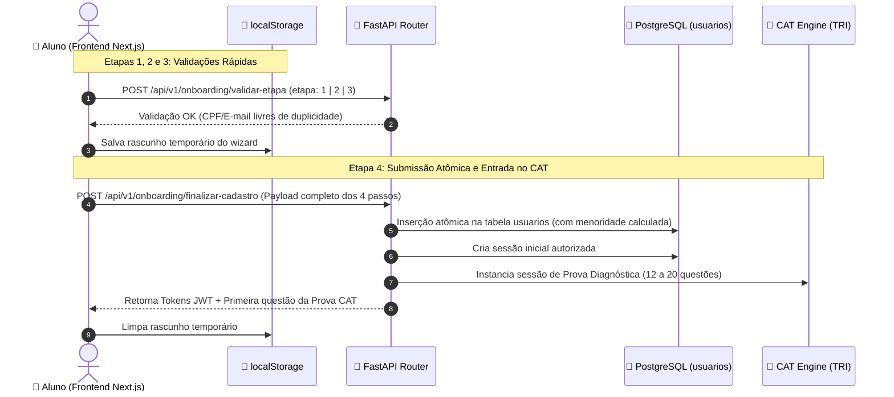

<!-- ai-summary
Hub de protótipos de código do módulo de Onboarding.
Implementações técnicas de referência em Python 3.11 (FastAPI, Pydantic v2, SQLAlchemy asyncpg) e TypeScript:
1. Schemas e DTOs das 4 Etapas do Wizard e Menoridade Civil (Pydantic v2).
2. Algoritmo Matemático de Validação de CPF (Módulo 11).
3. Serviço de Criação Atômica de Conta e Inicialização da Prova CAT.
4. Endpoints REST da API FastAPI (Validação em Tempo Real e Finalização).
-->

# Onboarding — Protótipos de Código e Cadastro

Esta seção reúne as implementações de referência e o código-fonte executável do subsistema de **cadastro de estudantes em 4 etapas**, cálculo automático de **menoridade civil**, validação algorítmica de **CPF** e transição atômica para a **Prova Diagnóstica CAT de Entrada** na plataforma **Tutor Inteligente**.

---

## Estrutura dos Protótipos Técnicos

| Documento | Escopo Técnico | Linguagem / Stack |
|:---|:---|:---:|
| [1. Schemas & DTOs](schemas.md) | Contratos tipados de cada etapa do wizard, dados do responsável legal e tipos TypeScript | **Pydantic v2 / TypeScript** |
| [2. Validador de CPF (Módulo 11)](cpf-validator.md) | Algoritmo estrito de dígitos verificadores sem bibliotecas externas pesadas | **Python Puro** |
| [3. Serviço de Cadastro Atômico](onboarding-service.md) | Gravação atômica na tabela `usuarios`, hash de senha e inicialização da Prova CAT | **Python / SQLAlchemy / Argon2id** |
| [4. Endpoints da API FastAPI](endpoints.md) | Rotas assíncronas para validação em tempo real de cada passo e finalização | **FastAPI / Python** |

---

## Fluxo de Execução do Wizard

