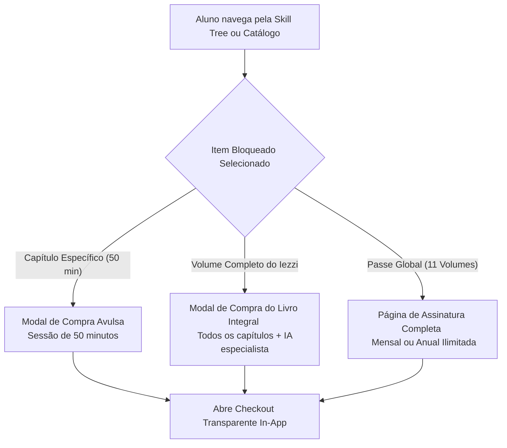

# 1. Seleção e Compra de Produtos

### 1.1 Fluxo de Escolha da Modalidade

```mermaid
flowchart TD
    A["Aluno navega pela Skill Tree ou Catálogo"] --> B{"Item Bloqueado Selecionado"}
    
    B -->|"Capítulo Específico (50 min)"| C["Modal de Compra Avulsa \n Sessão de 50 minutos"]
    B -->|"Volume Completo do Iezzi"| D["Modal de Compra do Livro Integral \n Todos os capítulos + IA especialista"]
    B -->|"Passe Global (11 Volumes)"| E["Página de Assinatura Completa \n Mensal ou Anual Ilimitada"]
    
    C --> F["Abre Checkout Transparente In-App"]
    D --> F
    E --> F
```
