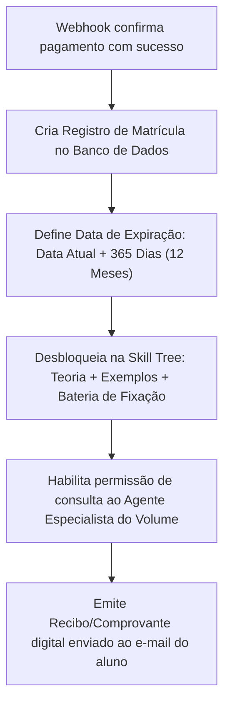

# 3. Liberação de Acesso e Vigência de 12 Meses

### 3.1 Ciclo de Vida da Matrícula

```mermaid
flowchart TD
    A["Webhook confirma pagamento com sucesso"] --> B["Cria Registro de Matrícula no Banco de Dados"]
    B --> C["Define Data de Expiração: Data Atual + 365 Dias (12 Meses)"]
    C --> D["Desbloqueia na Skill Tree: Teoria + Exemplos + Bateria de Fixação"]
    D --> E["Habilita permissão de consulta ao Agente Especialista do Volume"]
    E --> F["Emite Recibo/Comprovante digital enviado ao e-mail do aluno"]
```
