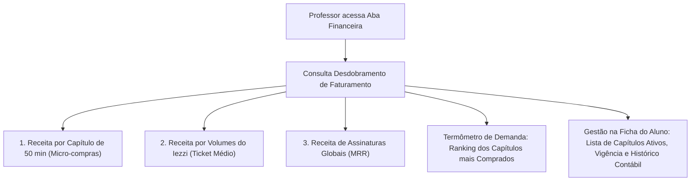

# 4. Painel Comercial e Gestão de Vendas do Professor

### 4.1 Visão Integrada de Faturamento e Demanda

```mermaid
flowchart TD
    A["Professor acessa Aba Financeira"] --> B["Consulta Desdobramento de Faturamento"]
    
    B --> C["1. Receita por Capítulo de 50 min (Micro-compras)"]
    B --> D["2. Receita por Volumes do Iezzi (Ticket Médio)"]
    B --> E["3. Receita de Assinaturas Globais (MRR)"]
    
    B --> F["Termômetro de Demanda: Ranking dos Capítulos mais Comprados"]
    
    B --> G["Gestão na Ficha do Aluno: Lista de Capítulos Ativos, Vigência e Histórico Contábil"]
```
