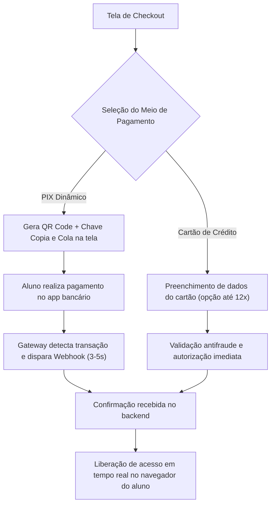

# 2. Processamento Instantâneo (PIX e Cartão)

### 2.1 Fluxo de Pagamento 100% Instantâneo

```mermaid
flowchart TD
    A["Tela de Checkout"] --> B{"Seleção do Meio de Pagamento"}
    
    B -->|"PIX Dinâmico"| C["Gera QR Code + Chave Copia e Cola na tela"]
    C --> D["Aluno realiza pagamento no app bancário"]
    D --> E["Gateway detecta transação e dispara Webhook (3-5s)"]
    
    B -->|"Cartão de Crédito"| F["Preenchimento de dados do cartão (opção até 12x)"]
    F --> G["Validação antifraude e autorização imediata"]
    
    E --> H["Confirmação recebida no backend"]
    G --> H
    H --> I["Liberação de acesso em tempo real no navegador do aluno"]
```
