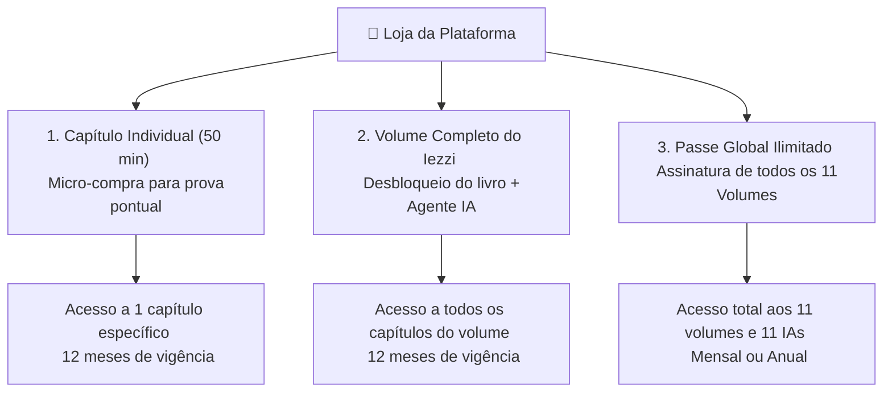
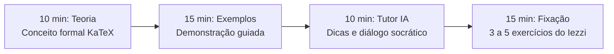
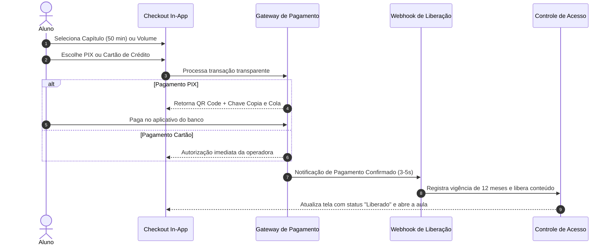
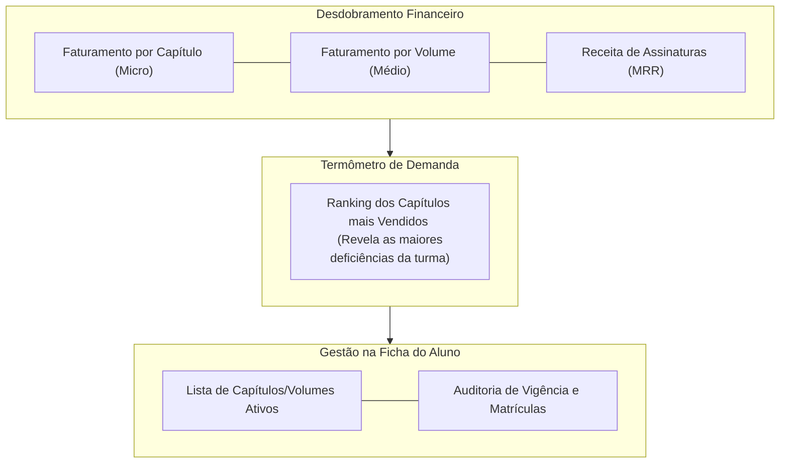

<!-- ai-summary
Módulo Pagamento. Sistema de monetização, precificação escalonada e checkout transparente 100% instantâneo do Tutor Inteligente.
Modelo de 3 níveis de produto:
1. Micro-compra por Capítulo (Sessão de Aprendizagem de 50 minutos: 10 min teoria + 15 min exemplos + 10 min tutor IA + 15 min fixação).
2. Pacote por Volume Completo do Iezzi (Todos os capítulos + Agente de IA especialista do volume).
3. Passe Global / Assinatura Ilimitada (Acesso a todos os 11 volumes, 11 Agentes de IA e testes CAT).
Vigência de 12 meses (ano letivo) para compras avulsas de capítulos e volumes.
Métodos de pagamento 100% instantâneos: PIX Dinâmico (3 a 5 segundos via webhook) e Cartão de Crédito (até 12x).
Integração total com o Painel do Professor: desdobramento de receita por produto, ranking de capítulos mais vendidos, gestão granular de acessos e vigência 100% automatizada.
-->

# Pagamento

Documentação do sistema de monetização, modelo de precificação escalonado por capítulos de 50 minutos, checkout transparente e gestão comercial do **Tutor Inteligente**.

---

## 1. Modelo de Precificação Escalonado

Para alinhar a compra sob demanda dos estudantes com a estrutura modular dos **11 volumes do Iezzi**, a plataforma implementa 3 modalidades de aquisição:

| Nível de Produto | Proposta de Valor | Formato Pedagógico | Vigência |
|:---|:---|:---|:---|
| **Capítulo Individual** | Reforço cirúrgico para a matéria escolar da semana | 1 sessão completa de 50 minutos | 12 meses (365 dias) |
| **Volume do Iezzi** | Domínio completo de uma disciplina (ex: Trigonometria) | Todos os capítulos + IA especialista | 12 meses (365 dias) |
| **Passe Global** | Preparação integral para o 2º Grau e Vestibulares | 11 volumes + 11 IAs + CATs ilimitados | Mensal / Anual recorrente |

---

## 2. A Sessão de Aprendizagem de 50 Minutos

Cada capítulo avulso adquirido é estruturado pedagogicamente para ser concluído em uma **hora-aula de 50 minutos**:

---

## 3. Checkout 100% Instantâneo (PIX & Cartão)

A plataforma opera com checkout transparente sem redirecionamentos externos e com liberação imediata:

---

## 4. Integração com o Painel do Professor

As decisões comerciais alimentam diretamente as métricas analíticas e pedagógicas do professor:

---

## 5. Navegação nas Seções Detalhadas

| Seção | Descrição |
|:---|:---|
| [Fluxo](flow/index.md) | Fluxo de checkout, ciclo de webhook PIX/Cartão, desbloqueio de 12 meses e tela docente |
| [Regras de Negócio](business-rules/index.md) | Especificação das regras RN-PAG-001 a RN-PAG-020 (preços, vigência, conciliação e zero cortesias) |
