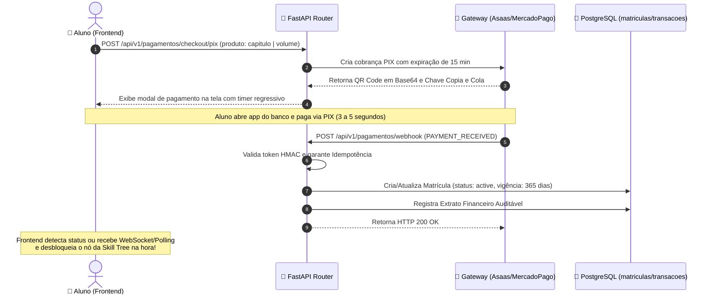

<!-- ai-summary
Hub de protótipos de código do módulo de Pagamento & Checkout.
Implementações técnicas de referência em Python 3.11 (FastAPI, SQLAlchemy asyncpg, Asaas/MercadoPago API) e TypeScript:
1. Schemas e DTOs de Checkout e Webhook (Pydantic v2).
2. Algoritmo de Abatimento Proporcional para Upgrade de Capítulos para Volume.
3. Handler de Webhook de PIX Instantâneo com Idempotência e Ativação de 12 Meses.
4. Endpoints REST da API FastAPI.
-->

# Pagamento — Protótipos de Código e Gateway

Esta seção reúne as implementações de referência e o código-fonte executável do subsistema de faturamento, emissão de **PIX dinâmico**, cálculo de **abatimento proporcional para upgrade** e processamento assíncrono de **webhooks com conciliação bancária instantânea** na plataforma **Tutor Inteligente**.

---

## Estrutura dos Protótipos Técnicos

| Documento | Escopo Técnico | Linguagem / Stack |
|:---|:---|:---:|
| [1. Schemas & DTOs](schemas.md) | Contratos de checkout PIX/Cartão, retorno de QR Code, payloads de webhook e TypeScript | **Pydantic v2 / TypeScript** |
| [2. Calculador de Upgrade Proporcional](upgrade-calculator.md) | Dedução de 100% dos valores já pagos em capítulos de 50 min na aquisição do volume | **Python / SQLAlchemy** |
| [3. Serviço de Webhook & Idempotência](webhook-service.md) | Validação de token de segurança, prevenção de duplicidade e desbloqueio por 365 dias | **Python / FastAPI / Asyncpg** |
| [4. Endpoints da API FastAPI](endpoints.md) | Rotas REST de checkout, consulta de abatimento e listener de webhook do gateway | **FastAPI / Python** |

---

## Ciclo de Vida do Pagamento e Webhook Instantâneo

