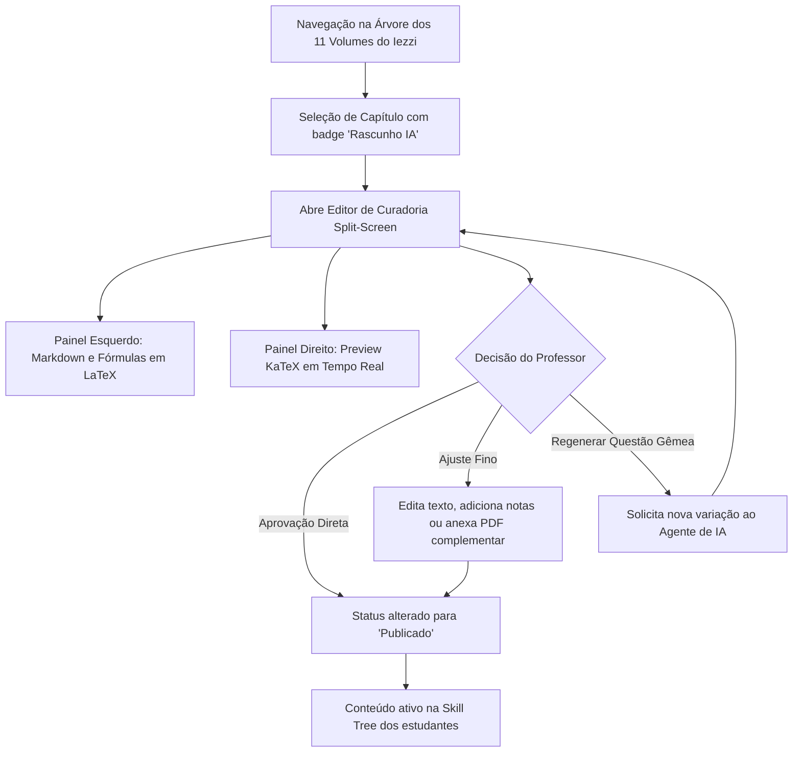

# 3. Central de Curadoria e Edição KaTeX

### 3.1 Ciclo de Validação e Publicação

```mermaid
flowchart TD
    A["Navegação na Árvore dos 11 Volumes do Iezzi"] --> B["Seleção de Capítulo com badge 'Rascunho IA'"]
    B --> C["Abre Editor de Curadoria Split-Screen"]
    
    C --> D["Painel Esquerdo: Markdown e Fórmulas em LaTeX"]
    C --> E["Painel Direito: Preview KaTeX em Tempo Real"]
    
    C --> F{"Decisão do Professor"}
    F -->|"Aprovação Direta"| G["Status alterado para 'Publicado'"]
    F -->|"Ajuste Fino"| H["Edita texto, adiciona notas ou anexa PDF complementar"]
    F -->|"Regenerar Questão Gêmea"| I["Solicita nova variação ao Agente de IA"]
    
    H --> G
    I --> C
    G --> J["Conteúdo ativo na Skill Tree dos estudantes"]
```
