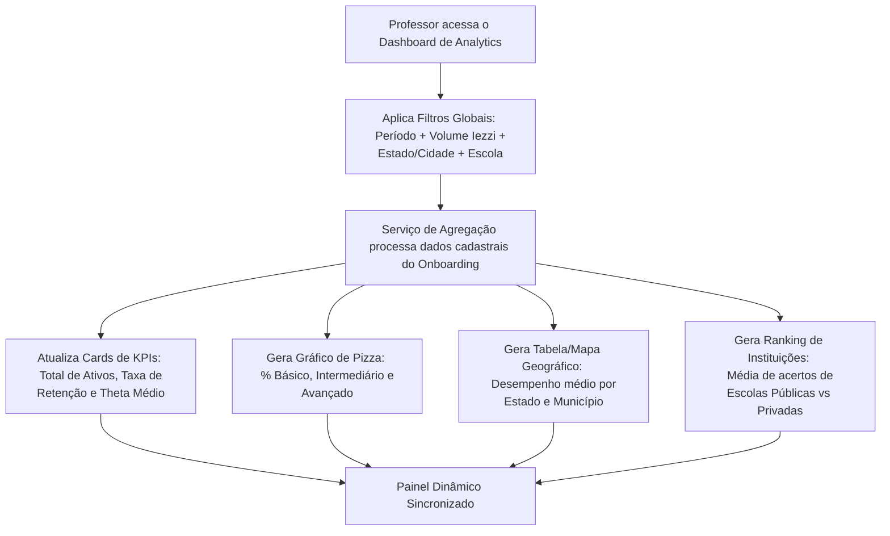

# 1. Dashboard de Analytics e Segmentação Demográfica

### 1.1 Fluxo de Filtragem e Cruzamento de Dados

```mermaid
flowchart TD
    A["Professor acessa o Dashboard de Analytics"] --> B["Aplica Filtros Globais: \n Período + Volume Iezzi + Estado/Cidade + Escola"]
    
    B --> C["Serviço de Agregação processa dados cadastrais do Onboarding"]
    
    C --> D["Atualiza Cards de KPIs: \n Total de Ativos, Taxa de Retenção e Theta Médio"]
    C --> E["Gera Gráfico de Pizza: \n % Básico, Intermediário e Avançado"]
    C --> F["Gera Tabela/Mapa Geográfico: \n Desempenho médio por Estado e Município"]
    C --> G["Gera Ranking de Instituições: \n Média de acertos de Escolas Públicas vs Privadas"]
    
    D --> H["Painel Dinâmico Sincronizado"]
    E --> H
    F --> H
    G --> H
```
