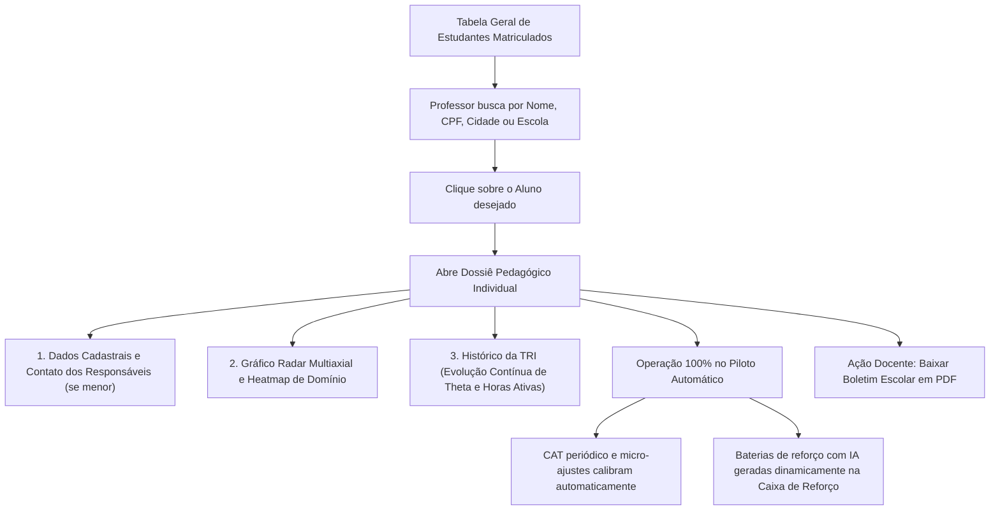

# 2. Acompanhamento Individual de Alunos e Dossiê

### 2.1 Consulta e Monitoramento Pedagógico (Automação Total)

```mermaid
flowchart TD
    A["Tabela Geral de Estudantes Matriculados"] --> B["Professor busca por Nome, CPF, Cidade ou Escola"]
    B --> C["Clique sobre o Aluno desejado"]
    
    C --> D["Abre Dossiê Pedagógico Individual"]
    D --> E["1. Dados Cadastrais e Contato dos Responsáveis (se menor)"]
    D --> F["2. Gráfico Radar Multiaxial e Heatmap de Domínio"]
    D --> G["3. Histórico da TRI (Evolução Contínua de Theta e Horas Ativas)"]
    
    D --> H["Operação 100% no Piloto Automático"]
    H --> I["CAT periódico e micro-ajustes calibram automaticamente"]
    H --> J["Baterias de reforço com IA geradas dinamicamente na Caixa de Reforço"]
    
    D --> K["Ação Docente: Baixar Boletim Escolar em PDF"]
```
