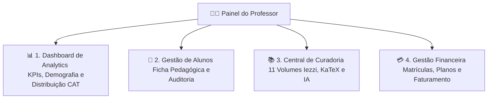
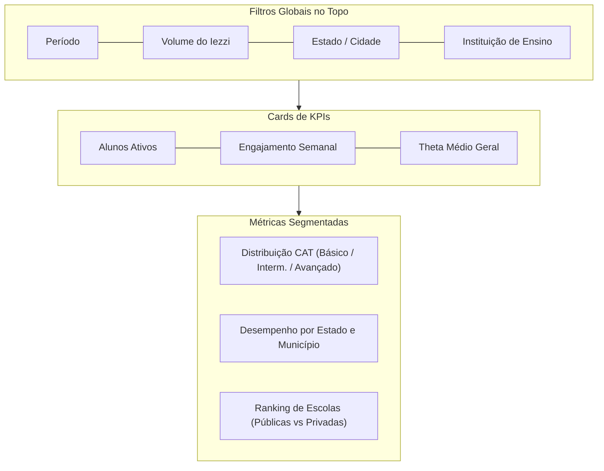
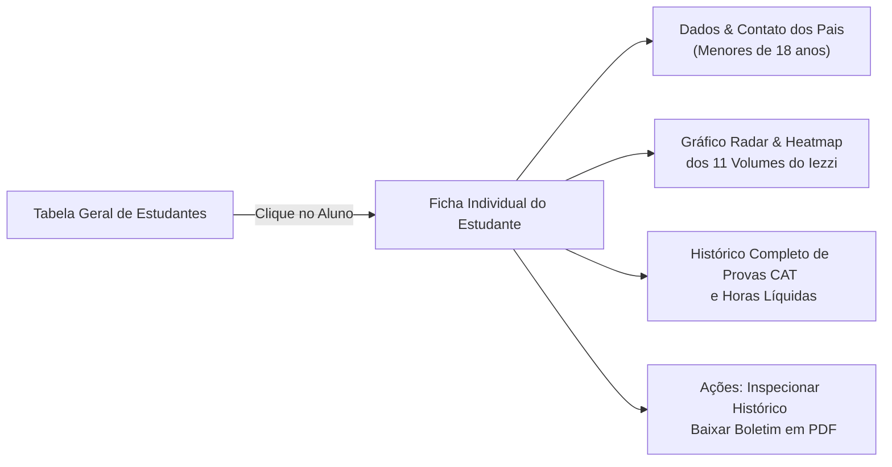
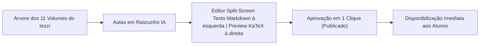

<!-- ai-summary
Módulo Painel do Professor. Centro de comando administrativo, pedagógico e analítico do professor na plataforma Tutor Inteligente.
4 grandes pilares de gestão:
1. Dashboard de Métricas & Analytics (KPIs globais, distribuição de proficiência CAT, cruzamento por Região/Estado/Cidade, Faixa Etária e Instituições de Ensino com filtros avançados).
2. Gestão Individual de Alunos (Ficha pedagógica completa, histórico no Iezzi, horas líquidas, emissão de Boletim PDF sob filosofia de Piloto Automático).
3. Central de Curadoria e Conteúdo (Workflow Draft & Publish dos 11 volumes, editor KaTeX split-screen em tempo real, aprovação de Questões Gêmeas e upload de materiais).
4. Visão Financeira e de Matrículas (MRR, total faturado, controle de vigência, auditoria contábil e extrato de repasses sem bolsas manuais).
-->

# Painel do Professor

Documentação da central de controle pedagógico, gestão de alunos, curadoria de conteúdo dos 11 volumes do Iezzi, análise demográfica e monitoramento financeiro do **Tutor Inteligente**.

---

## 1. Pilares de Gestão do Painel

O Painel do Professor é estruturado em 4 pilares centrais:

| Pilar | Descrição | Principais Ações |
|:---|:---|:---|
| **Analytics & Métricas** | Visão agregada de desempenho e demografia | Filtrar por região, escola, idade e volume |
| **Gestão de Alunos** | Dossiê individual de cada estudante | Consultar histórico, horas líquidas, emitir Boletim PDF |
| **Central de Curadoria** | Gestão do conteúdo dos 11 volumes | Aprovar aulas IA, editar KaTeX, gerir questões |
| **Gestão Financeira** | Monitoramento de vendas e matrículas | Acompanhar vigência, auditar transações, ver extrato |

---

## 2. Dashboard de Analytics e Demografia

O painel consolida os dados cadastrais do **Onboarding** e os resultados do **CAT / Exercícios** em tempo real:

---

## 3. Ficha Pedagógica Individual do Aluno

Permite ao professor inspecionar o progresso e a evolução pedagógica de qualquer estudante em modo piloto automático:

---

## 4. Central de Curadoria com Editor KaTeX

Workflow completo para validação de aulas e questões propostas pelos 11 Agentes Especialistas de IA:

---

## 5. Navegação nas Seções Detalhadas

| Seção | Descrição |
|:---|:---|
| [Fluxo](flow/index.md) | Diagramas de navegação docente, filtros demográficos, curadoria e gestão de matrículas |
| [Regras de Negócio](business-rules/index.md) | Especificação detalhada das regras RN-PRF-001 a RN-PRF-020 (permissões, agregações, KaTeX e acessos) |
