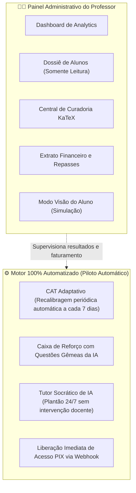

<!-- ai-summary
Hub de protótipos de código do módulo do Painel do Professor.
Filosofia Piloto Automático (Set & Forget): zero tarefas manuais de retestes ou listas repetitivas.
Implementações técnicas de referência em Python 3.11 (FastAPI, SQLAlchemy) e TypeScript (Next.js 14, Tailwind, KaTeX):
1. Schemas e DTOs de Analytics Executivo e Curadoria (Pydantic v2).
2. Agregador de Analytics Demográfico e Faturamento (SQLAlchemy).
3. Editor Split-Screen KaTeX para Curadoria Docente (React / Next.js).
4. Modo "Visão do Aluno" com Header Flutuante (React State).
5. Endpoints Administrativos da API FastAPI com Proteção de Role ('teacher').
-->

# Painel do Professor — Protótipos de Código e Analytics

Esta seção reúne as implementações de referência e o código-fonte executável do subsistema de **gestão analítica docente**, **auditoria financeira de vendas**, **editor de curadoria em split-screen KaTeX** e alternador para o **Modo Visão do Aluno** da plataforma **Tutor Inteligente**.

---

## Filosofia Arquitetural: 100% Piloto Automático (*Set & Forget*)

> [!IMPORTANT]
> **Zero Sobrecarga Operacional para o Professor**:
> - O professor não precisa passar listas manuais de exercícios, nem resetar cooldowns de provas ou corrigir gabaritos.
> - **O sistema opera sozinho no automático**: a IA socrática atende os estudantes, o motor CAT recalibra as proficiências e a Caixa de Reforço monta baterias com Questões Gêmeas baseadas nos erros reais.
> - O Painel do Professor atua como uma **torre de controle analítica e financeira passiva**, onde o docente monitora o impacto pedagógico e o faturamento das matrículas.

---

## Estrutura dos Protótipos Técnicos

| Documento | Escopo Técnico | Linguagem / Stack |
|:---|:---|:---:|
| [1. Schemas & DTOs](schemas.md) | Contratos tipados de analytics, dossiê do estudante, extrato financeiro e tipos TypeScript | **Pydantic v2 / TypeScript** |
| [2. Agregador de Analytics](teacher-analytics.md) | Agregações SQL de faturamento líquido, demografia por UF e proficiência média de turmas | **Python / SQLAlchemy** |
| [3. Editor Split-Screen KaTeX](curator-editor.md) | Interface React para curadoria de blocos com Markdown à esquerda e preview KaTeX à direita | **React / Tailwind / KaTeX** |
| [4. Modo Visão do Aluno](student-preview.md) | Chaveamento de contexto visual com banner superior persistente para testes da Skill Tree | **React / Context API** |
| [5. Endpoints da API FastAPI](endpoints.md) | Rotas assíncronas com proteção estrita por dependência de autorização (`role == 'teacher'`) | **FastAPI / Python** |

---

## Arquitetura de Interação do Painel Docente

