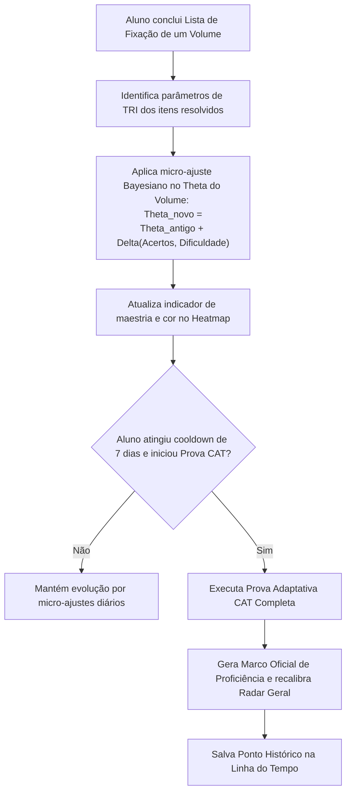

# 2. Fluxo de Calibragem Contínua e Marcos CAT

### 2.1 Atualização Dinâmica Híbrida

```mermaid
flowchart TD
    A["Aluno conclui Lista de Fixação de um Volume"] --> B["Identifica parâmetros de TRI dos itens resolvidos"]
    B --> C["Aplica micro-ajuste Bayesiano no Theta do Volume: \n Theta_novo = Theta_antigo + Delta(Acertos, Dificuldade)"]
    C --> D["Atualiza indicador de maestria e cor no Heatmap"]
    
    D --> E{"Aluno atingiu cooldown de 7 dias e iniciou Prova CAT?"}
    E -->|Não| F["Mantém evolução por micro-ajustes diários"]
    E -->|Sim| G["Executa Prova Adaptativa CAT Completa"]
    G --> H["Gera Marco Oficial de Proficiência e recalibra Radar Geral"]
    H --> I["Salva Ponto Histórico na Linha do Tempo"]
```
