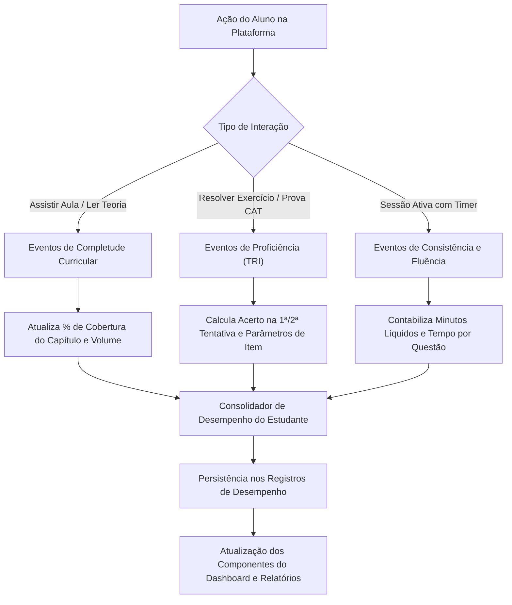

# 1. Ciclo de Coleta das Métricas Tridimensionais

### 1.1 Ingestão e Processamento de Eventos de Aprendizagem

```mermaid
flowchart TD
    A["Ação do Aluno na Plataforma"] --> B{"Tipo de Interação"}
    
    B -->|"Assistir Aula / Ler Teoria"| C["Eventos de Completude Curricular"]
    B -->|"Resolver Exercício / Prova CAT"| D["Eventos de Proficiência (TRI)"]
    B -->|"Sessão Ativa com Timer"| E["Eventos de Consistência e Fluência"]
    
    C --> F["Atualiza % de Cobertura do Capítulo e Volume"]
    D --> G["Calcula Acerto na 1ª/2ª Tentativa e Parâmetros de Item"]
    E --> H["Contabiliza Minutos Líquidos e Tempo por Questão"]
    
    F --> I["Consolidador de Desempenho do Estudante"]
    G --> I
    H --> I
    
    I --> J["Persistência nos Registros de Desempenho"]
    J --> K["Atualização dos Componentes do Dashboard e Relatórios"]
```
