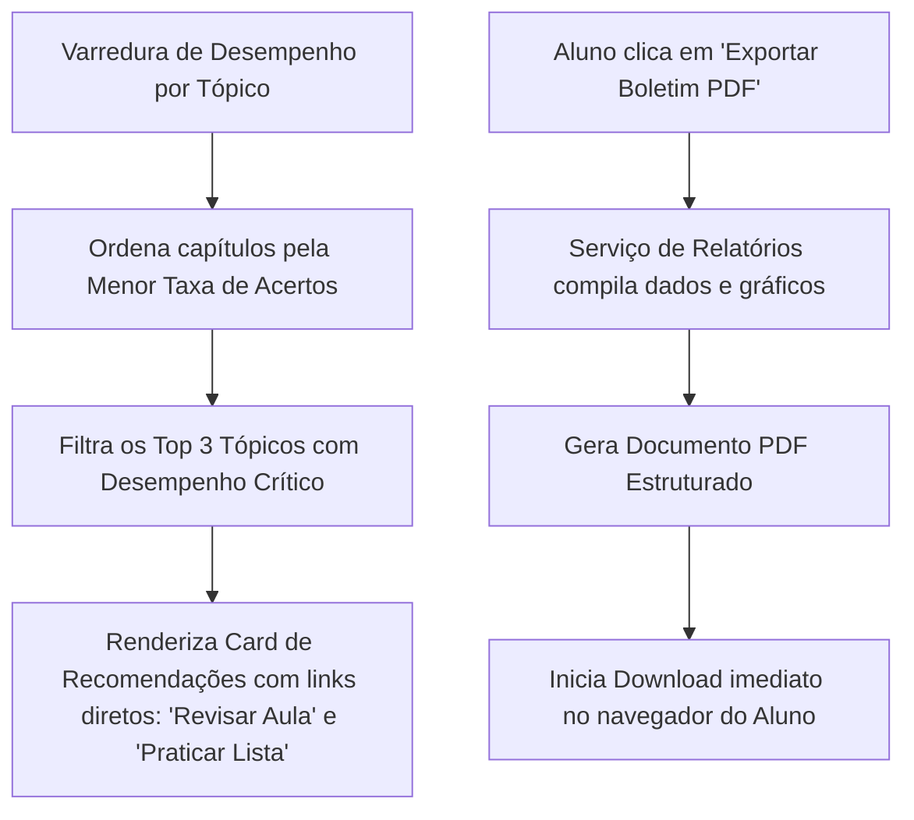

# 4. Geração de Recomendações e Exportação em PDF

### 4.1 Recomendações Críticas e Exportação

```mermaid
flowchart TD
    A["Varredura de Desempenho por Tópico"] --> B["Ordena capítulos pela Menor Taxa de Acertos"]
    B --> C["Filtra os Top 3 Tópicos com Desempenho Crítico"]
    C --> D["Renderiza Card de Recomendações com links diretos: 'Revisar Aula' e 'Praticar Lista'"]
    
    E["Aluno clica em 'Exportar Boletim PDF'"] --> F["Serviço de Relatórios compila dados e gráficos"]
    F --> G["Gera Documento PDF Estruturado"]
    G --> H["Inicia Download imediato no navegador do Aluno"]
```
