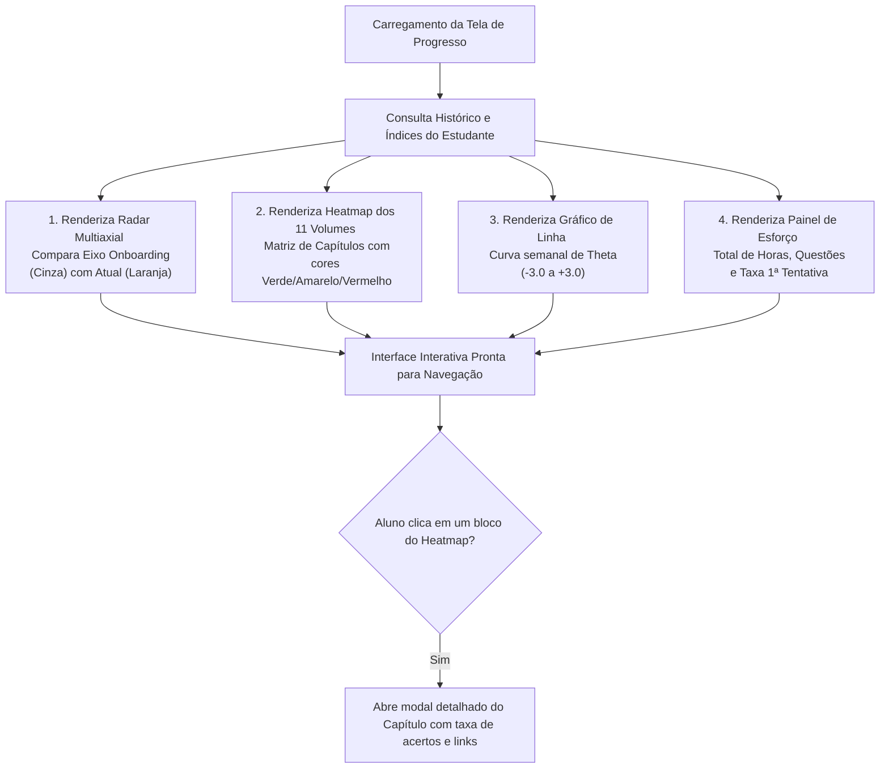

# 3. Fluxo de Renderização Gráfica

### 3.1 Composição Visual da Tela de Progresso

```mermaid
flowchart TD
    A["Carregamento da Tela de Progresso"] --> B["Consulta Histórico e Índices do Estudante"]
    
    B --> C["1. Renderiza Radar Multiaxial \n Compara Eixo Onboarding (Cinza) com Atual (Laranja)"]
    B --> D["2. Renderiza Heatmap dos 11 Volumes \n Matriz de Capítulos com cores Verde/Amarelo/Vermelho"]
    B --> E["3. Renderiza Gráfico de Linha \n Curva semanal de Theta (-3.0 a +3.0)"]
    B --> F["4. Renderiza Painel de Esforço \n Total de Horas, Questões e Taxa 1ª Tentativa"]
    
    C --> G["Interface Interativa Pronta para Navegação"]
    D --> G
    E --> G
    F --> G
    
    G --> H{"Aluno clica em um bloco do Heatmap?"}
    H -->|Sim| I["Abre modal detalhado do Capítulo com taxa de acertos e links"]
```
